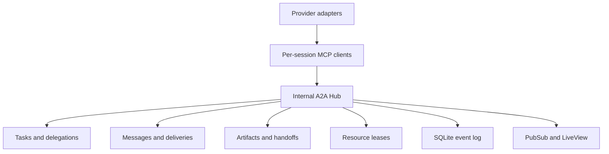
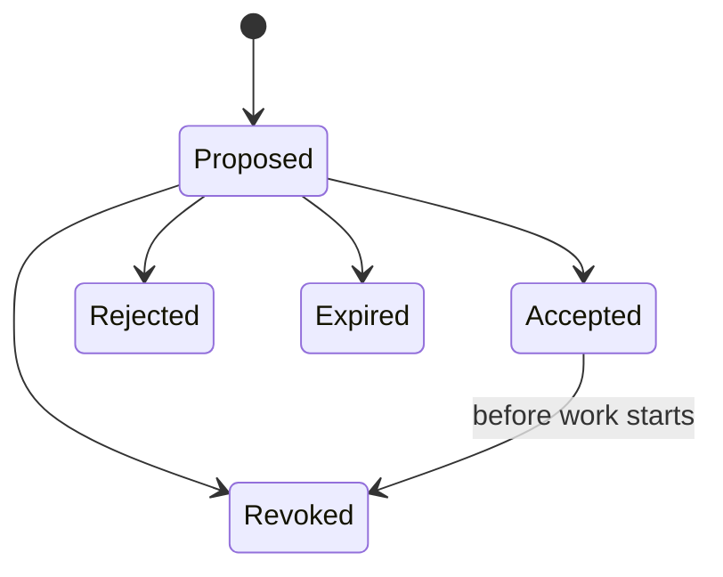
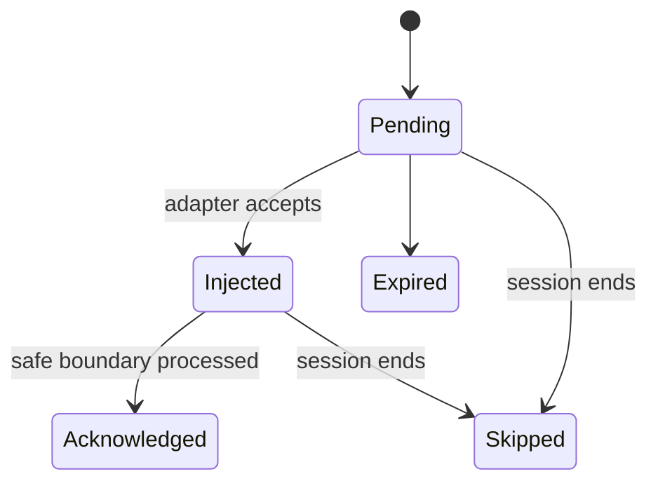
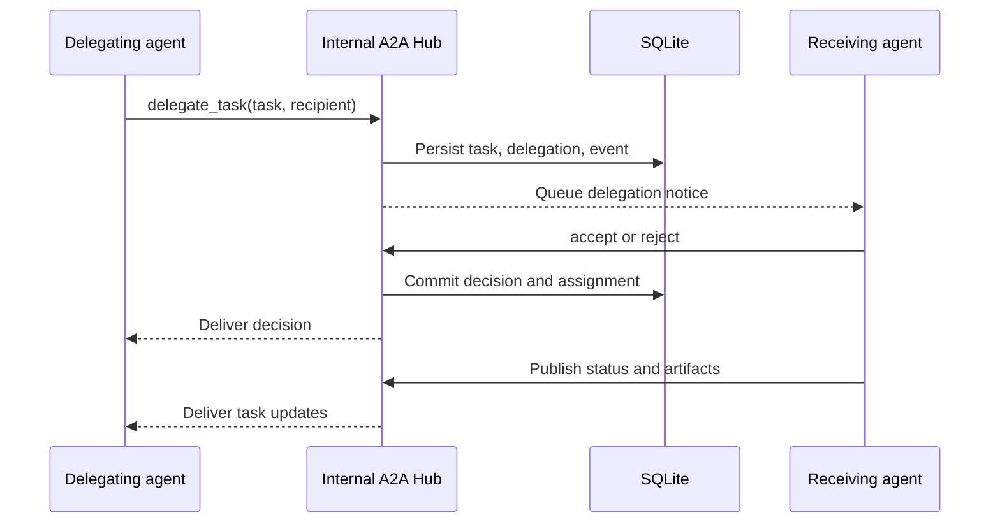
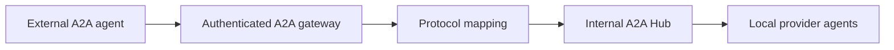

# Internal Agent-to-Agent Communication

## 1. Purpose

AgentDesk includes an internal agent-to-agent (A2A) coordination layer from the first release. It lets Codex, Claude Code, Cursor Agent, OpenCode, and future providers discover peers, delegate tasks, exchange structured messages, publish artifacts, request review, and coordinate shared resources through one durable local control plane.

The internal protocol is inspired by the A2A 1.0 semantic model—Agent Cards, tasks, messages, content parts, artifacts, asynchronous status, and capability discovery—but it is not presented as a wire-compatible public A2A server. A future gateway may translate between the internal domain and the public A2A protocol.

## 2. Protocol boundaries

| Layer | Direction | Responsibility |
| --- | --- | --- |
| Provider protocol | AgentDesk ↔ Codex/Claude Code | Provider lifecycle, turns, approvals, streamed activity |
| ACP | AgentDesk ↔ Cursor/OpenCode | Client-to-agent control, sessions, prompts, permissions, cancellation |
| MCP | Agent → Agent Hub | Calls to internal coordination, search, memory, and resource tools |
| Internal A2A | Agent Hub ↔ agents | Discovery, delegation, messages, task state, artifacts, delivery |
| Public A2A gateway | External agent ↔ AgentDesk | Deferred translation and federation boundary |

ACP and provider protocols control an agent process. MCP is the callable tool transport available to an agent. Internal A2A is the durable application-level collaboration model implemented behind those MCP tools.

## 3. Topology



Agents do not open sockets to one another and do not receive database credentials. Every collaboration operation is authorized, persisted, correlated, and routed by the Agent Hub.

## 4. Design principles

- **Built in:** the internal A2A runtime starts with every project runtime and is not a feature flag.
- **Hub mediated:** all agent-to-agent traffic passes through Agent Hub.
- **Provider neutral:** provider payloads never become the internal domain model.
- **Durable first:** important tasks, messages, artifacts, acknowledgements, and transitions survive restart.
- **Async first:** an agent may be busy, disconnected, awaiting input, or restarted when work is delegated.
- **Capability gated:** agents may only be assigned work matching their registered skills, modes, and policy.
- **Opaque execution:** agents exchange declared capabilities, work state, messages, and outputs—not private reasoning or provider secrets.
- **Idempotent:** retries must not duplicate a task, delegation, message, delivery, or artifact.
- **Human visible:** the user can inspect and override every delegation, conflict, and handoff.
- **Local by default:** no public A2A listener or external discovery endpoint is enabled in the MVP.

## 5. Core objects

### Agent Card

Every active session has a project-scoped internal Agent Card generated from user configuration and runtime provider capabilities.

```json
{
  "agent_id": "uuid",
  "project_id": "uuid",
  "name": "Backend implementer",
  "description": "Implements Elixir and database tasks",
  "provider": "cursor",
  "provider_version": "string",
  "revision": 3,
  "status": "idle",
  "skills": [
    {
      "id": "elixir-backend",
      "name": "Elixir backend",
      "description": "Implements OTP, Ecto, and Phoenix code",
      "tags": ["elixir", "phoenix", "ecto"]
    }
  ],
  "input_modes": ["text/plain", "application/json"],
  "output_modes": ["text/markdown", "application/json", "artifact/ref"],
  "features": {
    "task_delegation": true,
    "stream_updates": true,
    "review": true,
    "resource_leases": true
  }
}
```

An Agent Card contains no credentials, hidden prompts, private reasoning, global filesystem paths, or provider authentication material. Status and availability are runtime state; skills and policy are validated project configuration.

### Context

A `context_id` groups related tasks, messages, artifacts, and handoffs across several agents. A context is not a provider conversation ID. Provider thread/session IDs remain adapter metadata.

### Task

A task is the durable unit of work. It has an owner, current assignee, status, context, history, artifacts, an optional parent task, and a DAG of wait-edges in `task_dependencies`. Completing a prerequisite unblocks dependents that have no remaining unfinished edges. Reusable workflows instantiate that graph.

AgentDesk task states:

| State | Meaning | Public A2A 1.0 mapping |
| --- | --- | --- |
| `queued` | Created but not delegated | `TASK_STATE_SUBMITTED` |
| `assigned` | Delegation accepted | `TASK_STATE_SUBMITTED` |
| `working` | Agent is executing | `TASK_STATE_WORKING` |
| `input_required` | Needs user or peer input | `TASK_STATE_INPUT_REQUIRED` |
| `auth_required` | Needs explicit authentication/permission | `TASK_STATE_AUTH_REQUIRED` |
| `blocked` | Waiting on resource, dependency, or policy | `TASK_STATE_WORKING` plus status message |
| `review` | Output is awaiting review | `TASK_STATE_WORKING` plus artifact |
| `completed` | Required output accepted | `TASK_STATE_COMPLETED` |
| `failed` | Work ended unsuccessfully | `TASK_STATE_FAILED` |
| `cancelled` | Work was cancelled | `TASK_STATE_CANCELED` |
| `rejected` | Agent declined the delegation | `TASK_STATE_REJECTED` |

The mapping is used only by a future public gateway. Internal states remain more specific where the desktop workflow benefits.

### Delegation

A delegation is a proposal from a user, system, or agent to assign a task to an agent. It is separate from the task so rejections, expiry, reassignment, and history remain explicit.

Delegation states:



Accepting a delegation and assigning the task happen in one transaction. An agent may reject with a bounded reason such as missing capability, conflicting work, insufficient permission, or unavailable capacity.

### Message

Messages carry instructions, questions, status, review notes, and coordination notices. Task outputs belong in artifacts, not only in message bodies.

```json
{
  "id": "uuid",
  "idempotency_key": "uuid",
  "context_id": "uuid",
  "correlation_id": "uuid",
  "causation_id": "uuid-or-null",
  "reply_to_message_id": "uuid-or-null",
  "sender_agent_id": "uuid-or-null",
  "recipient_agent_id": "uuid-or-null",
  "scope": "direct",
  "task_id": "uuid-or-null",
  "kind": "request",
  "priority": "normal",
  "parts": [
    {"text": "Please review the lease transaction."},
    {"data": {"files": ["lib/agent_desk/resource_manager.ex"]}}
  ],
  "requires_ack": true,
  "created_at": "timestamp",
  "expires_at": "timestamp-or-null"
}
```

Supported internal part types:

- `text`: bounded UTF-8 text or Markdown;
- `data`: schema-identified bounded JSON;
- `artifact_ref`: reference to an AgentDesk artifact;
- `file_ref`: reference to an approved project-relative or app-managed file, never an arbitrary URL.

Binary bytes are never embedded in coordination messages. They are stored as artifacts with size, hash, type, and authorization metadata.

### Artifact

Artifacts are durable task outputs: commits, patches, reports, plans, test results, review reports, transcripts, or user-approved files. Each artifact has an immutable identity and integrity hash. A later version creates a new artifact or explicit artifact revision; it does not silently replace prior task history.

### Delivery

Every recipient has an independent delivery record. The message can be visible in the UI before the provider can safely receive it.



Acknowledgement means AgentDesk delivered the content at a safe provider boundary. It does not mean the model agreed, obeyed, or completed the request.

### Resource lease extension

The public A2A task model does not replace local coordination for files, databases, ports, services, migrations, and Git refs. AgentDesk adds resource leases as an internal extension. Delegating or accepting a task never grants resource ownership automatically.

## 6. Built-in MCP surface

Every first-class provider session receives the internal A2A MCP tools automatically.

Discovery and presence:

- `hub_register`
- `hub_heartbeat`
- `hub_list_agents`
- `hub_get_agent_card`
- `hub_find_agents`
- `hub_update_status`

Tasks and delegation:

- `hub_list_tasks`
- `hub_get_task`
- `hub_create_task`
- `hub_delegate_task`
- `hub_list_delegations`
- `hub_accept_delegation`
- `hub_reject_delegation`
- `hub_update_task`
- `hub_cancel_task`
- `hub_complete_task`
- `hub_split_work`
- `hub_crew_status`
- `hub_subscribe_task`
- `hub_request_review`

Messaging:

- `hub_send_message`
- `hub_broadcast`
- `hub_read_inbox`
- `hub_ack_messages`

Artifacts and handoffs:

- `hub_publish_artifact`
- `hub_get_artifact`
- `hub_publish_handoff`
- `hub_accept_handoff`

Resource coordination:

- `hub_claim_resources`
- `hub_renew_resources`
- `hub_release_resources`
- `hub_list_resources`

Search and memory remain separate Agent Hub capabilities even though agents call them through the same MCP connection.

## 7. Delegation flow



The user may approve, redirect, revoke, or reject a delegation. Automatic agent-selected delegation is subject to project policy, task depth, concurrency limits, and allowed skills.

### Lead crew split

A user can start a crew from the Tasks panel, or a lead agent can call `hub_split_work`. The hub creates a parent task, one child per lane, and a review task that waits on those children. The review stays blocked until every lane finishes; completing it earlier is rejected. The plan is stored in shared project memory. Completing a child notifies the lead through the A2A inbox, including whether review is ready, so they can control the result. Specialists stay on isolated worktrees. Assignment is not a lease. The hub never merges into the primary tree.

## 8. Routing and delivery

Routing scopes:

- `direct`: exactly one recipient;
- `task`: all active participants in the task;
- `context`: participants across related tasks in one context;
- `project`: all active project agents, with stricter rate limits;
- `system`: AgentDesk-generated notices.

Delivery order is stable per recipient using a monotonically increasing inbox sequence. Cross-recipient global order is not guaranteed. Adapters inject messages through provider steering when supported, otherwise at the next safe turn boundary.

Critical state is never communicated only through a transient provider prompt. Task status, delegation outcome, artifact identity, lease ownership, and approval decisions are independently persisted.

## 9. Idempotency and concurrency

- Every mutating call requires an `idempotency_key` scoped to the authenticated agent session.
- Repeating the same key and semantically identical request returns the original result.
- Reusing a key with a different request returns `idempotency_conflict`.
- Task and delegation transitions use optimistic versions plus transactional validation.
- A delegation can be accepted once.
- An artifact publish with the same content identity returns the existing artifact.
- Inbox acknowledgement is monotonic and safe to repeat.
- Cancellation never deletes artifacts or work already produced.

## 10. Authorization and visibility

Authorization is evaluated from the authenticated session capability, not IDs supplied by the caller.

Default policy:

- agents can discover only agents in the same project;
- peer-visible internal Agent Cards expose safe skills and availability only;
- direct message bodies are visible to sender, recipient, and user;
- task/context messages are visible only to participants and the user;
- project broadcasts are visible to all project agents;
- artifact access follows project, task, and explicit sharing policy;
- private provider transcripts and reasoning are never A2A content;
- an agent cannot delegate a task requiring permissions it does not possess unless the recipient and user explicitly approve the expansion;
- recursive delegation depth and fan-out are bounded.

## 11. Failure and restart behavior

| Failure | Required behavior |
| --- | --- |
| Recipient busy | Keep delivery pending and show it in UI |
| Recipient crashes | Preserve task, delegation, inbox, artifacts, and worktree |
| AgentDesk restarts | Rebuild routing from SQLite and resume pending delivery |
| Duplicate retry | Return prior idempotent result |
| Delegation expires | Mark expired; do not assign the task |
| Sender terminates | Preserve sent messages and task history |
| Artifact file missing | Mark artifact unavailable/corrupt; retain metadata and event |
| Provider cannot accept steering | Inject at the next safe turn boundary |
| Lease conflicts | Keep task blocked; never force ownership from a message |

## 12. User controls

The UI provides:

- an Agents directory with capability cards and current availability;
- delegation inbox with accept, reject, redirect, and revoke actions;
- task conversation and status history;
- unread/acknowledged delivery indicators;
- artifacts and handoff review;
- dependency and resource-conflict visibility;
- project policy for autonomous delegation depth, fan-out, and approval;
- an emergency stop that terminates providers without deleting durable A2A state.

## 13. Team sync bundles

Users can export a redacted `agentdesk.sync.v1` JSON file and import it on another machine that opened the same Git origin (or already shares `project.settings["sync_id"]`). The bundle copies tasks, wait-edges, workflow templates, and role templates. It does not copy capability tokens, leases, sessions, or worktrees. Git remains the source-code transport. This is not a public A2A gateway and does not bind a network listener.

## 14. Future public A2A gateway

The internal domain is designed so a later adapter can expose an A2A 1.0 Agent Card and translate public messages, tasks, status updates, and artifacts.



The gateway is post-MVP and disabled by default. It must not make the public wire model canonical, expose all local agents automatically, bind beyond loopback without explicit configuration, or translate AgentDesk lease authority into untrusted remote ownership.

## 15. Definition of internal A2A readiness

Internal A2A is ready when:

- every supported provider auto-registers and receives the same coordination tools;
- agents can discover eligible peers without receiving secrets;
- delegation accept/reject/expire/revoke is transactional and recoverable;
- messages support text, structured data, and artifact references;
- every recipient has durable ordered delivery and acknowledgement;
- task state and artifacts survive provider and application restart;
- resource leases remain independently enforced;
- all mutating calls are idempotent;
- capability, authorization, rate, recursion, and size limits are tested;
- no local agent requires a public A2A server to collaborate.
