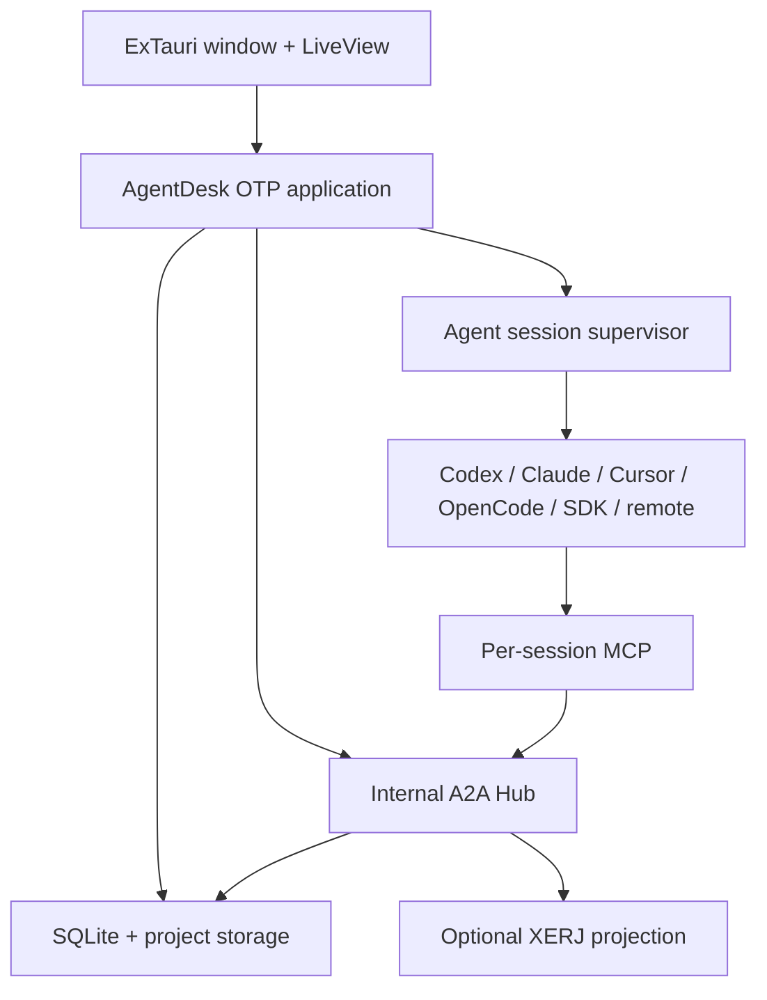
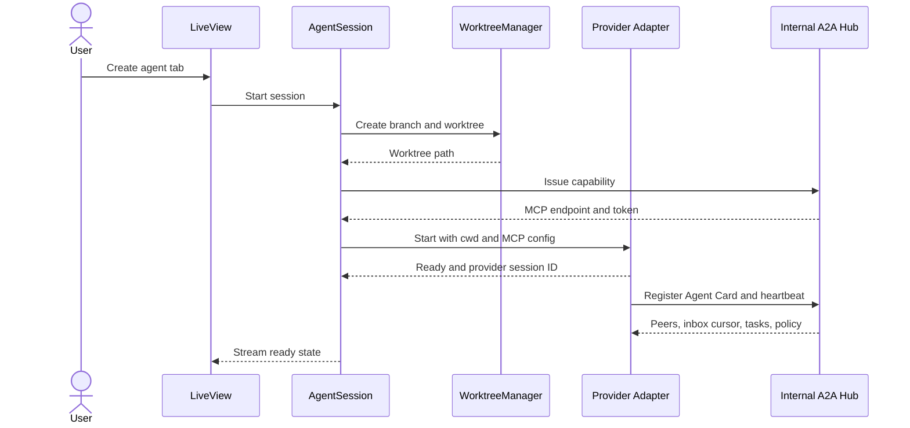
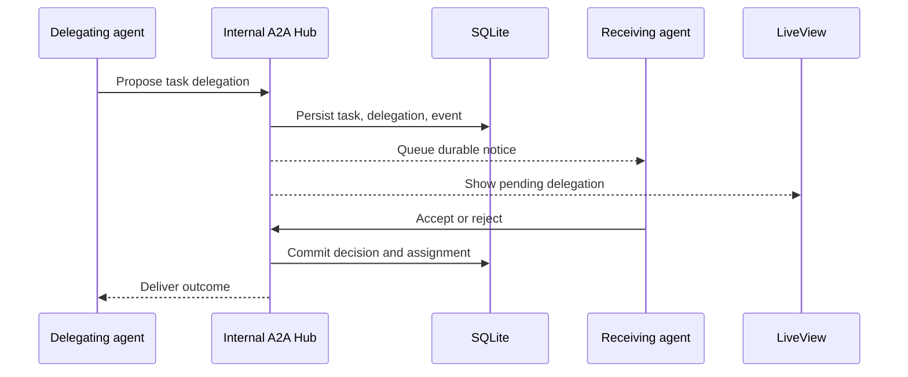
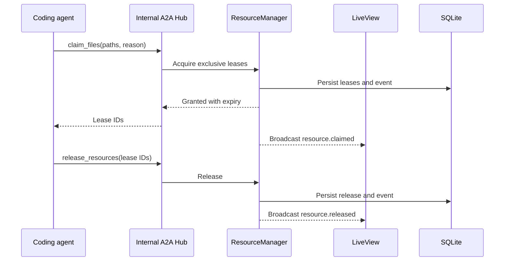

# Architecture

## 1. System overview

**Cuckoding** is an ExTauri desktop application (OTP modules `AgentDesk` / `AgentDeskWeb`) whose UI is rendered by Phoenix LiveView and whose coordination engine runs on the BEAM. HTTP binds loopback only. Provider processes such as Codex, Claude Code, Cursor Agent, and OpenCode run locally and are supervised by Elixir. Each active agent receives a tab, Agent Card, task context, worktree, provider session, durable A2A inbox, artifact space, and resource leases.

LiveView is split: `AgentDeskWeb.WorkspaceLive` (events/OTP), `WorkspaceHTML` (shell), `WorkspaceView` (helpers), `WorkspacePanels` (registry, analytics, grove, onboarding, activity).



## 2. Runtime processes

```text
AgentDesk.Application
├── ExTauri.ShutdownManager
├── AgentDesk.Repo
├── Phoenix.PubSub
├── AgentDesk.Circuit
├── AgentDesk.ProjectRegistry (and session/hub/worktree/search registries)
├── AgentDesk.Projects.Supervisor
│   └── AgentDesk.Projects.Runtime<project_id>
│       ├── AgentDesk.A2A.Supervisor
│       ├── AgentDesk.Worktrees.Supervisor
│       └── AgentDesk.Search.Supervisor
├── AgentDesk.ProviderProcessSupervisor
│   └── AgentDesk.Providers.SessionWorker
├── AgentDeskWeb.Endpoint
└── AgentDesk.Search.Xerj.Process   # only when the XERJ adapter is selected
```

`ResourceManager`, reviews, roles, usage, containers, and team sync are modules over SQLite, not extra GenServers. Closing one project stops only that runtime. Boot restores every row with `projects.open = true`.

## 3. Component responsibilities

### ExTauri and LiveView

- Native application lifecycle, windows, menus, dialogs, filesystem selection, notifications, and packaging.
- Desktop shell around the Phoenix application.
- LiveView screens for projects, tabs, approvals, tasks, leases, diffs, and settings.
- Native events are forwarded into LiveView through ExTauri's supported channel.

### AgentSession

One GenServer per tab/session. It owns:

- the durable `agent_sessions` identity;
- the current task and provider adapter handle;
- provider lifecycle state;
- inbox cursor and queued context;
- Agent Card revision and A2A delivery cursor;
- active lease IDs;
- normalized streaming events;
- heartbeat scheduling;
- graceful shutdown and crash reconciliation.

It does not own canonical locks or directly manipulate database rows belonging to another subsystem.

### Provider adapters

Adapters translate a provider's protocol into the common AgentDesk protocol.

```elixir
defmodule AgentDesk.Providers.Adapter do
  @callback probe(config :: map()) :: {:ok, map()} | {:error, term()}
  @callback start_session(context :: map()) :: {:ok, handle :: term()} | {:error, term()}
  @callback send_input(handle :: term(), input :: map()) :: :ok | {:error, term()}
  @callback interrupt(handle :: term()) :: :ok | {:error, term()}
  @callback terminate(handle :: term()) :: :ok | {:error, term()}
  @callback normalize_event(raw :: term()) :: {:ok, [map()]} | {:error, term()}
end
```

Codex uses `codex app-server` over the default stdio JSONL transport for rich sessions, approvals, thread resume, steering, and streamed items. `codex exec --json` remains a one-shot fallback. Claude Code receives a separate adapter using its structured headless/streaming interface.

Cursor Agent and OpenCode both expose Agent Client Protocol (ACP) servers over stdio with newline-delimited JSON-RPC. They share `AgentDesk.Providers.ACP.Client` for framing, request correlation, capability negotiation, cancellation, permissions, and session creation/loading. Separate `Cursor` and `OpenCode` adapters normalize provider extensions and capability differences. ACP controls an agent; MCP gives that agent access to AgentDesk coordination tools. See `PROVIDERS.md`.

### Internal A2A Hub and MCP surface

Internal A2A is a built-in project-scoped domain service. Agent Hub is its authenticated MCP-facing surface and the only coordination interface exposed to provider agents. Together they provide:

- Agent Card registration, availability, skill discovery, and policy filtering;
- user-defined session roles whose prompts stay off Agent Cards;
- SDK JSONL adapters and loopback attach sessions;
- optional Docker Compose stacks on isolated worktrees;
- token/cost samples in SQLite;
- task contexts and transactional delegation;
- durable messages, ordered per-recipient delivery, and acknowledgements;
- task artifacts, handoffs, and review requests;
- `ResourceManager` for leases;
- project/task queries;
- controlled access to XERJ search and memory;
- user-initiated team sync bundles (tasks, workflows, roles), never a sync listener.

Provider sessions receive a short-lived capability token binding them to one `agent_id`, `project_id`, and allowed tool set.

`AgentDirectory` serves safe project-scoped capability cards. `TaskCoordinator` serializes delegation and task transitions. `MessageRouter` persists fan-out and delivery before notifying adapters. `ArtifactRegistry` validates task association, storage ownership, size, and integrity hashes. `ResourceManager` remains separate because task assignment is not resource ownership.

### ResourceManager

- Grants shared or exclusive leases.
- Detects exact-file, directory, and glob overlap.
- Renews leases through heartbeats.
- Releases leases on normal completion.
- Expires leases after process loss.
- Allocates named resources such as ports, databases, migrations, or services.
- Emits conflict and lifecycle events.

SQLite stores durable lease state, while the ResourceManager serializes decisions for a project. Database uniqueness constraints are a second line of defense, not the entire overlap algorithm.

### WorktreeManager

- Creates one branch and linked worktree per agent session.
- Validates repository state before creation.
- Records base and head commits.
- Detects dirty or uncommitted work.
- Produces diffs and handoff commits.
- Removes only app-owned worktrees after explicit confirmation or verified cleanup eligibility.

### Review queue

- Enqueues each published handoff.
- Records accept/reject without merging.
- Evaluates required-check policy from project settings plus recorded check results.
- Merges into the primary checkout only after an explicit user confirmation when the tree is clean, on the target branch, and `merge-tree` reports no conflict.

### ProjectWatcher

- Watches the main checkout and agent worktrees.
- Updates file status shown in the UI.
- Detects edits that occurred without a matching lease.
- Debounces search re-index requests.
- Never treats filesystem events as guaranteed exactly-once messages.

### XERJ

XERJ is an optional local executable supervised by AgentDesk. It indexes code, documentation, handoffs, decisions, artifacts, and selected normalized history. It provides keyword, semantic, vector, and hybrid retrieval plus namespaced agent memory.

XERJ data is derived. Removing it must not remove tasks, messages, leases, or provider sessions.

## 4. Data flow: starting an agent



## 5. Data flow: agent delegation



## 6. Data flow: coordinated file change



## 7. Project storage layout

Checked-in or user-visible neutral project metadata:

```text
.agent-hub/
├── project.yml
├── shared/
│   └── context.md
├── decisions/
├── handoffs/
└── artifacts/
```

Private runtime data belongs under the operating system's application-data directory:

```text
AgentDesk/
├── agentdesk.sqlite3
├── projects/<project_id>/
│   ├── worktrees/<session_id>/
│   ├── sessions/<session_id>/isolation/   # ADR-026 templates; never the Git tree
│   ├── transcripts/
│   ├── diagnostics/
│   ├── sync/
│   └── xerj/
└── logs/
```

Isolation templates (`env`, `postgres.database.sql`, `postgres.schema.sql`, `elixir.test.exs`, `compose.overlay.yaml`) are written under the session directory. Isolated mode must not edit the user's primary checkout.

The user chooses whether `.agent-hub/` is committed. Generated status snapshots must be excluded through `.git/info/exclude` unless the user explicitly opts into versioning them.

## 8. Event model

Every subsystem emits a normalized envelope:

```json
{
  "id": "uuid",
  "project_id": "uuid",
  "agent_id": "uuid-or-null",
  "task_id": "uuid-or-null",
  "context_id": "uuid-or-null",
  "type": "resource.claimed",
  "source": "resource_manager",
  "occurred_at": "2026-08-20T20:15:01.123456Z",
  "correlation_id": "uuid",
  "causation_id": "uuid-or-null",
  "idempotency_key": "uuid-or-null",
  "payload": {}
}
```

The event is persisted before or in the same transaction as the state change when recovery depends on it. PubSub delivery happens after commit.

## 9. Failure boundaries

| Failure | Required behavior |
| --- | --- |
| Provider exits unexpectedly | Mark session failed, stop heartbeat, expire leases, retain worktree and transcript |
| AgentDesk restarts | Reconcile recorded PIDs/processes, mark lost sessions interrupted, recover worktrees, expire stale leases |
| XERJ fails | Search becomes unavailable; coordination continues; restart with backoff |
| PubSub consumer disconnects | UI resubscribes and reloads canonical state from SQLite |
| MCP client disconnects | Keep session alive during grace period, then expire capability and leases |
| A2A recipient is busy/disconnected | Keep ordered delivery pending; do not lose or duplicate it |
| Delegation races or retries | Commit one valid transition and return the original idempotent result |
| Artifact bytes are missing/corrupt | Preserve metadata, mark unavailable, emit a high-visibility event |
| Git conflict | Create explicit blocked state; never auto-discard either side |
| SQLite busy | Use bounded retry/backoff; serialize high-contention project operations |
| File changed without lease | Record violation, notify UI and relevant agents, preserve the file |

## 10. Important distinction: notification vs enforcement

An active model does not automatically understand every broadcast while it is generating a turn. AgentDesk therefore separates:

- **UI notification:** immediate through PubSub;
- **agent delivery:** injected through provider steering when supported, otherwise queued for the next safe turn boundary;
- **enforcement:** worktree isolation, lease checks, provider hooks where available, and filesystem violation detection.

Correctness must never depend on a model noticing a chat message in time.

## 11. Deployment model

Local macOS packaging is `mix cuckoding.app`: Mix `release desktop` plus a Tauri `.app` sidecar, because OTP 28 has no Burrito ERTS. Signed/notarized Burrito wraps remain open. Provider CLIs are discovered on the user's machine so their existing authentication and update lifecycle remain intact. Bundling providers is a separate licensing, size, and support decision.

XERJ may be bundled as an optional Apache-2.0 executable after platform packaging and upgrade tests pass. It is not required for coordination.

Internal A2A is part of the core BEAM application and is always available. A public A2A-compatible HTTP/JSON-RPC/gRPC gateway is post-MVP, disabled by default, and must translate into the internal domain rather than replace it. No non-loopback listener exists.
