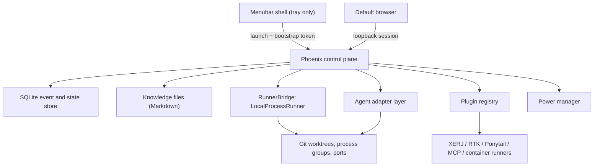
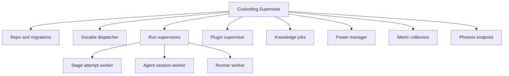

# Architecture

## System shape

Cuckoding is a menubar application whose real body is a local Phoenix control plane. The control plane owns workflow state, supervision, adapters, plugins, policy, knowledge, and telemetry. Agent processes and project commands run on the host inside per-run Git worktrees and process groups. SQLite is the durable source of truth; knowledge is Markdown on disk indexed in SQLite. The UI is LiveView served on a loopback port and opened in the default browser.

## Component responsibilities

### Menubar shell

- Starts the bundled Phoenix release as a child process with a one-time bootstrap token on a free loopback port.
- Waits for a structured readiness message, then shows the status-bar menu for the dashboard, About, Settings, logs, login-item status, updates, diagnostics, safe mode, and Quit.
- Shows a compact status line (active runs, attention needed) fed by a read-only status endpoint.
- Uses native `SMAppService` for the login-item registration, and handles
  updates, diagnostics reveal, and graceful shutdown with a termination ladder.
- Contains no workflow, provider, or knowledge logic. See `docs/DESKTOP_SHELL.md`.

### Phoenix control plane

- Serves the LiveView UI on `127.0.0.1` only; the shell opens `http://127.0.0.1:<port>/open?token=<one-time>` which exchanges the token for a browser session cookie.
- Owns commands, state transitions, approvals, policy checks, durable dispatch, recovery, and sleep/wake reconciliation.
- Supervises provider adapters, runner workers, plugin processes, and knowledge jobs through `DynamicSupervisor`.
- Persists events before broadcasting UI updates through PubSub.
- Rebuilds current projections from durable state after restart.

### SQLite persistence

- Stores configuration snapshots, workflow projections, append-only events, artifacts, approvals, usage, rollups, plugin state, knowledge index, provenance, and usage records.
- Uses WAL mode, foreign keys, a busy timeout, and short transactions.
- Is authoritative for business state; in-memory processes cache or execute work only.

### Agent Floor read model

`Cuckoding.AgentFloor` is a read-only projection over the durable execution,
workflow, telemetry, and project tables. It serves `/agents`, `/runs/:id`, and
`/agents/:id` without becoming another source of truth. The floor uses a bounded
base query plus fixed related queries rather than per-card reads, and detail
views bound activity, metrics, usage, optimization, process, and artifact lists.
LiveViews treat PubSub messages as refresh hints, coalesce bursts, and reload
committed rows; periodic resource refresh never infers workflow state.

### Runner bridge

`RunnerBridge` separates orchestration from execution location. Required operations: prepare, start, exec, pause, hibernate, resume, inspect, stream events, allocate/release ports, and destroy. The MVP implementation is `LocalProcessRunner` (`docs/EXECUTION_ENVIRONMENTS.md`). Container runners (Docker, OrbStack, Colima, Apple Containers) and remote runners implement the same behaviour as plugins later.

The implemented host bridge covers prepare, asynchronous start, synchronous exec, ownership-checked pause, process-group hibernate, durable resume preparation, read-only inspection/resource sampling, lifecycle-event retrieval, environment-wide process destruction, leased preview ports, loopback health probes, and listener ownership inspection. `Lifecycle` persists the active attempt checkpoint before hibernate, composes those runner operations with durable task/run transitions, revalidates Git and policy ownership before resume, and reuses the existing attempt.

`CommandPolicy` reads a size-bounded, non-symlinked `project.yml`, validates version 2 security fields, and resolves only a named command from the run's immutable trusted configuration snapshot. It tokenizes string declarations without a shell, passes an absolute executable plus argv to `RunnerBridge`, and rejects statically visible absolute or parent-traversal arguments. `ProtectedPaths` inspects committed, staged, unstaged, untracked, renamed, and copied paths with NUL-delimited Git output. A QA gate can pass a protected change only when the exact sorted path-set digest has a human approval; a later broader change requires a new approval.

`PortAllocator` combines SQLite's exclusive resource lease with a physical `127.0.0.1` bind probe and the environment's active-port unique index. The lease token stays in the supervised service handle, never SQLite. `Preview` starts only the trusted `dev_server` declaration with fixed `HOST`, `PORT`, and `CUCKODING_PORT`, performs a bounded HTTP probe without redirects, and stops the process before releasing its lease. `LocalHostInspector` maps the listening PID back to the runner's process-group leader and start identity for recovery decisions.

Safe cleanup delegates the exact registered path to Git only after the ownership marker, canonical workspace confinement, branch/head/base identity, clean status, and absence of running process records all pass. It removes the worktree without force, retains the run directory and artifacts, and records the retained-artifact inventory in start/completion events.

`Cuckoding.Power.Manager` is a supervised control-plane child after startup reconciliation. It samples the supported macOS continuous and uptime clocks, persists a `sleep_gap` before delegating to the same reconciler used at startup, and records `wake_reconciled` after leases, commands, processes, ports, worktrees, sessions, and services are classified. It owns one scrubbed `/usr/bin/caffeinate -i -w <beam-pid>` child only while eligible provider work or a durable unattended board window needs it.

`Cuckoding.Execution.Scheduler` is a stateless admission planner over SQLite projections. It uses durable run history as the fairness cursor, checks dependencies and layered capacity, and returns candidates to a replaceable host dispatcher rather than launching processes itself. The same boundary exposes stable unattended approval notifications to a notifier and fail-closed board control to a runtime-aware pause/hibernate controller. This keeps process handles and lease tokens in supervised runtime services while the database remains authoritative.

### Agent adapter layer

Each runtime adapter converts a common stage request into a provider-specific host process and converts output into normalized events, artifacts, usage, checkpoints, and completion status. Agents run on the host; their own permission systems (allowed tools, working directory, approval modes) are configured by the adapter from the stage capability grant, and the granted set is recorded. Capability discovery is explicit.

The walking skeleton composes the existing contexts without adding an authoritative workflow process: SQLite owns stage, run, task, approval, candidate, and event state. The deterministic CI adapter and an opt-in real adapter use the same stage request path. Before approval, the host validates a versioned evidence bundle and verifies every artifact and project-knowledge citation against its SHA-256 digest. Human approval then precedes the system release attempt. `VcsHost` implementations either perform an idempotent, non-force push to a validated local bare remote or fetch an opaque GitHub credential through `SecretStore`, push the candidate, and create a draft pull request. Both paths reject protected branches and unapproved runs. See `docs/WALKING_SKELETON.md`.

`Cuckoding.ProjectOnboarding` is the project-registration boundary used by the
dashboard wizard. A server-side macOS folder chooser supplies the path without
making the browser disclose filesystem contents. The review step first performs
a read-only canonical-path and Git inspection. Only after explicit confirmation
may onboarding initialize a selected non-repository or create the first local
commit in an unborn repository; an existing branch remains read-only. It then
atomically writes the project plus an initial trusted configuration with no
agent connection. The project edit surface validates multiple machine-local
runtime paths and role mappings, then appends a new immutable configuration
revision with an expected-revision guard. It creates no board, task, run,
branch, worktree, port, lease, or provider process. Board setup later publishes
a workflow and snapshots role assignments; task start alone prepares the
execution environment.

`Cuckoding.ProjectWorkflow` is the command boundary behind the landed project →
board → task surfaces. Board and task creation persist redacted audit events in
the same transaction as their projections. Run preparation accepts a Ready task
only once, validates the current repository revision and runnable role snapshot,
creates a queued run, and delegates owned worktree setup to `GitService`; no
provider process starts from a board or task form.

`Cuckoding.GuidedRun` launches that queued default workflow after run-scoped
authentication. It resolves the Specifications, Coding, and Review adapters
separately from the immutable run snapshot, while `WalkingSkeleton` remains the
bounded workflow executor and release-evidence path. `Cuckoding.AgentFloor`
rebuilds both session cards and the bounded recent-operation projection from
SQLite. The home dashboard refreshes that projection after committed PubSub
hints and on a periodic bounded timer, so PubSub is never the state owner.

`Cuckoding.BoardTaskIntake` is the separate planning-run boundary behind the
board prompt. It reuses `ProjectWorkflow` preparation and `AgentRuntime`
resolution, launches only the selected snapshotted role, and supplies a
read-only, network-denied stage request with a closed output schema. Provider
JSONL is bounded and decoded by `Adapters.OutputParser`; repository-relative
evidence paths are canonicalized against the owned worktree before proposals
are inserted. The planning task remains hidden from the delivery Kanban. The
run waits while `task_proposals` are reviewed, and one idempotent import command
creates only the selected Draft tasks and links each proposal to its result.

### Plugin registry

Discovers, validates, enables, and health-checks connectors described by manifests (`docs/PLUGINS.md`). Plugin kinds: `knowledge_backend`, `shell_filter`, `instruction_skill`, `mcp_server`, `runner`, `metric_source`, `vcs_host`, `secret_store`, `notifier`. Core code never imports a plugin directly; it talks to behaviours.

The implemented registry scans regular, non-symlinked `plugin.yml` files in
bundled and user directories, validates a closed manifest schema, runs only
bounded binary-version probes without a shell, and persists the manifest hash,
detected version, and health. Per-scope activation is an audited projection:
specific scopes may disable or narrow an ancestor grant but cannot expand it.
Each plugin process has a bounded restart host; exhausting the budget marks only
that plugin unhealthy. Network approvals preserve the exact `none`, `loopback`,
or `external` class, while host-runner enforcement remains advisory as described
in `docs/EXECUTION_ENVIRONMENTS.md`.

`Cuckoding.Plugins.Contracts` is the shared invocation boundary for all nine
kinds. It verifies a short-lived signed token against the current durable
activation and exact run, plugin, optional stage/role, permissions, and network
grant before calling an implementation. The manifest hash and approved config
are signed too, so either change revokes the old authority. Results use a closed public envelope:
recursive redaction happens before the caller receives public data, and every
numeric measurement must say `measured`, `reported`, or `estimated`. The
secret-store contract is the sole private-result exception; that value is
memory-only and its `Inspect` representation is redacted.

### Knowledge service

Owns knowledge files, the SQLite index, per-run extraction, consolidation jobs, the review queue, publication, skill packaging, injection into runtimes, and usage tracking (`docs/KNOWLEDGE_COMPRESSION.md`). A knowledge backend plugin may add semantic retrieval; without one, retrieval is file- and index-based.

The implemented store treats the exact Markdown bytes as content truth and
uses `knowledge_items` only as a validated, scope-bound mirror. Sync records
observed hashes and `synced`, `modified`, `missing`, or `invalid` state; it does
not silently accept a hand edit. Project roots are derived from the registered
repository and checked for symlinks and confinement. Project ownership is
authorized before the file path is resolved, while global reads require an
explicit opt-in.

Consolidation is deterministic and project-scoped. The Power Manager's durable
active-stage query gates automatic work; an explicit manual run may override
that gate. A job checkpoints after scanning, replaces only the bounded derived
`INDEX.md` atomically, and stores each redacted index revision append-only.
Duplicate and superseded source Markdown remains intact, while stale
observations are proposed for review rather than invalidated automatically.

`Cuckoding.Knowledge.Extractor` is a run-completion service, not an agent-owned
memory process. It reads only committed public activity, bounds and redacts the
fixed extraction input, uses the run's recorded adapter session, validates and
redacts structured output, assigns provenance from trusted database rows, and
atomically writes review candidates. Runtime-suggested operation labels and
evidence are ignored; the control plane computes both.

The review service materializes accepted candidates as project Markdown and
records the decision with a run event. Corrections create a new item with
`supersedes_id`; they never replace the prior file. Global publication,
revocation, and rollback each require the latest human approval whose run and
subject exactly match the requested action. The resulting global Markdown is
hash-indexed, while every published version and optional `SKILL.md` manifest
is append-only. `/knowledge` reloads this durable state and exposes native,
keyboard-operable review and approval forms.

`Cuckoding.Knowledge.Analytics` is the read-only projection for
`/knowledge/growth` and `/knowledge/lineage`. Counts and time buckets are
aggregated in SQLite; detailed candidates, usage summaries, run links,
unused/contradicted items, consolidations, and skills are independently
bounded. LiveViews replace the projection in one assignment on each periodic
refresh, so the database remains authoritative and the browser never owns
lineage state.

### Power manager

Holds a power assertion while runs are active, detects sleep gaps, and drives reconciliation of heartbeats, sessions, and leases after wake (`docs/LONG_RUNNING_AND_POWER.md`).

## Packaging model

The Phoenix production release is bundled with its ERTS and native dependencies inside the `.app` bundle as a resource directory. An Elixir release is a directory tree, not a single portable binary; builds are per OS/architecture. The MVP target is macOS Apple Silicon. The shell does not depend on an interactive user's dotfile `PATH`; it resolves bundled executables and configured tool paths explicitly, and the settings UI reports missing Git, agent CLIs, and plugin binaries.

The shell owns update download and application replacement; Phoenix owns the
durable update attempt, hibernation gate, and data snapshot. Tauri verifies the
detached update signature before returning download bytes. Only then may the
shell request a snapshot, copy the installed app, stop Phoenix, and install.
Candidate startup runs guarded forward migrations and must report healthy
before the previous app backup is removed. Migration or readiness failure
restores the hash-verified data snapshot and prior app. Safe mode starts only
Repo, PubSub, shell authentication, and the endpoint, leaving runners, plugins,
reconciliation, power, and metric workers stopped. Phoenix creates diagnostics
from fixed, bounded database projections; the native shell only authenticates
the request, confines the returned path to application data, and reveals the
archive for review.

## Runtime topology

Each active run receives:

- a unique Git worktree and branch under the workspace root;
- a process group for every command and agent process it launches;
- a port allocation from the project's range and a preview URL when the project declares a dev server;
- a lease with heartbeat;
- a policy snapshot tied to a trusted configuration revision;
- a capability grant that the adapter maps onto the runtime's permission settings.

Host-side Git operations manage credentials and upstream synchronization. Everything the agent does happens as the user on the host; the security model is described honestly in `docs/SECURITY.md`.

## OTP supervision outline

Workers may restart, but a restart never invents progress. On startup and after wake the dispatcher reconciles database state, active leases, operating-system processes, ports, and Git worktrees before continuing or marking a run blocked.

`Cuckoding.Execution.StartupReconciler` is the first supervised child after the repository. Its synchronous initialization must finish before the run registry and dynamic run supervisor start, so no stage scheduling can race the initial ownership check. Reconciliation has only read access to host resources; Phase 3 runner services own any later restart or cleanup action.

The root tree owns the unique `Cuckoding.RunRegistry` and `Cuckoding.Execution.RunSupervisors` dynamic supervisor. Each active run receives one registered `RunSupervisor`; its worker child specs contain durable identifiers, not authoritative progress. If that supervisor restarts, workers reload their state from SQLite and recorded external identities.

## Command and event pattern

1. A UI or API command arrives with an idempotency key.
2. Authorization and current-state guards run inside a short transaction.
3. The command writes the state projection change and append-only event.
4. Post-commit dispatch schedules side effects.
5. A worker records external identifiers (PID plus start time, port, session ID) before or immediately after process creation.
6. Normalized activity events are persisted and then broadcast.
7. Completion writes artifacts, usage, knowledge usage, and the next state atomically where practical.

`Cuckoding.Execution.EventStore` collects appended events inside the outer database transaction and broadcasts only the committed stream ID and sequence after that transaction succeeds. `Cuckoding.ActivityStream` subscribes before reading events after the browser's last acknowledged per-stream sequence, so the durable SQLite log closes the subscribe/read race and duplicate PubSub hints are harmless. Public payloads are recursively redacted before persistence and carry a nullable project → board → task → run → stage-attempt → agent-session chain, including role, runtime, model, and request correlation when known.

## Extension boundaries

- `AgentAdapter`: provider-neutral typed requests, capability probes, per-run config, normalized untrusted events, recovery, cancellation, and usage; Claude Code, Codex, Cursor Agent, and OpenCode implement the boundary.
- `RunnerBridge`: `LocalProcessRunner`; future container and remote runners via plugins.
- `Plugin` kinds: closed behaviours and guarded invocation in `Cuckoding.Plugins.Contracts`; see `docs/PLUGINS.md`.
- `KnowledgeBackend`: built-in file/index retrieval; optional backends enter through the knowledge contract while Markdown stays authoritative.
- `ShellFilter`, `InstructionSkill`, and `McpServer`: provide validated run configuration to agent adapters; they do not bypass command policy or runtime grants.
- `Runner`: mirrors the `RunnerBridge` lifecycle for container and remote implementations.
- `VcsHost`: local Git and GitHub; plugin handoff remains behind host approval.
- `SecretStore`: macOS Keychain; private results remain on the host-only secret path.
- `MetricSource`: feeds source-labeled measurements into telemetry; it never rewrites provider usage facts.
- `Notifier`: delivers idempotently keyed notices; it never decides an approval.

The built-in `LocalMetricCollector` revalidates the recorded PID/start identity, discovers only that root's owned process groups, and measures their cumulative CPU time, RSS, process count, and listening TCP ports. `ResourceSampler` runs every three seconds (the supported configuration range is two to five seconds), persists no row when ownership or the process is missing, and always labels host limits unenforced. Its minute maintenance pass creates completed-minute and final-stage rollups, then enforces the documented seven-day raw and 30-day rollup retention. Rollups aggregate only stored samples; stage timing comes from the durable active/wall counters rather than inferred sample gaps.

`Cuckoding.Telemetry.Accounting` persists idempotent adapter usage facts keyed by an agent-session-scoped event digest. Provider token provenance is independent from cost provenance: a provider-reported monetary value wins, while an estimate requires an explicit API billing mode and the immutable catalog effective at the usage timestamp. Subscription and unknown billing modes remain unavailable. Plugin optimization claims are append-only records in a separate table and never reduce provider tokens or cost.

The bundled reference layer implements RTK, Ponytail, XERJ, and a read-only
filesystem MCP configuration without making any of them a core dependency.
RTK resolves the immutable command policy before wrapping and records only
estimated optimization claims. Ponytail requires stage authority and retains a
fixed safety overlay. XERJ derives namespaces from the durable run ownership
chain. MCP configuration fixes the official package version and integrity,
uses offline execution, and accepts only its reviewed read-tool allowlist.

## Failure domains

| Failure | Expected behavior |
| --- | --- |
| Browser tab closed or reloaded | LiveView reconnects and reads current projections; no state changes by inference |
| Phoenix restart | Reconcile leases, processes, ports, worktrees, pending commands |
| Shell quit | Graceful shutdown: hibernate or stop runs per policy, then terminate |
| Agent process exit | Close session, preserve logs, apply retry policy or block |
| Malformed or unknown provider event | Reject the event; never promote it to workflow state or a command |
| System sleep | Assertion missing or ignored; gap recorded on wake; heartbeats reconciled; sessions resumed or continued |
| Network loss | Provider calls fail; classified transient; retry within budget |
| Plugin unavailable | Feature degraded and labeled; core continues |
| Provider auth failure | Block only the affected adapter/session |
| Power loss | WAL recovery; reconcile on next start; hibernated state resumes |

## Architectural constraints

- No direct agent-to-agent hidden channel. Delegation, messages, artifacts, and handoffs use the hub and are auditable.
- No workflow state inferred solely from Kanban column position.
- No automatic cross-project knowledge sharing.
- No destructive cleanup until ownership is proven by recorded identifiers.
- No hard dependency on plugins for core project access and history.
- No isolation claim stronger than what the active runner provides.
