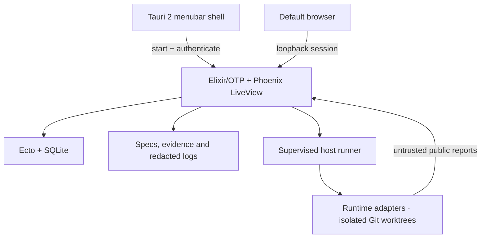

# Architecture

Target architecture, implemented incrementally. R010 provides the tray,
authenticated LiveView foundation, SQLite and metadata-only setup dispatcher.
R020a–d add the Codex version/inspection/authorization and fixed model-check adapter.
R030a adds saved default-team configuration; R040a adds Arena registration and
frozen team inheritance. Git operations, battles and the task runner below remain subsequent slices.

Current startup order: Repo → schema validation/migration → PubSub → shell
authority → durable dispatcher → loopback Endpoint → readiness message.
`Cuckoding.Foundation` owns idempotent setup commands and append-only events;
`Cuckoding.Dispatcher` executes their bounded claims; uncertain provider effects
are interrupted rather than automatically replayed. The shell owns
its release process group and storage lock. R020a adds an explicitly consented
Codex version child process. R020b can inspect a stable private profile through
a fixed native app-server helper. R020c adds managed login/logout with native
profile locking and no agent conversation. SQLite owns login lifecycle; a small
dispatcher-owned ETS table holds only the expiring provider URL. LiveView exposes
a session-protected local redirect, never the provider URL in its state.
R020d reuses the same ledger/helper for a separately consented, fixed model
diagnostic with private scratch permissions and a validated public receipt.
The single dispatcher serializes setup; parallel task execution is a later slice.
`Cuckoding.Team` commits configuration-only revisions and audit events directly in
SQLite transactions. It never queues a worker or expands grants. TeamLive and
HomeLive share the application layout and session boundary; live updates preserve
unsaved team edits while refreshing catalog observations.

`Cuckoding.Arenas` reuses the command ledger/dispatcher for a fixed native
`NSOpenPanel` helper, then commits confirmed registration directly in SQLite.
The chooser has a clean environment, its own process group, no child processes,
and exits on stdin loss/cancel or a two-minute deadline. Folder results do not
advance provider workspace revisions. Registration reads directory and `.git`
entry metadata only; it never runs Git or reads project contents. ArenaLive
previews the path and immutable team revision before confirmation.

## Components

```mermaid
flowchart TD
  Tray["Tauri 2 menubar shell"] -->|start + authenticate| App["Elixir/OTP + Phoenix LiveView"]
  Browser["Default browser"] -->|loopback session| App
  App --> DB["Ecto + SQLite"]
  App --> Files["Specs, evidence and redacted logs"]
  App --> Runner["Supervised host runner"]
  Runner --> Workers["Runtime adapters · isolated Git worktrees"]
  Workers -->|untrusted public reports| App
```

| Boundary | Responsibility |
| --- | --- |
| Tauri 2 tray shell, Rust | Bundle/start the release, one-time handshake, browser open, status, native folder picker and graceful Quit |
| Phoenix LiveView + HEEx + Tailwind | Forms, Tabula Gladiatorum, Tabula, task/log inspector, accessible controls |
| Domain contexts in Elixir | Agents, roles, Arenas, Tabulae, planning, battles, review and validated commands |
| OTP supervisors and workers | Execute/recover bounded jobs; never own the only copy of workflow state |
| Ecto + SQLite | Config revisions, snapshots, tasks, leases, command ledger, events and evidence index |
| Git service | Inspect/init with consent, worktrees, candidate provenance and serialized local integration |
| Runtime adapters | Runtime-specific authorization, model discovery, permissions, transport and normalized output |
| Runner | Owned host process groups, environment, cancellation, logs, ports and recovery |

Summa Rudis is an agent role invoked by the battle context. It is not the
scheduler, database or a privileged second control plane. Secutor is a distinct
review session. All agent-to-agent handoffs go through persisted host-validated
evidence; no peer sockets or direct database writes.

Use behaviours at replaceable boundaries: runtime adapter, runner, secret store,
and any implemented VCS host, metrics collector, plugin kind or knowledge backend.
Do not scaffold deferred subsystems or introduce a second queue/database. Start
with the OTP supervision tree needed by actual workers, one durable command
dispatcher and one common admission path for every launch.

## Durable effects

Accept UI actions and validated agent proposals as commands with stable keys and
expected revisions. In a short transaction, check authorization/state, write
command intent and an append-only event, update the projection, then commit.
Broadcast after commit. A dispatcher claims due commands by a TTL lease.

External process/Git effects cannot be made atomic with SQLite. Persist intent,
record verifiable process/ref/artifact identities, reconcile an uncertain result
before retry, and never promise exactly-once external execution. Repeated UI
submissions return the original command/result.

A lost browser reconnects from committed projections. A crashed worker is
replaced by supervision and durable reconciliation, not a recreated private
queue. A provider failure affects its work, not the app or every Arena.

## Packaging and extension limits

Bundle the Phoenix release and required runtimes/helpers with the thin shell.
Users should not install Elixir, Erlang, Rust or a database to run Cuckoding.
Agent CLIs remain separately discoverable/authorizable. Initial distribution:
macOS Apple Silicon. Pin toolchain and adapter versions when validating R010/R020;
previous pins and binaries are historical evidence only.

Use a provider's supported structured CLI/API or ACP when it satisfies the
required contract. ACP is a transport choice behind an adapter, not a prerequisite
for every runtime and not execution authority. Do not rebuild a general plugin
marketplace to connect four agent CLIs.

RTK and Ponytail are required engineering defaults and managed-role defaults.
The host validates underlying commands before wrapping compatible shell output;
machine-readable provider protocol bypasses filtering. See
[execution](EXECUTION_ENVIRONMENTS.md) and [adapters](AGENT_RUNTIME_ADAPTERS.md).

Markdown specifications and evidence live on disk with hashes/ownership in
SQLite. Basic scoped file reading and `rg` are sufficient; advanced knowledge
services are deferred. See [data](DB.md), [security](SECURITY.md) and
[workflow](FLOW.md) for the authoritative constraints.
