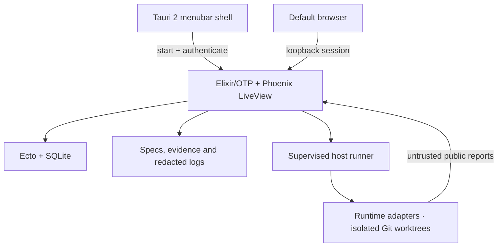

# Architecture

## Implemented boundary · reviewed 2026-10-08

Cuckoding currently delivers authenticated setup and draft planning. It does
**not** yet run battles, worktree task attempts, review loops or parallel workers.
The later sections describe the target architecture, not additional shipped code.

Startup: Repo → schema validation/migration → PubSub → shell authority →
durable dispatcher → loopback Endpoint → readiness message. SQLite is authoritative;
LiveView owns unsaved forms, not workflow progress. The native shell owns the
release process group and private storage lock.

| Current source | Responsibility and durable owner |
| --- | --- |
| `Foundation`, `Dispatcher`, `records.ex` | Idempotent commands, expiring claims, append-only events and setup projections in SQLite; one synchronous dispatcher executes bounded external operations |
| `ShellAuth`, web session guard | One-time shell/browser handoff and expiring DB sessions; stateful components must guard their own events |
| `Codex`, native `connection.rs` / `model_check.rs` | Private-profile authorization, model catalog, fixed diagnostic and structured no-tools planning; SQLite retains only normalized public receipts |
| `Team`, `TeamAssignments` | Immutable default revisions and confirmed scoped adoptions; no provider launch or permission grant |
| `Arenas`, native `folder.rs` | Native folder selection and confirmed directory identity; registration reads metadata only |
| `Tabulae` | Immutable default boards, revisioned Specs/ToDo drafts, acyclic prerequisites and proposal import provenance; delivery columns stay locked |
| `Planning`, `PlanningDocuments` | Freeze team/model/brief and optional selected text snapshots in commands; validate proposals before explicit draft import |
| `ProjectChecks` | Immutable Arena check declarations, explicit preview/consent and atomic command/revision/event saves; no executable resolution, filesystem access or execution |
| `Specifications`, `Storage` | Freeze accepted draft/prerequisite revisions, write private Markdown, verify artifact hash and atomically commit acceptance/history/ToDo; no execution authority |
| `ArenaGit`, `NativeHelper`, native `arena_git.rs` | Fixed inspect/init/initial-commit operations and descriptor-relative selected file reads; no remotes, hooks or arbitrary commands |

The dispatcher serializes setup, local previews and planning globally. This is a
known preview-stage capacity limit, not the future parallel scheduler. Pending
intent/cancellation remains usable through other DB connections. Expired external
operations become interrupted without replay; metadata discovery alone retries.
Login URLs are transient in dispatcher-owned ETS and a protected redirect; their
absence after restart does not invalidate historical authorization observations.

R040f reuses the native pinned-directory reader for up to four selected `.md`/`.txt`
files without running Git. A local `preview_documents` command stores exact text,
relative paths, byte counts and SHA-256; events omit content/paths/hashes. A
separately consented `plan_tabula` freezes the scoped, fresh preview reference and
text. The provider receives untrusted snapshots on stdin, under the unchanged
empty-scratch/no-tools grant; it never receives the Arena root. No new worker,
dependency or migration is introduced. See [Security](SECURITY.md) for limits.

R040g stores prerequisite IDs in existing immutable draft revision JSON. Current
tasks join their matching revision; save validates the current board graph inside
the immediate transaction before projection/history/event writes. No new table,
worker or scheduler is needed. The graph is loaded per save; query reachable
edges if board size makes this too costly.

R040h versions new proposals as `brief-plan-v2`. Task references use earlier
proposal indices; citations use frozen document indices. Elixir binds both to
the saved contract/request before persistence. Tabulae resolves prerequisite
indices through completed same-board import receipts in the existing transaction.
Original citations remain reachable through the import command after draft edits.
The native transport still uses the same no-tools scratch grant. No new migration.

R040i reuses commands as accepted-spec receipts. Preview generates literal Markdown
from saved task/prerequisite revisions and original citations. A consented command
persists intent before an exclusive private file write; completion hash-checks
the file and current revisions, then commits acceptance, draft history and ToDo
atomically. Missing/changed files cannot be downloaded. Later edits retain historical
artifacts; cancelled/interrupted writes do not replay. No new table or migration.

R040j adds `check_revisions` for explicit user-authored Arena checks. Its LiveView
editor previews literal argv, relative directories and timeouts before consent;
updates retain dirty input and clear stale approval. The existing command/event
transaction records configuration synchronously without entering the dispatcher.
Old Arenas begin with no approved checks. No arbitrary command runner is added.

Audit consequences: preserve these domain/host boundaries; extend execution
evidence before adding battles. The eight-migration schema has no
battle authorization, attempts, reviews,
worker leases or integration receipts. Required work remains in [Plan](PLAN.md),
including real-account acceptance; fixture responses do not close that gate.

## Target components

```mermaid
flowchart TD
  Tray["Tauri 2 menubar shell"] -->|start + authenticate| App["Elixir/OTP + Phoenix LiveView"]
  Browser["Default browser"] -->|loopback session| App
  App --> DB["Ecto + SQLite"]
  App --> Files["Specs, evidence and redacted logs"]
  App --> Runner["Supervised host runner"]
  Runner --> Workers["Runtime adapters · isolated Git worktrees"]
  Workers -->|untrusted public reports| App
```

| Boundary | Responsibility |
| --- | --- |
| Tauri 2 tray shell, Rust | Bundle/start the release, one-time handshake, browser open, status, native folder picker and graceful Quit |
| Phoenix LiveView + HEEx + Tailwind | Forms, Tabula Gladiatorum, Tabula, task/log inspector, accessible controls |
| Domain contexts in Elixir | Agents, roles, Arenas, Tabulae, planning, battles, review and validated commands |
| OTP supervisors and workers | Execute/recover bounded jobs; never own the only copy of workflow state |
| Ecto + SQLite | Config revisions, snapshots, tasks, leases, command ledger, events and evidence index |
| Git service | Inspect/init/first commit with separate consent, worktrees, candidate provenance and serialized local integration |
| Runtime adapters | Runtime-specific authorization, model discovery, permissions, transport and normalized output |
| Runner | Owned host process groups, environment, cancellation, logs, ports and recovery |

Summa Rudis is an agent role invoked by the battle context. It is not the
scheduler, database or a privileged second control plane. Secutor is a distinct
review session. All agent-to-agent handoffs go through persisted host-validated
evidence; no peer sockets or direct database writes.

Use behaviours at replaceable boundaries: runtime adapter, runner, secret store,
and any implemented VCS host, metrics collector, plugin kind or knowledge backend.
Do not scaffold deferred subsystems or introduce a second queue/database. Start
with the OTP supervision tree needed by actual workers, one durable command
dispatcher and one common admission path for every launch.

## Target durable effects

Accept UI actions and validated agent proposals as commands with stable keys and
expected revisions. In a short transaction, check authorization/state, write
command intent and an append-only event, update the projection, then commit.
Broadcast after commit. A dispatcher claims due commands by a TTL lease.

External process/Git effects cannot be made atomic with SQLite. Persist intent,
record verifiable process/ref/artifact identities, reconcile an uncertain result
before retry, and never promise exactly-once external execution. Repeated UI
submissions return the original command/result.

A lost browser reconnects from committed projections. A crashed worker is
replaced by supervision and durable reconciliation, not a recreated private
queue. A provider failure affects its work, not the app or every Arena.

## Packaging and extension limits

Bundle the Phoenix release and required runtimes/helpers with the thin shell.
Users should not install Elixir, Erlang, Rust or a database to run Cuckoding.
Agent CLIs remain separately discoverable/authorizable. Initial distribution:
macOS Apple Silicon. Pin toolchain and adapter versions when validating R010/R020;
previous pins and binaries are historical evidence only.

Use a provider's supported structured CLI/API or ACP when it satisfies the
required contract. ACP is a transport choice behind an adapter, not a prerequisite
for every runtime and not execution authority. Do not rebuild a general plugin
marketplace to connect four agent CLIs.

RTK and Ponytail are required engineering defaults and managed-role defaults.
The host validates underlying commands before wrapping compatible shell output;
machine-readable provider protocol bypasses filtering. See
[execution](EXECUTION_ENVIRONMENTS.md) and [adapters](AGENT_RUNTIME_ADAPTERS.md).

Markdown specifications and evidence live on disk with hashes/ownership in
SQLite. Basic scoped file reading and `rg` are sufficient; advanced knowledge
services are deferred. See [data](DB.md), [security](SECURITY.md) and
[workflow](FLOW.md) for the authoritative constraints.
