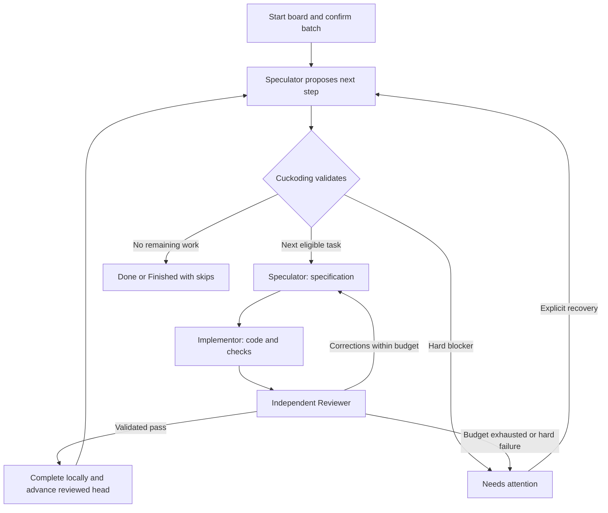

# Cuckoding Control: board development controller

Status: **Proposed; feature implementation is not complete.**
Source baseline: local main `caed0e7`, inspected on 2026-09-25.
Documentation delivery: [task 1048](../tasks/phase-10-hardening-beta/1048-cuckoding-control-plan.md)
and [worklog](../worklog/2026-09-25-1048-cuckoding-control-plan.md).

## 1. Goal and agreed decisions

Let a user start development of a board in one action, watch its assigned
Speculator coordinate tasks in priority order, and control execution until the
batch finishes or reaches a hard blocker. Cuckoding remains the authority for
state transitions, permissions, evidence validation, and process ownership.

| Decision | Agreed behavior |
| --- | --- |
| Start scope | Existing Draft and Ready delivery cards form a fixed batch after one preflight review. |
| Controller | The board's assigned Speculator actively proposes each next step; Cuckoding validates it. |
| Ordering | One delivery task at a time; dependencies first, then higher numeric priority, earlier creation time, and task ID. |
| Completion | The user explicitly authorizes automatic local completion at Start board; independent review and evidence remain required. |
| Code handoff | Each task uses an isolated worktree based on the previous task's reviewed commit. |
| Blockers | Halt the batch at the first hard blocker; ordinary review corrections and bounded transient retries may continue. |
| Skip | Exclude from this batch, preserve unfinished work, and continue independent tasks. |
| Visibility | Animated live progress, complete batch statistics, public evidence, and accessible pause/resume/stop/skip/retry controls. |

This document plans the feature. It does not mark it implemented, change existing
project settings, or authorize a remote release. Existing boards, runs, and
manual-completion defaults keep their historical contracts. A future Start board
records the user's completion choice for that batch and each admitted run.

## 2. Current implementation and gaps

The following is source inspection, not fresh runtime or real-provider evidence.
Use [PRODUCT.md](PRODUCT.md), [FLOW.md](FLOW.md), [ARCHITECTURE.md](ARCHITECTURE.md),
and [DB.md](DB.md) alongside these entry points. Older sections of
[AUTONOMOUS_PROJECT_FLOW.md](AUTONOMOUS_PROJECT_FLOW.md) describe earlier
baselines; do not copy their open-gap claims without checking current source.

| Existing foundation and source | Missing board-controller behavior |
| --- | --- |
| [ProjectAutopilot](../lib/cuckoding/project_autopilot.ex#L118) persists project operation state and repeatedly admits Ready delivery tasks across active boards. | A fixed board batch, active Speculator coordination, and exactly one delivery task owned by that batch. |
| [Scheduler](../lib/cuckoding/execution/scheduler.ex#L90) plans dependency-, priority-, capacity-, port-, and memory-aware admission. [Queued starts](../lib/cuckoding/project_autopilot.ex#L263) take a separate capacity path; [RunControl.admit](../lib/cuckoding/run_control.ex#L39) guards workspace admission. | One shared admission boundary for controller, prepared, manual, and automatic starts, with a durable board claim that none can bypass. |
| [WalkingSkeleton](../lib/cuckoding/walking_skeleton.ex#L87) runs Speculator, Implementor, custom roles, and Reviewer; passes task/specification evidence; and bounds review attempts. [Local completion](../lib/cuckoding/walking_skeleton.ex#L367) retains branches and evidence. | Coordination between tasks, batch-level stopping/settlement, and promotion of a reviewed commit to the next task's base. |
| [ProjectWorkflow.prepare_task](../lib/cuckoding/project_workflow.ex#L267) captures the project base. [GitService.prepare](../lib/cuckoding/execution/git_service.ex#L91) requires it to match the default branch. | Explicit provenance for a reviewed commit chain without relaxing ownership, protected-branch, or drift checks. |
| [RunControl](../lib/cuckoding/run_control.ex#L95) supports per-run and workspace pause/resume/stop. Project pause stops new admissions. A lower-level [BoardControl](../lib/cuckoding/execution/scheduler.ex#L453) delegates pause/hibernate. | A complete board-execution control contract, batch-only skip, observed control outcomes, and restart recovery. |
| [AgentFloor](../lib/cuckoding/agent_floor.ex#L21) limits session cards to 100 and operations to 50. Existing [accounting](../lib/cuckoding/telemetry/accounting.ex) and [resource metrics](../lib/cuckoding/telemetry/resource_metrics.ex) retain durable observations. | Whole-batch aggregates across every task, controller session, and retry, independent of visible list limits. |
| [Board motion](../assets/js/app.js#L91) uses a 200 ms native animation; LiveView already exposes board progress and activity history. | A coherent controller panel, next-task explanation, board controls, complete statistics, and stage handoff visualization. |

Reuse these components. Add neither a second workflow engine nor another UI
framework, provider abstraction, animation library, or metrics collector.

## 3. Start and execution contract

### Preflight and membership

**Start board** uses `ModalComponents.modal/1`. Show the included task count,
ordered queue, exclusions, assigned agents/models, current authorization,
budgets, dependencies, project revision, and explicit local-completion choice.
Use saved board roles; do not ask the user to select agents separately for every
task. Missing roles or authorization must have actionable recovery links.

Snapshot task requests, priorities, dependencies, workflow version, role
assignments/grants, trusted policy, plugins, budgets, and the initial project
revision when the user confirms. The snapshot defines the batch:

- Include existing Draft and Ready delivery cards. Exclude Done, Archived,
  Cancelled, and hidden planning/control tasks from membership.
- Existing Blocked or Failed work must be resolved or explicitly excluded at
  preflight. Conflicting prepared or active delivery runs prevent acquisition;
  starting a batch never silently adopts or cancels them.
- Reject an empty batch. Newly created cards wait for the next batch, and
  project autopilot cannot admit them on a board owned by this execution.
- Validate prerequisite membership or previously completed evidence. A
  prerequisite outside the batch must already be satisfied in the captured
  code base; excluded unfinished prerequisites are a visible preflight blocker.
- Draft cards become Ready through an audited transition immediately before
  authorized execution. This does not import unreviewed agent task proposals.

Recheck the reviewed snapshot at confirmation. Changes to a pending card or its
dependencies after start make its snapshot stale and require attention before
admission. A confirmed refresh while paused may update pending task content and
order, with an audit event and execution revision; it does not silently add new
members, expand grants, or rewrite past run snapshots.

### Controller decision loop

The assigned Speculator retains its read-only grant. Board coordination is an
additional responsibility, not a new authority to run host commands, approve
policy, change priority, or declare a task Done.

1. Cuckoding derives eligible pending tasks from the batch and durable state.
   Prerequisites constrain eligibility; order eligible tasks by descending
   priority, ascending creation time, then task ID, matching the current
   scheduler's within-board order.
2. At a decision boundary, Speculator receives the queue, public evidence,
   previous outcomes, remaining budgets, execution revision, and latest reviewed
   commit. It proposes starting the next task, reporting a blocker, or finishing.
3. Parse a bounded, closed structured result tied to that execution revision.
   Validate membership, order, prerequisites, current state, permissions, and
   capacity host-side before converting a proposal into a trusted command.
   Invalid output requires attention; stale output has no side effect and must
   be reconciled before another decision.
4. Admit one delivery task through the shared boundary. Run the existing
   Speculator → Implementor → Reviewer flow and snapshotted custom roles.
   Preserve task descriptions, specifications, reports, and independent review.
5. Reviewer corrections return to Speculator within the recorded attempt and
   budget limits. After validated passing review, complete locally and advance
   the reviewed head. Then request the next controller decision.
6. A hard blocker closes admission. When no work remains, derive Done or
   Finished with skips from durable membership outcomes, not the agent's text.

Controller invocations occur at start, completed-task handoff, or an explicit
recovery/control decision. Do not invoke a model on every dispatcher tick or
while a delivery task or capacity wait is already in progress. Controller work
uses finite policy budgets and the normal authorization/failure boundary.

Custom roles remain at their recorded insertion points even though the diagram
shows only the three default roles. Existing historical workflow routing is
not rewritten; incompatible legacy definitions require an explicit future-flow
update before the board starts under this contract.

## 4. Durable state, admission, and code handoff

### Persistence and commands

Add a `BoardExecution` aggregate and membership records containing the versioned
batch snapshot, linked runs/attempts, current item, reviewed head, control state,
revision, and outcomes. Keep append-only events for decisions and transitions.
Use a SQLite uniqueness constraint for one nonterminal execution per board;
pausing or requesting attention does not release that ownership.

Represent controller activity with a hidden `board_control` task/run, reusing
stage attempts, agent sessions, artifacts, accounting, and owned process control.
Exclude that task kind from delivery totals and ordinary task admission. An
active controller session consumes agent capacity, but an idle controller does
not consume a delivery slot. Do not keep an otherwise unused process alive
between decisions.

Expose context commands `start`, `pause`, `resume`, `stop`, `skip`, and `retry`.
Commands carry a stable idempotency key and expected execution revision. Return
an explicit accepted/rejected outcome, including the reason and current state.
Reuse the command/event ledger; no new public HTTP API is required.

Extend the existing supervised dispatcher and shared admission boundary:

- Recheck the batch claim, task/run state, dependency evidence, board/project/
  global limits, ports, memory, authorization, and workspace controls before
  starting controller or delivery execution. Prepared and manual runs cannot
  bypass these checks.
- Atomically reserve the next item and persist its command/event before launch.
  Use existing leases with TTL/heartbeat and reconciliation for abandoned work;
  keep external process/Git operations outside long SQLite transactions.
- Retain the claim during pending control operations. Mark side-effect outcomes
  durably and recover interrupted preparation/launch without a duplicate run.
- Persist before broadcasting. Workers and LiveViews reload authoritative state
  from SQLite; PubSub hints are not the queue or the command record.

Use forward migrations tested against a prior-schema copy. Existing tasks,
events, role grants, workflows, and completion defaults must remain intact. Record
an ADR before changing the control or Git ownership boundary.

### Reviewed commit chain

Capture a clean project base for the batch. Create the first task's isolated
worktree from that revision and each later worktree from the most recent
successfully reviewed commit, including successful independent tasks.

Retain both the original project revision and each task's execution base in
durable provenance and ownership checks. Do not simply remove GitService's
default-branch comparison: separate default-branch drift detection from the
explicitly authorized reviewed execution base. Resolve bases from trusted batch
records, never arbitrary model-provided Git refs.

Before advancing the batch head, validate the completed run's passing evidence,
candidate identity, clean worktree, ancestry, and protected-path decisions. Keep
the exact reviewed commit associated with its task and attempt. Each task's
change range begins at its own execution base; the final batch comparison begins
at the original project revision.

A Done task is a satisfied prerequisite only when its reviewed changes are
available in the next base. Missing code, a changed candidate, or Git drift
requires attention. Failed/skipped work never advances the head, and no recovery
silently resets, rebases, merges, or deletes a worktree.

The project default branch stays unchanged. Push, PR creation, merge, changed
execution policy, and global knowledge publication retain their separate human
approval boundaries. Follow [SECURITY.md](SECURITY.md) and
[EXECUTION_ENVIRONMENTS.md](EXECUTION_ENVIRONMENTS.md); the host runner is not a
sandbox, and controller instructions grant no new filesystem or credential access.

## 5. Controls, blockers, and recovery

Board controls affect this execution's controller and delivery work. Existing
workspace pause/stop remains authoritative; resuming the workspace must not
silently resume a board separately paused or stopped by the user.

| Control or display state | Contract |
| --- | --- |
| Pause | Close admission first, then safely pause the controller or active task; retain the board claim and show pending status until suspension is verified. |
| Resume | Revalidate authorization, ownership, policy, prerequisites, and capacity; restore the recorded wait reason where applicable. |
| Stop | Confirm and audit; close admission, stop owned execution, retain branches/worktrees/artifacts, and settle Stopped only after cleanup is verified. A stopped batch is historical; starting again requires a new reviewed batch. |
| Skip | Confirm the item and dependent impact; stop any active run safely, record a batch exclusion, preserve work, and continue independent pending tasks. |
| Retry | Explicitly create a new attempt for a failed/blocked item after cleanup and validation, retaining previous evidence. |
| Waiting | Show the capacity or bounded transient wait reason; do not repeatedly invoke Speculator. |
| Needs attention | Admission is closed; show the blocker, affected task, evidence, and recovery actions. |
| Done | Every included task completed successfully under the recorded policy. |
| Finished with skips | All remaining executable work finished, but skipped/deferred items remain visibly unfinished. |

These are board-execution controls and outcomes. Do not add `skipped` as a
replacement task lifecycle state or mark a skipped task Done. Use existing run
stop/cancellation semantics for active work and a separate batch exclusion.
Skipping an unstarted card leaves its task state unchanged. Descendants of a
skipped prerequisite are deferred for this batch with an explicit dependency
reason; neither skipped nor deferred work counts as completed.

Normal review corrections continue within the existing limits (currently three
review attempts in the default executor). Bounded transient retries may continue
under policy. Halt at the first authentication/permission requirement, exhausted
budget, invalid controller output, unrecoverable failure, or unsatisfied
dependency that prevents progress. A dependent waiting for a prerequisite still
pending in this batch is not itself a hard blocker. A hard-blocked task does not
silently permit unrelated work to continue; the user must resolve or skip it.

Record control intent separately from confirmed process outcomes. If suspension
or cleanup cannot be verified, keep admission closed, retain ownership, and show
Needs attention; do not claim Pause/Stop/Skip succeeded or start the next task.
Use verified PID/start identity and owned process groups, never raw process
arguments or indiscriminate process termination.

On restart or wake, reconcile recorded processes, worktrees, checkpoints,
leases, decisions, and incomplete commands before admitting anything. Resume
only where ownership and the runtime's checkpoint support can be established;
otherwise require attention with retained evidence. Sleep gaps are recorded and
reconciled, not treated as proof of a crash. Reopening the browser reconstructs
the same state without restarting work.

## 6. Dashboard, statistics, and motion

Extend the board with a controller panel and mirror its summary on the home
dashboard. Reuse Agent Floor, activity-history components, and inspectors;
follow [UI_DASHBOARD.md](UI_DASHBOARD.md).

| Area | Required information |
| --- | --- |
| Controller | Execution state, Speculator identity/runtime/model, public decision summary, last activity, remaining budget, and recovery reason. |
| Queue | Current/next task, priority, dependency eligibility, pending items, and skip/defer explanations. |
| Workflow | Speculator → Implementor → Reviewer, configured custom roles, correction loop, current owner, runtime, requested/observed model, and stage elapsed time. |
| Progress | Included, pending, active, completed, blocked, skipped, and deferred counts. Show paused/waiting detail without counting a task twice. |
| Time and attempts | Batch wall time, active stage time, pause/sleep intervals, per-task/stage attempts, review returns, and retries. Label summed work duration separately from elapsed batch time. |
| Usage and cost | Input/output/reasoning/cache token dimensions where reported, controller and delivery usage, and provider-reported or catalog-estimated cost by currency. |
| Resources | Measured CPU time, memory, owned process count, and ports, with sample freshness and unavailable intervals. |
| Evidence and controls | Specifications, reviews, tests, public logs, branches, worktrees, previews, and accessible Pause/Resume/Stop/Skip/Retry/Inspect actions. |

Aggregate all linked records in the batch, including controller sessions and
retries; never compute totals from the 50-run or 100-session display windows.
Use task membership once for progress and unique attempt/session/usage records
for work accounting. Preserve current token-dimension semantics rather than
summing overlapping cache/reasoning fields into invented totals. Keep currencies
separate and distinguish provider-reported cost from catalog estimates.

Missing measurements are unavailable, not zero. Label measured, reported,
estimated, partial, and stale values explicitly. Keep UTC timestamps and
monotonic measured durations; record pause and sleep gaps without double counting.
Do not fabricate per-agent completion percentages, forecasts, or hidden reasoning.

Persist normalized events before broadcast, coalesce refreshes, and use the
existing periodic durable refresh for timing/resources. Reuse the existing
200 ms native movement animation for committed task moves and role handoffs;
timer-only updates and chart refreshes do not move content for decoration.

Keep keyboard-focused cards stable, preserve entered text/disclosures/scroll
position, provide text/icon status beyond color, and offer a semantic table for
charts. Respect reduced motion and background tabs, cancel interrupted motion,
and provide non-drag alternatives for every state change. Reconnect must reload
state without replaying old events as new animation or duplicating commands.

## 7. Implementation tasks

All checkboxes below describe future implementation acceptance. Documentation
completion does not check them. Claim each implementation task separately and
record its exact verification commands/results in its own worklog. Follow
[REFERENCE_CODING.md](REFERENCE_CODING.md) before unfamiliar implementation and
the relevant repository skills, including security and quality gates.

### CTRL-01 — Contracts and persistence

Dependencies: none.

- [ ] Record the architecture decision and state/ownership contract; synchronize affected architecture, database, flow, and security documentation.
- [ ] Add BoardExecution, membership snapshots/outcomes, hidden board_control task kind, execution revision, and unique nonterminal board ownership.
- [ ] Reuse durable commands/events/leases and existing stage/session evidence; distinguish controller capacity from delivery capacity.
- [ ] Verify forward migration against a prior-schema copy, historical snapshot preservation, uniqueness, event ordering, and duplicate command behavior.

### CTRL-02 — Start-board preflight

Dependencies: CTRL-01.

- [ ] Add the reviewed Draft/Ready batch modal with ordered queue, explicit exclusions, saved roles/models, authorization, budgets, base revision, and local-completion consent.
- [ ] Reject empty/stale/conflicting batches and unresolved external prerequisites; preserve unreviewed proposal-import boundaries.
- [ ] Snapshot membership and policy; audit Draft-to-Ready transitions and any confirmed pending-snapshot refresh.
- [ ] Verify missing sign-in, unsupported roles, dirty/unborn base, pending edits, new cards, explicit exclusions, keyboard access, and actionable validation.

### CTRL-03 — Speculator controller and shared admission

Dependencies: CTRL-01, CTRL-02.

- [ ] Invoke the assigned read-only Speculator at bounded decision points using the existing runtime, stage, artifact, and failure infrastructure.
- [ ] Validate closed structured decisions, execution revision, membership, priority/dependencies, completion evidence, and effective grants host-side.
- [ ] Apply one admission boundary to controller, queued, manual, and autopilot paths; enforce exactly one delivery task and all resource/workspace limits.
- [ ] Verify concurrent ticks/clicks, forged/stale proposals, hidden-task exclusion, idle-controller capacity, transient waits, and durable dispatch failures.

### CTRL-04 — Reviewed commit handoff

Dependencies: CTRL-01, CTRL-03.

- [ ] Carry original project revision, per-task base, candidate identity, and reviewed head through Git preparation, ownership markers, inspection, and recovery.
- [ ] Advance only after validated review/local completion and clean, correctly related candidate evidence; preserve per-task and whole-batch change ranges.
- [ ] Verify a later task reads its prerequisite's code, skipped/failed code is absent, external prerequisite evidence is present, and drift/tampered evidence blocks progress.
- [ ] Verify the default branch is unchanged and no push, PR, merge, policy escalation, or automatic knowledge publication occurs.

### CTRL-05 — Controls and recovery

Dependencies: CTRL-03, CTRL-04.

- [ ] Implement board Pause/Resume/Stop/Skip/Retry with durable intent, confirmed outcomes, retained ownership during control, and existing workspace-control precedence.
- [ ] Halt at the first hard blocker; preserve bounded review/transient retries and distinguish Done, Finished with skips, and Stopped.
- [ ] Defer skipped prerequisites' descendants without marking them complete; retain branches, worktrees, previous attempts, and evidence.
- [ ] Verify controls during controller/delivery/stage-boundary execution, cleanup failure, restart, missing workers/checkpoints, sleep/wake, expired leases, and duplicate recovery.

### CTRL-06 — Dashboard and accounting

Dependencies: CTRL-01, CTRL-03, CTRL-05. Build against the established command/event contracts.

- [ ] Add the board controller panel and home summary with current/next task, public decisions, role/model/stage progress, controls, and evidence links.
- [ ] Aggregate the entire batch, including controller work/retries; define nonoverlapping progress counts and honest timing, token, cost, and resource provenance.
- [ ] Reuse LiveView and native 200 ms motion; preserve focus, input, disclosures, history position, reduced motion, and chart/table equivalence.
- [ ] Verify totals beyond existing display caps, duplicate usage events, missing/stale samples, partial cost coverage, narrow screens, keyboard controls, and reconnect.

### CTRL-07 — Integrated acceptance and documentation

Dependencies: CTRL-01, CTRL-02, CTRL-03, CTRL-04, CTRL-05, CTRL-06.

- [ ] Exercise the full board journey with deterministic adapters and explicit security, transition, migration, recovery, and process-ownership checks.
- [ ] Run focused tests, full relevant quality gates, browser motion checks, and rendered desktop/mobile/keyboard/reduced-motion acceptance.
- [ ] Synchronize PRODUCT, ARCHITECTURE, DB, FLOW, SECURITY, EXECUTION_ENVIRONMENTS, UI_DASHBOARD, AUTONOMOUS_PROJECT_FLOW, and TESTING claims where affected.
- [ ] Record real-provider, sleep/restart, and packaged-app acceptance separately from fixtures; retain explicit open gates and exact build/revision evidence.

Execution order: CTRL-01 → CTRL-02 → CTRL-03 → CTRL-04 → CTRL-05 → CTRL-06 → CTRL-07.
The dependency declarations above are authoritative; none of these tasks is
completed by creating this proposal.

## 8. Integrated verification checklist

- [ ] Mixed Draft/Ready tasks execute in dependency-aware priority order with exactly one delivery task active.
- [ ] Equal priorities have deterministic ordering; ordinary pending prerequisites do not cause a false hard blocker.
- [ ] Duplicate clicks, competing dispatchers, prepared runs, and manual starts cannot duplicate or bypass admission.
- [ ] Forged, stale, out-of-batch, out-of-order, or permission-expanding controller proposals cannot mutate trusted state.
- [ ] Reviewer corrections return through Speculator; exhausted limits halt the batch and retain evidence.
- [ ] A later task demonstrably sees an earlier task's reviewed code; failed/skipped code is absent and the default branch remains unchanged.
- [ ] Pause, Stop, Skip, and Retry work during controller execution, delivery, and stage boundaries; unconfirmed cleanup prevents the next launch.
- [ ] Skipped prerequisites defer descendants; skipped/deferred/cancelled/archived work is never mislabeled completed.
- [ ] Restart, sleep/wake, lost authorization, Git drift, stale snapshots, and uncertain process ownership preserve evidence and prevent unsafe launches.
- [ ] Statistics include every batch attempt without double counting and label unavailable, stale, partial, and estimated telemetry honestly.
- [ ] Desktop/mobile, keyboard-only, reduced-motion, focus/input/disclosure preservation, and reconnect checks pass.
- [ ] Prior-schema migration, focused regression suites, full relevant quality gates, and motion tests pass against the feature under test.
- [ ] Real-provider and packaged-app evidence is recorded independently of deterministic fixtures; open acceptance gates remain unchecked.

Implementation verification includes `rtk mix quality` and
`rtk node --test test/task_board_motion_test.cjs`, plus focused scheduler,
workflow, run-control, Git, migration/recovery, security, accounting, and LiveView
checks selected under [TESTING.md](TESTING.md). Process or packaging changes also
require their applicable native gates. Record exact commands, tested revision,
outcomes, and unavailable checks rather than treating this list as passing evidence.

For task 1048's documentation delivery, validate local links/source anchors,
current claims, task dependencies, checklist coverage, unchecked feature status,
and `rtk git diff --check`. Product tests, native builds, application restarts,
and provider runs are not evidence required for writing this proposal. Report
working-tree delivery, local main integration, remote publication, and running
build status separately.
