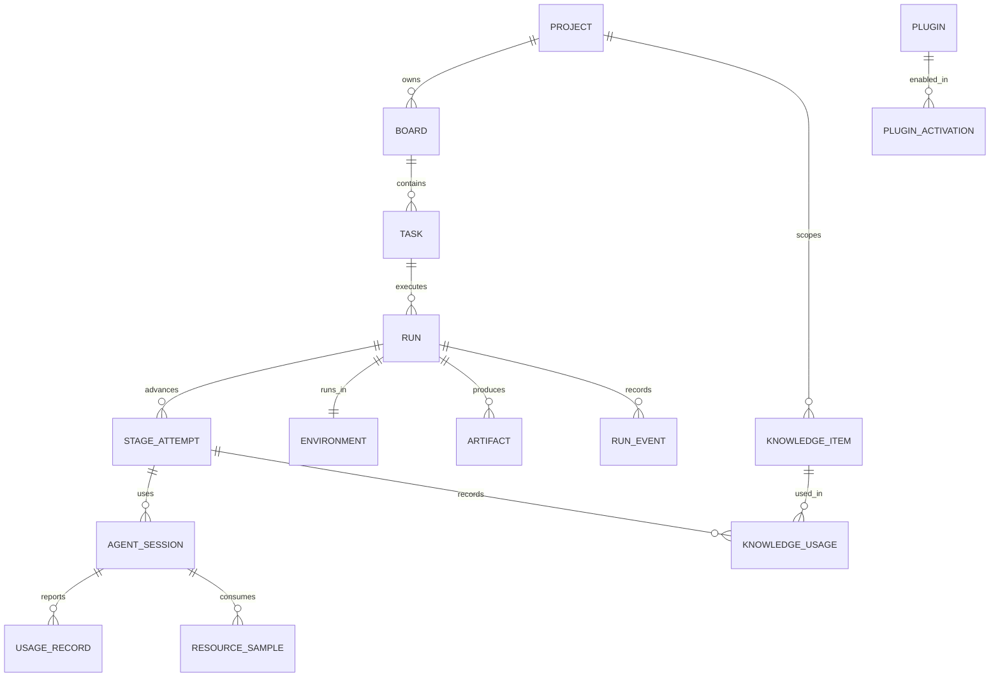

# Database Design

## Storage approach

Use SQLite through Ecto for the single-user local product. Configure WAL mode, foreign keys, a busy timeout, synchronous mode appropriate for desktop durability, and short transactions. Keep the schema portable enough that a future hosted control plane can move to PostgreSQL without changing domain semantics. Knowledge content lives in Markdown files; SQLite holds their index, provenance, and usage.

## Identity and conventions

- UUIDv7 identifiers generated by the application.
- UTC timestamps with microsecond precision; durations as integer milliseconds, stored twice where relevant: `active_ms` from the non-sleeping uptime clock and `wall_ms` from continuous elapsed time. UTC wall time labels events but is not used to infer sleep.
- Money as integer micros plus ISO currency.
- Hashes as lowercase hexadecimal with the algorithm named in a sibling field.
- Normalized enums as constrained strings.
- `created_at`, `updated_at`, and optimistic `lock_version` where concurrent edits are possible.
- JSON only for provider-specific payloads, snapshots, and flexible evidence; queryable business fields remain columns.

## Core entities

## Tables

### Configuration and identity

| Table | Important fields | Notes |
| --- | --- | --- |
| `projects` | `id`, `name`, `description`, `repo_path`, `default_branch`, `workspace_root`, `port_range_start`, `port_range_end`, `status` | Local repository registration |
| `project_config_versions` | `project_id`, `revision`, `source_hash`, `config_json`, `trusted_at` | Immutable policy/config snapshots |
| `boards` | `project_id`, `name`, `description`, `workflow_version_id`, `status`, `concurrency_limit`, `unattended_until` | Multiple independent processes per project |
| `workflow_versions` | `project_id?`, `name`, `version`, `definition_json`, `published_at` | Immutable once used by a run |
| `role_assignments` | `board_id`, `role_key`, `adapter_key`, `model_ref`, `settings_json` | Board defaults; run snapshot is separate |
| `provider_accounts` | `adapter_key`, `label`, `auth_mode`, `status`, `capabilities_json`, `probed_at` | Runtime auth is observed, never stored |
| `secret_access_audits` | `secret_ref`, `purpose`, `run_id?`, `occurred_at` | Opaque reference-use audit; never stores the value |
| `plugins` | `key`, `kind`, `version`, `manifest_hash`, `manifest_json`, `health`, `detected_at`, `last_error` | Registry state |
| `plugin_activations` | `plugin_id`, `scope_type`, `scope_id`, `enabled`, `config_json`, `approved_by`, `approved_at` | Per-scope enablement with audit |

### Work management

| Table | Important fields | Notes |
| --- | --- | --- |
| `tasks` | `board_id`, `title`, `description`, `priority`, `position`, `state`, `wait_reason`, `active_run_id` | Kanban card and user intent |
| `task_dependencies` | `task_id`, `depends_on_task_id`, `kind` | Prevent cycles at write time |
| `task_comments` | `task_id`, `author_kind`, `body`, `created_at` | User and public agent notes |
| `runs` | `task_id`, `sequence`, `state`, `wait_reason`, `workflow_snapshot_json`, `policy_snapshot_id`, `plugin_snapshot_json`, `branch`, `base_sha` | One task may have retries or replacements; workflow and roles are copied from the immutable board version |
| `stage_attempts` | `run_id`, `stage_key`, `attempt`, `state`, `role_key`, `role_kind`, `started_at`, `finished_at`, `active_ms`, `wall_ms`, `checkpoint_json` | Immutable attempt history plus current state; checkpoint replacement is projected in the same transaction as `stage.checkpointed` |
| `approvals` | `run_id`, `stage_attempt_id?`, `kind`, `decision`, `actor`, `reason`, `decided_at` | Trust-boundary evidence; protected-path approvals include the exact sorted change-set digest in `kind` |
| `findings` | `run_id`, `stage_attempt_id`, `severity`, `category`, `status`, `summary`, `evidence_json` | Review and QA findings |

### Execution

| Table | Important fields | Notes |
| --- | --- | --- |
| `environments` | `run_id`, `runner_key`, `kind` (`local_process` / `container` / `remote`), `worktree_path`, `run_dir`, `base_sha`, `head_sha`, `port`, `ports_json`, `preview_url`, `isolation_claims_json`, `state` | One active owner per worktree and run directory; the scalar port is the MVP ownership key and its preview URL must match the allocated loopback port |
| `processes` | `environment_id`, `agent_session_id?`, `command_id?`, `pid`, `pgid`, `start_identity`, `role`, `state`, `exit_code`, `ended_at` | Recorded external process identity; exit status and end time are durable before the worker retires |
| `agent_sessions` | `stage_attempt_id`, `adapter_key`, `runtime_version`, `requested_model`, `actual_model`, `external_session_id`, `effective_grant_json`, `state` | Requested and observed model kept separately; null actual model means not reported; effective grant records requested, enforced, and unenforced fields |
| `leases` | `resource_type`, `resource_id`, `owner_id`, `token_hash`, `acquired_at`, `heartbeat_at`, `expires_at`, `released_at`, `release_reason` | One unreleased lease per resource; raw bearer tokens are returned once and never persisted |
| `commands` | `idempotency_key`, `kind`, `target_type`, `target_id`, `payload`, `state`, `attempts`, `max_attempts`, `not_before`, `last_error`, `result` | Durable side-effect dispatch; duplicate keys return the original row/result |
| `power_events` | `kind` (`assertion_on` / `assertion_off` / `sleep_gap` / `wake_reconciled` / `unattended_on` / `unattended_off`), `gap_ms`, `affected_runs_json`, `metadata_json`, `occurred_at` | Append-only power timeline; measured gaps are positive milliseconds and assertion metadata contains no capability-bearing value |

### Evidence and observability

| Table | Important fields | Notes |
| --- | --- | --- |
| `run_event_sequences` | `run_id`, `last_sequence` | Transactional allocator for gapless per-run event sequence numbers |
| `run_events` | `run_id`, `sequence`, `event_type`, `public_summary`, `payload`, `occurred_at` | Append-only and strictly sequenced per stream; standalone board/task transitions use `board:<uuid>` / `task:<uuid>`. The redacted payload carries the nullable project → board → task → run → stage-attempt → agent-session correlation chain. |
| `artifacts` | `run_id`, `stage_attempt_id?`, `kind`, `path_or_uri`, `sha256`, `metadata_json` | Specs, patches, logs, test reports, reviews |
| `usage_records` | `agent_session_id`, `event_key_hash`, `provider`, `model`, token dimensions, `source`, `confidence`, `billing_mode`, `cost_micros`, `currency`, `cost_source`, `cost_confidence`, `price_catalog_version_id?`, `formula_json?`, `occurred_at` | Append-only idempotent usage fact; provider usage provenance stays separate from reported, catalog-estimated, or unavailable cost provenance |
| `resource_samples` | `agent_session_id`, `process_id`, `cpu_nanos`, `memory_bytes`, `process_count`, `open_ports_json`, `sampled_at`, `limits_enforced` | Measured host process-group samples; missing intervals have no row and host limits are false/unenforced |
| `optimization_records` | `run_id`, `plugin_key`, `kind`, `raw_units`, `optimized_units`, `saved_units`, `source`, `confidence`, `estimation_method`, `metadata_json`, `recorded_at` | Append-only plugin-reported claim, always separate from usage and cost |
| `metric_rollups` | `scope_type`, `scope_id`, `window`, `bucket_start`, `sample_count`, CPU/RSS/process/port aggregates, `active_ms?`, `wall_ms?`, `limits_enforced`, `computed_at` | Replaceable one-minute/session and stage projections; timing is populated only from durable stage counters, never interpolated from sample gaps |
| `price_catalog_versions` | `provider`, `version`, `effective_from`, `source_uri`, `catalog_json` | Immutable integer-micros rates required for reproducible estimated cost |

### Knowledge

| Table | Important fields | Notes |
| --- | --- | --- |
| `knowledge_items` | `scope`, `project_id?`, `kind`, `title`, `file_path`, `content_hash`, `observed_hash?`, `sync_state`, `revision_source`, `status`, `version`, `confidence`, `valid_from`, `invalid_at`, `supersedes_id`, `triggers_json`, `evidence_json`, `produced_by_json`, `review_json`, `reviewed_by`, `reviewed_at` | Mirror of Markdown front matter; file is the content; observed mismatch never overwrites accepted metadata |
| `knowledge_candidates` | `extraction_job_id`, `project_id`, `kind`, `operation` (`add` / `update` / `supersede` / `noop`), `target_item_id?`, `title`, `content`, `confidence`, `evidence_json`, `redaction_state`, `decision` | Reviewed before becoming items |
| `knowledge_jobs` | `kind` (`extract` / `consolidate` / `publish`), `scope_type`, `scope_id`, `state`, `runtime`, `policy_version`, `input_budget`, `started_at`, `finished_at`, `summary_json` | Non-destructive, resumable |
| `knowledge_usages` | `knowledge_item_id`, `item_version`, `run_id`, `stage_attempt_id`, `kind` (`injected` / `retrieved` / `cited` / `accepted` / `contradicted`), `evidence_json`, `occurred_at` | Feeds lineage and usage views |
| `skill_packages` | `knowledge_item_id`, `name`, `version`, `manifest_json`, `content_hash`, `published_at` | Approved `SKILL.md` output with provenance |
| `knowledge_retrievals` | `run_id`, `stage_attempt_id`, `backend_key`, `namespace`, `query_hash`, `hit_count`, `context_bytes`, `selected_ids_json` | Retrieval audit without storing secrets in query text |

## State integrity

- Domain rows are created through context commands that assign UUIDv7 identifiers; creation changesets do not accept lifecycle state fields.
- Dependency insertion runs in an immediate transaction and rejects self-links, cross-board links, duplicate edges, and transitive cycles with a recursive query.
- Only domain command functions update `runs`, `stage_attempts`, `tasks`, or `boards` state.
- A state transition and its `run_events` row are written in the same transaction.
- Transition commands persist explicit accepted or rejected results under their idempotency key. Replays return that original result without updating projections or appending another event.
- Command rows commit before dispatch begins. Claims increment `attempts`; failures return to `pending` with exponential `not_before` backoff until `max_attempts`, then become terminal `failed` rows.
- Application startup performs one recovery pass: interrupted `running` claims return to `pending`, then due commands replay through the configured top-level handler.
- A handler always receives the stable command idempotency key. Replay is exactly once inside Cuckoding's command ledger; an external integration must honor that key because a process can stop after an external side effect but before its result is persisted.
- Constraints prevent two active attempts for the same run and stage, two active environments per run, and two active allocations of the same port.
- A partial unique index prevents more than one unreleased lease for an exclusive resource. Acquisition first closes an expired row in the same immediate transaction, so a new owner can recover the resource without a race.
- Preview allocation additionally uses the environment active-port unique index. The durable lease stores `tcp:127.0.0.1:<port>` and its owner, while the bearer token exists only in the supervised allocation handle.
- The Power Manager must call the lease sleep-gap hook before expiry reconciliation. Only leases alive when the measured gap began are extended; the hook emits correlated telemetry with `kind: sleep_gap`.
- Artifact and knowledge files are content-addressed or hash-verified before being referenced; a mismatch between file and index is flagged, never silently resolved.
- Secret values remain in the configured `SecretStore`; SQLite stores opaque references and value-free access audits only.
- A run snapshots workflow, role assignment, policy, plugin versions, and relevant prices so history remains explainable.
- Published workflow versions and project configuration versions are immutable. Run creation copies the board's workflow definition and ordered role assignments, and accepts only a trusted policy version owned by the same project.
- Approval decisions are atomically single-use and append an audit event in the same transaction. A protected-path approval authorizes only its run, stage attempt, and path-set digest; a changed set cannot reuse it.

## Retention

- Workflow events, approvals, knowledge provenance and usage, and aggregate usage are retained by default.
- High-frequency resource samples are downsampled after 7 days and removable after 30 days, subject to user settings.
- Raw command output follows configurable size and age limits; redaction happens before persistence.
- Deleting a project is a confirmed, recoverable archive action first. Permanent deletion enumerates database rows, worktrees, run folders, processes, artifacts, and knowledge files before removal.

## Migration policy

- Every migration has a forward data strategy and a clean-install test.
- Released migrations are never edited in place.
- The updater creates a database backup and a knowledge-folder snapshot before migration.
- Migrations that transform large event tables run in bounded batches and expose progress.
- Startup failure after migration offers restore instructions and never silently creates a new empty database.
