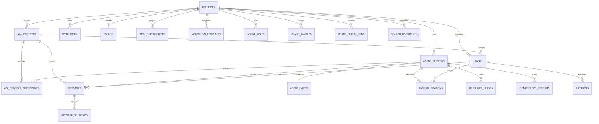

# Database Design

## 1. Purpose

AgentDesk uses SQLite through Ecto as the canonical durable state store. The schema is optimized for a local desktop application with several concurrent provider processes and a built-in internal A2A coordination layer, not for a multi-node SaaS deployment.

XERJ, Markdown snapshots, PubSub, and provider transcript files are projections or supporting artifacts. None may replace SQLite for authoritative Agent Cards, A2A contexts, tasks, delegations, messages, deliveries, artifacts, leases, sessions, worktree state, merge-queue items, roles, usage samples, or workflow templates.

## 2. SQLite operating policy

- Enable WAL mode.
- Enable foreign keys for every connection.
- Set an explicit busy timeout.
- Keep write transactions short.
- Serialize high-contention project operations through their owning GenServer.
- Use UTC microsecond timestamps.
- Use UUID text primary keys for domain entities.
- Prefer explicit status strings backed by Ecto enums or validated changesets.
- Run migrations before starting project runtimes.
- Back up before any destructive or irreversible migration.

Recommended initial database settings must be verified against the selected Ecto SQLite adapter during Phase 0:

```text
journal_mode = WAL
foreign_keys = ON
busy_timeout = 5000
synchronous = NORMAL
```

## 3. Entity relationship model



Additional relationships are implemented with nullable foreign keys where an event or message is project-wide.

## 4. Tables

### `projects`

| Column | Type | Rules |
| --- | --- | --- |
| `id` | UUID/text | Primary key |
| `name` | text | Required |
| `root_path` | text | Required, normalized absolute path |
| `canonical_path` | text | Required, resolved path, unique |
| `vcs_type` | text | Initially `git` |
| `default_branch` | text | Nullable until detected |
| `settings` | JSON/text | Includes `sync_id` after the first team-sync export |
| `last_opened_at` | UTC datetime_usec | Nullable |
| `open` | boolean | True while the project runtime should be restored on boot |
| `inserted_at` | UTC datetime_usec | Required |
| `updated_at` | UTC datetime_usec | Required |

Indexes:

- unique `canonical_path`;
- `last_opened_at DESC`;
- `open`.

### `a2a_contexts`

Groups related tasks, messages, delegations, and artifacts across provider sessions. It is independent of any provider thread ID.

| Column | Type | Rules |
| --- | --- | --- |
| `id` | UUID/text | Primary key |
| `project_id` | UUID/text | Required FK |
| `title` | text | Required, bounded |
| `status` | text | `active`, `completed`, `cancelled`, `archived` |
| `created_by_type` | text | `user`, `agent`, `system` |
| `created_by_agent_id` | UUID/text | Nullable FK |
| `metadata` | JSON/text | Validated bounded object |
| `inserted_at` | UTC datetime_usec | Required |
| `updated_at` | UTC datetime_usec | Required |

Indexes:

- `(project_id, status, updated_at)`.

### `a2a_context_participants`

Explicit context membership used for authorization and scoped fan-out.

| Column | Type | Rules |
| --- | --- | --- |
| `id` | UUID/text | Primary key |
| `context_id` | UUID/text | Required FK |
| `agent_session_id` | UUID/text | Required FK |
| `role` | text | `owner`, `participant`, `reviewer`, `observer` |
| `joined_at` | UTC datetime_usec | Required |
| `left_at` | UTC datetime_usec | Nullable |
| `inserted_at` | UTC datetime_usec | Required |
| `updated_at` | UTC datetime_usec | Required |

Indexes:

- unique active `(context_id, agent_session_id)`;
- `(agent_session_id, left_at)`.

### `tasks`

| Column | Type | Rules |
| --- | --- | --- |
| `id` | UUID/text | Primary key |
| `project_id` | UUID/text | Required FK |
| `context_id` | UUID/text | Required FK to `a2a_contexts` |
| `parent_task_id` | UUID/text | Nullable self-FK |
| `title` | text | Required |
| `description` | text | Required, may be empty |
| `status` | text | `queued`, `assigned`, `working`, `input_required`, `auth_required`, `blocked`, `review`, `completed`, `failed`, `cancelled`, `rejected` |
| `status_reason` | text | Nullable, bounded, redacted |
| `lock_version` | integer | Required optimistic transition version, default `1` |
| `priority` | integer | Default `0` |
| `assigned_agent_id` | UUID/text | Nullable FK to agent session |
| `created_by` | text | `user`, `agent`, `system` |
| `metadata` | JSON/text | Validated bounded object |
| `started_at` | UTC datetime_usec | Nullable |
| `completed_at` | UTC datetime_usec | Nullable |
| `inserted_at` | UTC datetime_usec | Required |
| `updated_at` | UTC datetime_usec | Required |

Indexes:

- `(project_id, status, priority)`;
- `(context_id, status, priority)`;
- `(assigned_agent_id, status)`;
- `parent_task_id`.

### `task_dependencies`

| Column | Type | Rules |
| --- | --- | --- |
| `id` | UUID/text | Primary key |
| `project_id` | UUID/text | Required FK |
| `task_id` | UUID/text | Dependent task FK |
| `depends_on_id` | UUID/text | Prerequisite task FK |
| `inserted_at` | UTC datetime_usec | Required |

Unique `(task_id, depends_on_id)`. Cycles are rejected in `A2A.Graph`, not by a database constraint.

### `agent_roles`

Project-scoped role templates. Prompt bodies are session-private.

| Column | Type | Rules |
| --- | --- | --- |
| `id` | UUID/text | Primary key |
| `project_id` | UUID/text | Required FK |
| `name` | text | Required, unique per project, `[a-z0-9][a-z0-9_-]*` |
| `description` | text | Safe Agent Card description, max 500 |
| `prompt` | text | Session-only template, max 8000; never copied to cards or MCP lists |
| `permission_profile` | text | `default`, `observer`, or `restricted` |
| `skills` | JSON/text | Optional skill descriptors |
| `inserted_at` | UTC datetime_usec | Required |
| `updated_at` | UTC datetime_usec | Required |

Indexes:

- unique `(project_id, name)`.

### `usage_samples`

Rebuildable token/cost ledger from normalized provider `:usage` events.

| Column | Type | Rules |
| --- | --- | --- |
| `id` | UUID/text | Primary key |
| `project_id` | UUID/text | Required FK |
| `agent_session_id` | UUID/text | Required FK |
| `input_tokens` | integer | Required, `>= 0` |
| `output_tokens` | integer | Required, `>= 0` |
| `total_tokens` | integer | Required, `>= 0` |
| `cost_cents` | integer | Nullable, never float |
| `model` | text | Nullable, bounded |
| `inserted_at` | UTC datetime_usec | Required |
| `updated_at` | UTC datetime_usec | Required |

Indexes:

- `(project_id, inserted_at)`;
- `(agent_session_id, inserted_at)`.

### `workflow_templates`

| Column | Type | Rules |
| --- | --- | --- |
| `id` | UUID/text | Primary key |
| `project_id` | UUID/text | Required FK |
| `name` | text | Required |
| `description` | text | May be empty |
| `definition` | JSON/text | `%{"steps" => [%{"key", "title", "depends_on"}]}` , max 20 steps |
| `inserted_at` | UTC datetime_usec | Required |
| `updated_at` | UTC datetime_usec | Required |

### `agent_sessions`

| Column | Type | Rules |
| --- | --- | --- |
| `id` | UUID/text | Primary key |
| `project_id` | UUID/text | Required FK |
| `provider` | text | `codex`, `claude`, `cursor`, `opencode`, or registered adapter key |
| `display_name` | text | Required |
| `role` | text | Nullable user-defined role name |
| `settings` | JSON/text | Includes `tab_open`, `permission_profile`, `role_id` |
| `status` | text | See session state machine |
| `provider_session_id` | text | Nullable, encrypted only if provider treats it as sensitive |
| `provider_version` | text | Nullable |
| `process_identity` | JSON/text | PID/start token metadata; never assumed valid after restart |
| `capability_hash` | binary/text | Hash only; never store raw token |
| `capability_expires_at` | UTC datetime_usec | Nullable |
| `last_heartbeat_at` | UTC datetime_usec | Nullable |
| `started_at` | UTC datetime_usec | Nullable |
| `ended_at` | UTC datetime_usec | Nullable |
| `exit_reason` | text | Redacted/bounded |
| `inserted_at` | UTC datetime_usec | Required |
| `updated_at` | UTC datetime_usec | Required |

Allowed statuses:

```text
queued, starting, idle, working, waiting, blocked,
completed, failed, interrupted, terminating, terminated
```

Indexes:

- `(project_id, status)`;
- `(provider, provider_session_id)`;

The current task is derived from active `tasks.assigned_agent_id` rows. The current worktree is derived from `worktrees.agent_session_id`. Avoiding reciprocal foreign keys keeps the SQLite schema and migrations simpler.

### `agent_cards`

Project-scoped internal capability cards. They are safe discovery metadata, not provider credentials or hidden prompts.

| Column | Type | Rules |
| --- | --- | --- |
| `id` | UUID/text | Primary key |
| `project_id` | UUID/text | Required FK |
| `agent_session_id` | UUID/text | Required FK, unique |
| `revision` | integer | Required, monotonically increasing |
| `name` | text | Required, bounded |
| `description` | text | Required, bounded |
| `skills` | JSON/text | Validated bounded array of safe skill descriptors |
| `input_modes` | JSON/text | Bounded MIME/media-type list |
| `output_modes` | JSON/text | Bounded MIME/media-type list |
| `features` | JSON/text | Validated internal A2A capability flags |
| `availability` | text | `offline`, `starting`, `idle`, `busy`, `blocked`, `draining` |
| `published_at` | UTC datetime_usec | Required |
| `inserted_at` | UTC datetime_usec | Required |
| `updated_at` | UTC datetime_usec | Required |

Indexes:

- unique `agent_session_id`;
- `(project_id, availability)`;
- `(project_id, updated_at)`.

### `task_delegations`

Records assignment proposals separately from tasks so acceptance, rejection, expiry, revocation, and reassignment are auditable.

| Column | Type | Rules |
| --- | --- | --- |
| `id` | UUID/text | Primary key |
| `project_id` | UUID/text | Required FK |
| `context_id` | UUID/text | Required FK |
| `task_id` | UUID/text | Required FK |
| `from_agent_id` | UUID/text | Nullable FK; null for user/system |
| `to_agent_id` | UUID/text | Required FK |
| `status` | text | `proposed`, `accepted`, `rejected`, `expired`, `revoked` |
| `reason` | text | Required, bounded instructions or rationale |
| `response_reason` | text | Nullable, bounded |
| `request_message_id` | UUID/text | Nullable FK |
| `response_message_id` | UUID/text | Nullable FK |
| `idempotency_key` | text | Required |
| `lock_version` | integer | Required, default `1` |
| `expires_at` | UTC datetime_usec | Nullable |
| `responded_at` | UTC datetime_usec | Nullable |
| `inserted_at` | UTC datetime_usec | Required |
| `updated_at` | UTC datetime_usec | Required |

Indexes:

- unique `(from_agent_id, idempotency_key)` when sender is present;
- `(to_agent_id, status, inserted_at)`;
- `(task_id, status)`;
- `(status, expires_at)`.

Accepting a delegation and updating `tasks.assigned_agent_id/status/lock_version` occur in one transaction. At most one accepted active delegation may assign a task at a time.

### `worktrees`

| Column | Type | Rules |
| --- | --- | --- |
| `id` | UUID/text | Primary key |
| `project_id` | UUID/text | Required FK |
| `agent_session_id` | UUID/text | Nullable FK, unique while active |
| `path` | text | Required normalized absolute path |
| `branch_name` | text | Required |
| `base_commit` | text | Required Git object ID |
| `head_commit` | text | Nullable |
| `status` | text | `creating`, `ready`, `dirty`, `handed_off`, `conflicted`, `stale`, `removing`, `removed` |
| `app_owned` | boolean | Must be true before automated cleanup |
| `last_scanned_at` | UTC datetime_usec | Nullable |
| `inserted_at` | UTC datetime_usec | Required |
| `updated_at` | UTC datetime_usec | Required |

Indexes:

- unique `path`;
- unique `(project_id, branch_name)`;
- `(project_id, status)`.

### `resource_leases`

| Column | Type | Rules |
| --- | --- | --- |
| `id` | UUID/text | Primary key |
| `project_id` | UUID/text | Required FK |
| `agent_session_id` | UUID/text | Required FK |
| `resource_type` | text | `file`, `directory`, `glob`, `database`, `migration`, `service`, `port`, `git_ref`, `custom` |
| `resource_key` | text | Canonical resource identifier |
| `mode` | text | `shared` or `exclusive` |
| `status` | text | `active`, `released`, `expired`, `revoked` |
| `reason` | text | Required, bounded |
| `acquired_at` | UTC datetime_usec | Required |
| `renewed_at` | UTC datetime_usec | Required |
| `expires_at` | UTC datetime_usec | Required |
| `released_at` | UTC datetime_usec | Nullable |
| `metadata` | JSON/text | Bounded |
| `inserted_at` | UTC datetime_usec | Required |
| `updated_at` | UTC datetime_usec | Required |

Indexes:

- `(project_id, resource_type, resource_key, status)`;
- `(agent_session_id, status)`;
- `(status, expires_at)`;
- partial unique index for active exact exclusive named resources where supported.

Important: parent/child path overlap and shared/exclusive compatibility are evaluated by `ResourceManager` inside a transaction. A simple unique index cannot detect `lib/app` overlapping `lib/app/user.ex`.

### `messages`

| Column | Type | Rules |
| --- | --- | --- |
| `id` | UUID/text | Primary key |
| `project_id` | UUID/text | Required FK |
| `context_id` | UUID/text | Required FK |
| `task_id` | UUID/text | Nullable FK |
| `sender_agent_id` | UUID/text | Nullable FK; null for user/system |
| `recipient_agent_id` | UUID/text | Nullable FK |
| `scope` | text | `direct`, `task`, `context`, `project`, `system` |
| `kind` | text | `info`, `request`, `response`, `warning`, `handoff`, `coordination` |
| `body` | text | Nullable bounded text projection for display/search |
| `parts` | JSON/text | Required validated array of `text`, `data`, `artifact_ref`, or approved `file_ref` wrappers |
| `priority` | text | `low`, `normal`, `high`, `urgent` |
| `requires_ack` | boolean | Required, default true for direct/task/context messages |
| `metadata` | JSON/text | Bounded structured data |
| `idempotency_key` | text | Required for mutating agent calls |
| `correlation_id` | UUID/text | Required |
| `causation_id` | UUID/text | Nullable |
| `reply_to_message_id` | UUID/text | Nullable self-FK |
| `expires_at` | UTC datetime_usec | Nullable |
| `inserted_at` | UTC datetime_usec | Required |

Validation:

- `direct` requires `recipient_agent_id`;
- `task` requires `task_id`;
- `context` requires `context_id` and active participant authorization;
- `project` must not require a recipient;
- `system` may have no sender;
- `artifact_ref` must resolve to an authorized artifact in the same project;
- `file_ref` must be project-relative or app-managed and must never contain an arbitrary remote URL.

Indexes:

- `(project_id, inserted_at)`;
- `(context_id, inserted_at)`;
- `(recipient_agent_id, inserted_at)`;
- `(task_id, inserted_at)`;
- `correlation_id`;
- unique `(sender_agent_id, idempotency_key)` when sender is present.

### `message_deliveries`

Tracks per-recipient consumption without mutating the message.

| Column | Type | Rules |
| --- | --- | --- |
| `id` | UUID/text | Primary key |
| `message_id` | UUID/text | Required FK |
| `agent_session_id` | UUID/text | Required FK |
| `inbox_sequence` | integer | Required, monotonically increasing per recipient |
| `state` | text | `pending`, `injected`, `acknowledged`, `expired`, `skipped` |
| `attempt_count` | integer | Required, default `0` |
| `last_error` | text | Nullable, bounded and redacted |
| `injected_at` | UTC datetime_usec | Nullable |
| `acknowledged_at` | UTC datetime_usec | Nullable |
| `inserted_at` | UTC datetime_usec | Required |
| `updated_at` | UTC datetime_usec | Required |

Indexes:

- unique `(message_id, agent_session_id)`;
- unique `(agent_session_id, inbox_sequence)`;
- `(agent_session_id, state, inbox_sequence)`.

### `idempotency_records`

Stores bounded replay results for mutating internal A2A operations.

| Column | Type | Rules |
| --- | --- | --- |
| `id` | UUID/text | Primary key |
| `project_id` | UUID/text | Required FK |
| `agent_session_id` | UUID/text | Required FK |
| `idempotency_key` | text | Required |
| `operation` | text | Required stable operation name |
| `request_hash` | text | Required SHA-256 of canonical validated input |
| `result_status` | text | `succeeded`, `failed` |
| `result_payload` | JSON/text | Bounded, redacted replay result |
| `expires_at` | UTC datetime_usec | Required |
| `inserted_at` | UTC datetime_usec | Required |

Indexes:

- unique `(agent_session_id, idempotency_key)`;
- `(expires_at)`.

Reusing a key with the same request returns the stored result. Reusing it with a different request hash returns `idempotency_conflict`.

### `events`

Append-only normalized activity and audit timeline.

| Column | Type | Rules |
| --- | --- | --- |
| `id` | UUID/text | Primary key |
| `project_id` | UUID/text | Required FK |
| `agent_session_id` | UUID/text | Nullable FK |
| `task_id` | UUID/text | Nullable FK |
| `context_id` | UUID/text | Nullable FK |
| `type` | text | Required namespaced event type |
| `source` | text | Required |
| `correlation_id` | UUID/text | Nullable |
| `causation_id` | UUID/text | Nullable |
| `idempotency_key` | text | Nullable |
| `payload` | JSON/text | Redacted and bounded |
| `occurred_at` | UTC datetime_usec | Required |
| `inserted_at` | UTC datetime_usec | Required |

Indexes:

- `(project_id, occurred_at)`;
- `(agent_session_id, occurred_at)`;
- `(task_id, occurred_at)`;
- `(context_id, occurred_at)`;
- `(type, occurred_at)`;
- `correlation_id`.

### `artifacts`

| Column | Type | Rules |
| --- | --- | --- |
| `id` | UUID/text | Primary key |
| `project_id` | UUID/text | Required FK |
| `context_id` | UUID/text | Required FK |
| `task_id` | UUID/text | Nullable FK |
| `agent_session_id` | UUID/text | Nullable FK |
| `kind` | text | `handoff`, `commit`, `patch`, `plan`, `report`, `test_result`, `review`, `transcript`, `diagnostic`, `file`, `other` |
| `name` | text | Required |
| `mime_type` | text | Required |
| `path` | text | Required local app-managed or project-relative path |
| `sha256` | text | Required |
| `size_bytes` | integer | Required, non-negative |
| `state` | text | `available`, `missing`, `corrupt`, `quarantined` |
| `revision_of_id` | UUID/text | Nullable self-FK; revisions never overwrite prior rows |
| `metadata` | JSON/text | Bounded |
| `inserted_at` | UTC datetime_usec | Required |

Indexes:

- `(project_id, kind, inserted_at)`;
- `(context_id, inserted_at)`;
- `task_id`;
- `(sha256)`.

### `merge_queue_items`

| Column | Type | Rules |
| --- | --- | --- |
| `id` | UUID/text | Primary key |
| `project_id` | UUID/text | Required FK |
| `artifact_id` | UUID/text | Required FK, unique |
| `agent_session_id` | UUID/text | Nullable FK |
| `worktree_id` | UUID/text | Nullable FK |
| `branch_name` | text | Required |
| `commit_sha` | text | Required |
| `target_ref` | text | Default branch at enqueue time |
| `summary` | text | Required |
| `status` | text | `queued`, `accepted`, `rejected`, `merged` |
| `policy_status` | text | `passed` or `failed` |
| `policy_report` | JSON/text | Failed and missing required checks |
| `accepted_by_id` | UUID/text | Nullable reviewer session |
| `merged_at` | UTC datetime_usec | Nullable |
| `inserted_at` | UTC datetime_usec | Required |
| `updated_at` | UTC datetime_usec | Required |

Indexes: unique `artifact_id`; `(project_id, status)`.

Acceptance is not a merge. `Reviews.merge/2` is a user-triggered Git integration and is refused when policy fails, the primary tree is dirty, HEAD is not `target_ref`, or `git merge-tree` reports a conflict.

### `provider_events_raw`

Optional bounded diagnostic storage. Disabled or aggressively retained by default.

| Column | Type | Rules |
| --- | --- | --- |
| `id` | integer | Autoincrement primary key |
| `agent_session_id` | UUID/text | Required FK |
| `sequence` | integer | Required |
| `stream` | text | `stdout`, `stderr`, `protocol` |
| `payload` | JSON/text | Redacted |
| `inserted_at` | UTC datetime_usec | Required |

Unique index: `(agent_session_id, sequence)`.

### `search_documents`

Rebuildable projection used when XERJ is off or unavailable. Never a lock or task source of truth.

| Column | Type | Rules |
| --- | --- | --- |
| `id` | UUID/text | Primary key |
| `project_id` | UUID/text | Required FK |
| `source` | text | Required |
| `source_id` | text | Required |
| `title` | text | Required |
| `passage` | text | Required, bounded |
| `path` | text | Nullable |
| `content_hash` | text | Required |
| `inserted_at` | UTC datetime_usec | Required |

Unique `(project_id, source, source_id)`.

### `search_memories`

| Column | Type | Rules |
| --- | --- | --- |
| `id` | UUID/text | Primary key |
| `project_id` | UUID/text | Required FK |
| `namespace` | text | Required, project-scoped |
| `text` | text | Required |
| `metadata` | JSON/text | Redacted, no secrets |
| `inserted_at` | UTC datetime_usec | Required |

Index: `(project_id, namespace)`.

### `search_index_states`

| Column | Type | Rules |
| --- | --- | --- |
| `id` | UUID/text | Primary key |
| `project_id` | UUID/text | Required FK, unique |
| `status` | text | `unavailable`, `indexing`, `ready`, `stale`, `error` |
| `adapter` | text | Adapter module name |
| `last_indexed_at` | UTC datetime_usec | Nullable |
| `error` | text | Nullable |
| `inserted_at` | UTC datetime_usec | Required |
| `updated_at` | UTC datetime_usec | Required |

## 5. Transactional invariants

1. A session cannot be `working` without a project and valid runtime ownership.
2. Only one project runtime grants leases for a project at a time.
3. An active exclusive lease conflicts with every overlapping lease owned by another agent.
4. Active shared leases conflict only with overlapping exclusive leases owned by another agent.
5. A lease cannot be renewed after expiry, release, revocation, or owner termination.
6. Worktree cleanup is permitted only when `app_owned = true`, the path matches the recorded canonical path, and Git confirms it is a linked worktree.
7. A handoff artifact must reference a task or agent session and include immutable integrity metadata.
8. PubSub events are emitted only after the corresponding transaction commits.
9. Accepting a delegation and assigning its task is one transaction guarded by task and delegation versions.
10. Every agent-originated mutating A2A call is idempotent within its retention window.
11. Inbox sequence increases monotonically per recipient; acknowledgement cannot move backward.
12. Agent Cards never contain secrets, hidden prompts, private reasoning, or unrestricted local paths.
13. Message artifact/file references must remain inside the authorized project and context.
14. Artifact revisions create new rows and never overwrite history.
15. Merge-queue acceptance is not a Git merge; only an explicit user merge mutates the primary tree.
16. Search documents and memories are projections; deleting them must not change tasks, leases, or Git state.
17. Team-sync identity lives in `projects.settings["sync_id"]`; bundles never persist capability tokens.

## 6. Retention

Initial defaults:

- Agent Cards, contexts, tasks, delegations, messages, handoffs, artifacts, and decisions: retained until project removal;
- normalized events: 90 days, configurable;
- raw provider events: 7 days or disabled;
- transcripts: configurable per project;
- expired/released leases: 30 days for diagnostics;
- idempotency replay records: at least 24 hours and longer than the maximum client retry window;
- diagnostic exports: explicit user cleanup;
- XERJ indices: rebuildable and removable at any time.

Retention jobs must never delete dirty worktrees or artifacts referenced by an active task.

## 7. Migration order

1. projects
2. agent_sessions
3. agent_cards
4. a2a_contexts and a2a_context_participants
5. tasks
6. messages and message_deliveries
7. task_delegations
8. worktrees
9. resource_leases
10. idempotency_records
11. events
12. artifacts
13. provider_events_raw
14. agent_roles
15. workflow_templates
16. merge_queue_items
17. task_dependencies
18. usage_samples

The schema intentionally avoids reciprocal task/session and worktree/session foreign keys. Do not disable foreign keys globally.
