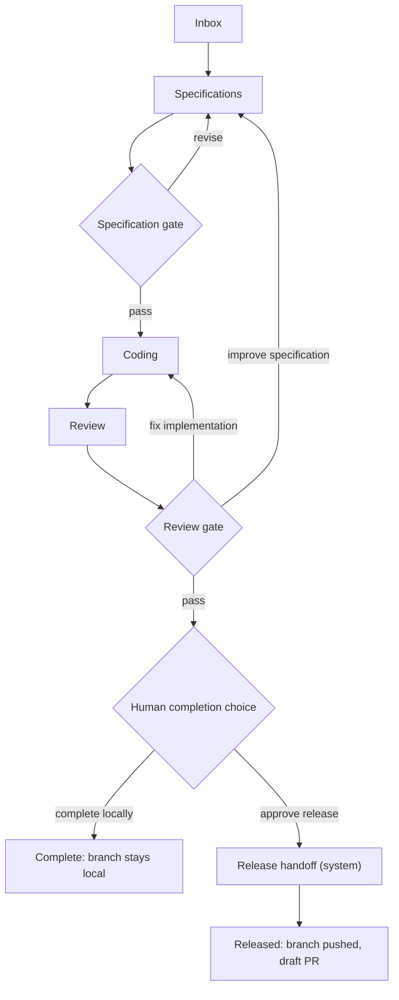

# Workflow and State Machines

## Setup boundaries

Project setup, board setup, board task intake, and delivery execution are separate commands:

1. **Project setup** registers identity, a system-selected project folder, and
   base branch through Project → Repository → Review. Folder inspection is
   read-only until review is confirmed. A confirmed empty or unborn folder is
   initialized with a first local commit; an existing branch is not changed.
   Registration redirects to project settings, where machine-wide saved agents
   can be attached and project role defaults are versioned separately. A saved
   agent holds only validated runtime settings, authorization status, and a bounded
   provider-reported model catalog refreshed after successful sign-in checks;
   supported credentials stay in the provider's credential store. Failed sign-in checks and
   disconnects append redacted provider events and remain visible in the saved agent's error
   history after reload. Neither action creates a
   board, task, run, feature branch, worktree, or provider process.
2. **Board setup** creates a named board with the default versioned workflow,
   copied project role assignments, and a chosen concurrency limit. Workflow
   selection and board-level role/budget editors remain design targets.
3. **Task execution** has two explicit actions. Moving a task to Ready does not
   start it automatically. The Ready card's **Set up and start** link opens task
   detail; an already prepared task links directly to its queued run.
   **Prepare run** accepts only a
   Ready task on an active board, rejects setup-only runtimes, snapshots the
   board configuration and trusted project policy, and creates the owned branch
   and worktree. Start checks each distinct saved account automatically before
   starting provider work. One card groups its assigned roles. Sign in once on
   **Agents**, using a complete read-only command with an adjacent copy control;
   old unbound queued runs offer an explicit saved-account selector. A
   queued run is visible on the global operation monitor even before its first
   agent session. Once output exists, Artifacts follows the selected log's last
   5,000 lines in LiveView and offers a full filtered download; viewer pause does
   not pause execution. See [UI_DASHBOARD.md](UI_DASHBOARD.md) for safety limits.
4. **Board task intake** accepts a bounded prompt and one snapshotted agent
   role. It creates a hidden planning task and normal queued run, verifies that
   role's saved authorization or isolated runtime setup, and launches a single read-only,
   network-denied stage. The agent may use read-only inspection commands under
   the runtime's permission mode so it can open project files; the host runner is
   not a sandbox. The run waits at `task proposal review`; validated
   proposals remain separate rows until a human selects them. Import creates
   normal Draft tasks and links each proposal to the created task so retries do
   not duplicate cards. The board shows LiveView submit feedback immediately,
   then the run page derives progress from durable run state and refreshes after
   committed PubSub hints. A failed planning run records a sanitized cause,
   marks its agent session failed, and shows the recovery action beside its
   progress state; browser state is never authoritative.

This boundary keeps onboarding reversible and lets one project own several
boards without fabricating a first task.

## Intended default feature flow

The accepted product flow is below. It is a target, not a claim that the current
launcher follows every branch:

The current creation UI uses `Definition.default()`. `GuidedRun` invokes the
bounded `WalkingSkeleton.run/2` executor. Review provider output is parsed from
the run-owned artifact and revalidated by the host against a closed schema.
Error and blocker findings are persisted with their evidence, routed through
`Definition.route_findings/3`, and restart the loop from Specifications or
Coding; mixed findings restart at Specifications. The third failing Review
exhausts the fixed MVP attempt budget and blocks the run. Passing Review creates
one human choice: the existing approved release, or an atomic local completion
that marks the run/task done, rejects only the release handoff, and preserves the
local branch, worktree, and evidence.
Every planning or delivery worker runs behind the same durable failure boundary.
Returned errors and unexpected worker exceptions append a safe failure code and
public recovery message, fail the current agent session and running stage when
present, and block the run. Raw exception text is not persisted. The run alert,
timeline, and filtered process-log viewer therefore survive browser reloads and
show where to inspect the failure.
Multiple boards and their runs execute independently,
subject to project and machine resource budgets. Kanban columns show task
lifecycle states; workflow stages appear in the run timeline.

## Domain levels

- **Board:** a durable process with a workflow version, role assignments, concurrency budget, and Kanban view.
- **Task:** user intent represented as a card. It may be edited while in Draft or Ready; material edits during execution create a new revision and may invalidate the current run.
- **Task proposal:** untrusted, source-cited planning output owned by a hidden board-intake task. It is not a Kanban card until selected by a human and imported.
- **Run:** one execution of a task against a fixed base revision, workflow, policy, and plugin snapshot.
- **Stage attempt:** one try at a workflow stage.
- **Agent session:** a concrete runtime/model invocation serving a stage attempt.

## Task states (single vocabulary)

| State | Meaning | Allowed user actions |
| --- | --- | --- |
| `draft` | Incomplete request | Edit, delete, mark ready |
| `ready` | Validated and queued | Start, reprioritize, return to draft |
| `running` | Active run owns the task | Pause, hibernate, stop, inspect |
| `waiting` | Approval, dependency, budget, rate limit, or reconciliation | Resolve, approve, extend budget, pause, stop |
| `paused` | Soft stop; runtime may remain allocated | Resume, hibernate, stop |
| `hibernated` | Compute released; durable state preserved | Resume, stop, archive |
| `blocked` | Cannot continue automatically | Retry, edit policy, reassign, stop |
| `done` | Reviewed task completed locally or release handoff completed | Extract knowledge, archive, reopen as new run |
| `failed` | Retry policy exhausted | Retry as new attempt, diagnose, stop |
| `cancelled` | Explicitly ended | Archive or restart as new run |
| `archived` | Removed from active boards; history kept | Restore, delete (confirmed) |

Human review of a passed run is the `human_approval` stage inside the workflow; while there, the task is `waiting` with reason `approval`. The workflow YAML uses stage keys and transition labels only; it never introduces task states.

## Allowed state transitions

| Current state | Task destinations | Run destinations |
| --- | --- | --- |
| `draft` | `ready`, `cancelled`, `archived` | — |
| `ready` | `draft`, `running`, `cancelled`, `archived` | — |
| `queued` | — | `running`, `cancelled` |
| `running` | `waiting`, `paused`, `hibernated`, `blocked`, `done`, `failed`, `cancelled` | Same |
| `waiting` | `running`, `paused`, `hibernated`, `blocked`, `failed`, `cancelled` | Same |
| `paused` | `running`, `hibernated`, `cancelled` | Same |
| `hibernated` | `running`, `cancelled`, `archived` | `running`, `cancelled` |
| `blocked` | `running`, `waiting`, `failed`, `cancelled` | Same |
| `done` | `archived` | Terminal; a later attempt is a new run |
| `failed` | `ready`, `archived` | Terminal; retry creates a new run |
| `cancelled` | `ready`, `archived` | Terminal; restart creates a new run |
| `archived` | `draft` | — |

Standalone task commands handle pre-run and post-run lifecycle changes. Once a run starts, its transition command updates the run and owning task together. A transition into `waiting` requires a non-blank reason. Every accepted change appends one public event in the same immediate transaction; rejected commands persist an explicit result without an event. Reusing an idempotency key returns its original result without repeating either write.

## Roles

| Role | Kind | Responsibilities | Required outputs |
| --- | --- | --- | --- |
| Specifications | agent | Clarify intent, inspect code and knowledge, define scope and acceptance criteria | Versioned specification and testable acceptance criteria |
| Coding | agent | Change only approved scope, add tests, report decisions | Commits, implementation summary, test evidence |
| Review | agent | Independently test and review correctness, security, and scope | Structured findings, gate result, reproducible commands |
| Human approver | human | Verify diff and evidence bundle | Approval decision |
| Release handoff | system | Push the branch and create the draft PR with the host-side VCS service | Evidence bundle, ready branch, PR link |

The same runtime may fill multiple agent roles, but the default policy prevents the exact same agent session from both implementing and independently approving its work. System roles never run an LLM and never receive a capability grant; they run application code under the user's Git credentials after approval.

Role display names and instructions are editable project defaults; required
output contracts remain part of the workflow/adapter configuration, not a
dedicated role-form editor. Workflow stages reference stable role keys. Boards snapshot their
assignments, and runs snapshot the board assignments again, so editing an agent
profile or role never rewrites active or historical work. Reauthorizing a saved
agent changes provider credential state and its current health projection.
Authentication mode is also resolved from the current saved account at launch;
it is not pinned in the role copy. Existing boards do not acquire account IDs
from later project saves. See [configuration boundaries](CONFIGURATION.md).

The default board launcher resolves Specifications, Coding, and Review
independently from that snapshot. Each stage receives its assigned connection,
runtime version, and role instructions; a single implementation runtime is not
silently reused for the other roles. Identical account/runtime settings share one
authentication check, while role instructions stay distinct. Saved Codex and
Cursor accounts use shared app-owned profiles; execution configuration stays
run-specific. OpenCode and Custom Agent remain saveable
project connections but fail closed at run preparation until their reviewed
launch adapters pass conformance.

## Pause, hibernate, and resume

### Pause

Pause requests a safe checkpoint from the adapter and stops scheduling new tools. If the provider supports session suspension, keep the resumable session. Processes may remain alive for fast continuation. If no safe checkpoint is available within the timeout, the UI offers forced hibernation or continued waiting.

### Hibernate

1. Stop accepting new tools.
2. Persist the latest public session summary, artifact hashes, and checkpoint or continuation package.
3. Store provider session identifiers when resumable.
4. Stop the agent process group with the termination ladder.
5. Stop declared services (dev server) and release ports.
6. Preserve the worktree, branch, database state, and checkpoint.
7. Release leases and update resource accounting.

### Resume

Resume reacquires leases, validates the worktree and policy hashes, reallocates ports, restores declared services, and either resumes the provider session or creates a new session with a bounded continuation package. Drift in the base branch or trusted configuration blocks resume until the user chooses rebase, continue unchanged, or restart. Resume after a sleep gap follows `docs/LONG_RUNNING_AND_POWER.md`.

The host lifecycle implementation requires an adapter checkpoint for an active stage before pause or hibernate. Hibernate stops only PID/start-identity-verified process groups and releases the in-memory bearer lease before the durable transition. After relaunch, resume reconstructs the run, environment, and active attempt from SQLite, verifies the ownership marker plus recorded base/branch/head and policy hash, acquires a new port lease, and passes the existing attempt and checkpoint to the adapter. It never creates a retry attempt.

Destroy uses the same owned-process shutdown first, then asks Git to remove the exact recorded worktree without `--force`. A dirty worktree, ownership drift, an unverified path, or any still-running process refuses cleanup. The run directory and artifacts remain, and their relative path/type/size inventory is attached to cleanup events.

## Stage contract

Every stage definition declares: stable key, display name, and role; input artifact types and required context; knowledge triggers; allowed tool categories; maximum attempts, active duration, wall duration, token budget, and cost budget; entry guards and exit gates; required output artifact schema; transitions for success, findings, timeout, cancellation, and system failure; whether pause and provider-native resume are supported; whether a human approval is mandatory; checkpoint interval.

`Cuckoding.Workflows.Definition` is the Phase 5 executable subset of this contract. A compact definition must provide at least one stage with a unique `key` and `role`; publication expands the display name, role kind, finite budgets, knowledge triggers, gates, checkpoint interval, and sequential `pass` transition defaults before storing the immutable version. Explicit transitions must target another declared stage or `$done`. The entry stage and every other stage must be reachable. A strongly connected component made only of `pass` edges is rejected as an unsafe cycle; labeled revision/fix loops remain valid under finite attempt budgets.

The evaluator checks attempt, active-time, wall-time, token, and cost budgets; requires all declared gates; and then resolves the requested transition label. QA findings carry a transition label and are grouped by its resolved target without changing their evidence. Task/run lifecycle states remain separate from stage keys and transition labels.

## Retry semantics

- A retry always creates a new stage attempt.
- Automatic retry is allowed only for classified transient failures (network, rate limit, provider 5xx, process killed by sleep/wake).
- Review findings route to the responsible stage with structured evidence; the fixed MVP ceiling is three Review attempts.
- Changing requirements invalidates downstream stage results and creates a new specification revision.
- Every retry increments cost and duration budgets; budget exhaustion moves the task to `waiting` for approval.
- Idempotency keys prevent a retry request from launching duplicate workers.
- Stage timing updates are also idempotent. They add separately measured monotonic active milliseconds and continuous wall milliseconds, and require each wall delta to include its active delta.

## Git flow

1. Require a clean registered repository, resolve and record the default branch SHA, and refuse protected target branches (`main`, `master`, and the configured default branch).
2. Resolve the workspace root, reject traversal and symlink escapes, then create a unique feature branch and per-run worktree with an ownership marker.
3. Agents commit in the feature worktree on the host, or produce a patch according to policy.
4. Before QA, record a clean status or explicitly list uncommitted files.
5. QA runs on the same immutable candidate revision when possible.
6. The host validates the typed evidence bundle, verifies artifact and knowledge-citation digests, and shows the candidate base/head, changed files, tests, artifacts, and citations for human approval.
7. After passing Review, the human may complete locally; this changes durable state without calling a VCS host and leaves the branch/worktree/evidence intact. Otherwise the release handoff stage revalidates that evidence, refuses protected branches or missing approval, and then pushes the branch. The GitHub implementation fetches the credential only inside the host service and creates a draft PR whose body carries the test evidence, artifacts, and knowledge citations.
8. Merge remains outside the autonomous workflow for MVP.

Before resume, the host Git service compares the current default branch, checked-out worktree branch, recorded head SHA, and ownership marker with the durable environment. Any mismatch remains blocked until the user explicitly chooses rebase, continue unchanged, or restart; task 0301 does not perform any of those destructive or history-changing actions.

## Concurrency and scheduling

- Board concurrency limits cap active tasks.
- Project limits cap active runs, ports, and aggregate memory.
- Global limits protect the machine and provider budgets.
- Priority, readiness, dependencies, age, and resource fit determine scheduling.
- Fair scheduling prevents one board from starving another.
- A user can pause or hibernate a board, which drains or stops its active work according to policy.
- Unattended mode keeps a board's queue moving and the machine awake up to approval gates.

`Cuckoding.Execution.Scheduler` implements the Phase 5 admission plan from durable rows. It excludes unmet dependencies, orders each board by priority and age, rotates boards by their oldest last-scheduled time, and then applies board, trusted-policy project, and global agent-session limits. Admission fails closed when the replaceable host probe cannot establish available memory or loopback-port capacity. The scheduler returns stable unattended approval notification keys and delegates all process-starting and notification side effects through behaviours; it does not make the planner process authoritative. Board pause or hibernate first durably pauses new admission, then delegates each active run to the ownership-aware run controller. Resume reopens admission but leaves each run's resume as an explicit lifecycle action.
