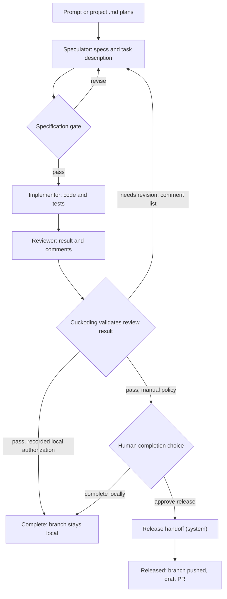

# Workflow and State Machines

## Setup boundaries

Project setup, board setup, board task intake, and delivery execution are separate commands:

1. **Project setup** registers identity, a system-selected project folder, and
   base branch through Project → Repository → Review. Folder inspection is
   read-only until review is confirmed. A confirmed empty or unborn folder is
   initialized with a first local commit; an existing branch is not changed.
   Registration redirects to project settings, where machine-wide saved agents
   can be attached and project role defaults are versioned separately. A saved
   agent holds only validated runtime settings, authorization status, and a bounded
   provider-reported model catalog refreshed after successful sign-in checks;
   its add wizard steps through name/runtime, discovered executable and
   authorization, then model and Codex-supported reasoning level. **Find
   automatically** checks known executable locations without running candidates;
   finding a file does not establish version support or sign-in. A manual
   executable path and runtime/model defaults remain available; see
   [executable discovery](AGENT_AUTHORIZATION_FLOW.md#executable-discovery).
   Supported credentials stay in the provider's credential store. Failed sign-in checks and
   disconnects append redacted provider events and remain visible in the saved agent's error
   history after reload. Neither action creates a
   board, task, run, feature branch, worktree, or provider process.
2. **Board setup** creates a named board with the default versioned workflow,
   copied project role assignments (which may still be unassigned), and a chosen concurrency limit. **Assign agents to board** explicitly applies current project roles to an existing board for future runs and appends compatible bindings to queued runs without rewriting their snapshots. Workflow
   selection and board-level role/budget editors remain design targets.
3. **Task execution** can be started manually or by **Start project**. Moving a task to Ready does not start it while the project is paused. Once the project is running, a supervised dispatcher admits eligible Ready delivery tasks using the existing scheduler, prepares a separate run/worktree for each, and starts the Speculator → Implementor → Reviewer flow for new defaults. The Ready card's **Set up and start** link opens task
   detail; an already prepared task links directly to its queued run.
   **Prepare run** accepts only a
   Ready task on an active board, rejects setup-only runtimes, snapshots the
   board configuration and trusted project policy, and creates the owned branch
   and worktree. Start checks each distinct saved account automatically before
   starting provider work. One card groups its assigned roles. Sign in once on
   **Agents**, using a complete read-only command with an adjacent copy control;
   old unbound queued runs offer an explicit saved-account selector. A
   queued run is visible on the global operation monitor even before its first
   agent session. Once output exists, Artifacts follows the selected log's last
   5,000 lines in LiveView and offers a full filtered download; viewer pause does
   not pause execution. See [UI_DASHBOARD.md](UI_DASHBOARD.md) for safety limits.
   A blocked or failed delivery task offers **Retry with a new run**. It closes
   the stopped blocked run as failed, returns the task to Ready, and prepares a
   new queued run with a distinct branch/worktree. The user can start the new run explicitly; project automatic mode also picks up queued delivery runs when capacity allows. Prior runs, worktrees, and evidence are
   retained; uncommitted changes from the old worktree are not copied.
   Ready cards on the board show a read-only scheduler snapshot while the
   project runs: next eligible start or the current dependency, board/project/
   machine limit, port, or memory deferral. A paused project or board and an
   already prepared run have separate explanations. These messages are live
   observations, not durable task states or a promise that preparation will
   succeed; the next dispatcher pass rechecks all conditions.
4. **Board task intake** accepts a bounded prompt and one snapshotted agent
   role. It creates a hidden planning task and normal queued run, verifies that
   role's saved authorization or isolated runtime setup, and launches a single read-only,
   network-denied stage. The agent may use read-only inspection commands under
   the runtime's permission mode so it can open project files; the host runner is
   not a sandbox. The run waits at `task proposal review`; validated
   proposals remain separate rows until a human selects them. Import creates
   normal Draft tasks and links each proposal to the created task so retries do
   not duplicate cards. The board shows LiveView submit feedback immediately,
   then the run page derives progress from durable run state and refreshes after
   committed PubSub hints. A failed planning run records a sanitized cause,
   marks its agent session failed, and shows the recovery action beside its
   progress state; browser state is never authoritative.
5. **Independent proposal review** is available before any proposal is imported.
   The run page lists other snapshotted agent roles with a different configured
   model/runtime. Review launches a read-only, network-denied
   `task_proposal_review` attempt on the same planning run. Its closed output
   must return the same proposal IDs exactly once, valid repository file
   citations, revised descriptions/specs, per-task comments and an overall
   summary. Cuckoding saves a private Markdown report plus an append-only
   before/after event, then returns to human selection. Import and concurrent
   review are blocked while it runs. Invalid output preserves the originals
   and supports retry from Blocked; every failed attempt records its own state
   transition. Once any proposal is imported, model review cannot revise that
   planning batch. Changing project roles does not rewrite a prepared run;
   apply roles to the board and create a new planning run to use new models.

Start-time saved-agent probes update the durable authorization observation
before the queued run transitions. A rejected sign-in names the affected
connection and links to its one-time Agents sign-in action; it does not create
an agent session or alter the task/worktree. Codex file-store probes additionally
require a private credential file in the selected app-owned profile, so an old
keyring-era "Connected" observation cannot appear ready for a file-store run.

This boundary keeps onboarding reversible and lets one project own several
boards without fabricating a first task.

Project operation state and limits live in `project_autopilots`, not the LiveView
or worker. Start validates an active project, at least one Ready or queued delivery
run, runnable board roles, and a readable committed base for Ready work.
Start/Pause/attention/done append project events. The supervised worker re-reads
running projects after restart and periodically admits work; it stops new
admissions at the configured count of distinct blocked delivery tasks with open
`blocker` review findings on their active runs. Preparation and start failures
pause admission with a visible reason; other failed tasks remain blocked for
review. Board/project/global limits apply to new work, and queued starts check
running capacity. Pause stops new admissions, not active processes. Draft task
proposals still need human selection. At Project Start or manual run start,
**After a passing review** defaults to **Wait for my decision**. The user can
explicitly choose **Complete locally automatically**. Project admission persists
that choice in `project_autopilots`; each run copies it into a
`run.completion_policy` event atomically with its start. Later project edits do
not change that run's choice. Local automatic completion validates review
evidence, marks run/task Done, rejects the unused release handoff and retains
the branch/worktree/artifacts. No autonomous push, PR, merge or execution-policy
approval is granted by Start. Existing project controls migrate to manual mode.

## Intended default feature flow

The accepted product flow uses **Speculator, Implementor and Reviewer**, as
clarified on 2026-09-24. Speculator creates specs and task descriptions from a
prompt or project `.md` plan files. Reviewer reports its result and comments to
Cuckoding; every revision returns through Speculator, which updates the task
and specs before Implementor changes code/tests again. This is the target; the
new default implements this routing. Legacy snapshots retain their original
definition, including any direct Coding return.

The current creation UI uses `Definition.default()`. `GuidedRun` invokes the
bounded `WalkingSkeleton.run/2` executor. Review provider output is parsed from
the run-owned artifact and revalidated by the host against a closed schema.
Error and blocker findings are persisted with their evidence and routed through
`Definition.route_findings/3` using the run's immutable definition. New default
definitions send both `fix_intent` and `fix_code` to Speculator. Older snapshots
may still route code findings to Implementor; they are never interpreted using
today's default. The third failing Review
exhausts the fixed MVP attempt budget and blocks the run. Passing Review follows
the recorded completion policy. Manual mode offers approved release or atomic
local completion; explicit local mode takes that local completion path
automatically. Both retain the local branch, worktree and evidence. Only the
separately approved release path can invoke a VCS host.
Every planning or delivery worker runs behind the same durable failure boundary.
Returned errors and unexpected worker exceptions append a safe failure code and
public recovery message, fail the current agent session and running stage when
present, and block the run. New unexpected-failure events also include a bounded
application module/function/line when available; this is a diagnostic location,
not a root cause. Raw exception text, arguments, and file paths are not
persisted. Historical events do not acquire a location retroactively. The run
alert, timeline, and filtered process-log viewer survive browser reloads.
Multiple boards and their runs execute independently,
subject to project and machine resource budgets. Kanban columns show task
lifecycle states; workflow stages appear in the run timeline.

## Domain levels

- **Board:** a durable process with a workflow version, role assignments, concurrency budget, and Kanban view.
- **Task:** user intent represented as a card. It may be edited while in Draft or Ready; material edits during execution create a new revision and may invalidate the current run.
- **Task proposal:** untrusted, source-cited planning output owned by a hidden board-intake task. It is not a Kanban card until selected by a human and imported.
- **Run:** one execution of a task against a fixed base revision, workflow, policy, and plugin snapshot.
- **Stage attempt:** one try at a workflow stage.
- **Agent session:** a concrete runtime/model invocation serving a stage attempt.

## Task states (single vocabulary)

| State | Meaning | Allowed user actions |
| --- | --- | --- |
| `draft` | Incomplete request | Edit, delete, mark ready |
| `ready` | Validated and queued | Start, reprioritize, return to draft |
| `running` | Active run owns the task | Pause, hibernate, stop, inspect |
| `waiting` | Approval, dependency, budget, rate limit, or reconciliation | Resolve, approve, extend budget, pause, stop |
| `paused` | Soft stop; runtime may remain allocated | Resume, hibernate, stop |
| `hibernated` | Compute released; durable state preserved | Resume, stop, archive |
| `blocked` | Cannot continue automatically | Retry, edit policy, reassign, stop |
| `done` | Reviewed task completed locally or release handoff completed | Extract knowledge, archive, reopen as new run |
| `failed` | Retry policy exhausted | Retry as new attempt, diagnose, stop |
| `cancelled` | Explicitly ended | Archive or restart as new run |
| `archived` | Removed from active boards; history kept | Restore, delete (confirmed) |

Human review of a passed run is the `human_approval` stage inside the workflow; while there, the task is `waiting` with reason `approval`. The workflow YAML uses stage keys and transition labels only; it never introduces task states.

## Allowed state transitions

| Current state | Task destinations | Run destinations |
| --- | --- | --- |
| `draft` | `ready`, `cancelled`, `archived` | — |
| `ready` | `draft`, `running`, `cancelled`, `archived` | — |
| `queued` | — | `running`, `cancelled` |
| `running` | `waiting`, `paused`, `hibernated`, `blocked`, `done`, `failed`, `cancelled` | Same |
| `waiting` | `running`, `paused`, `hibernated`, `blocked`, `failed`, `cancelled` | Same |
| `paused` | `running`, `hibernated`, `cancelled` | Same |
| `hibernated` | `running`, `cancelled`, `archived` | `running`, `cancelled` |
| `blocked` | `running`, `waiting`, `failed`, `cancelled` | Same |
| `done` | `archived` | Terminal; a later attempt is a new run |
| `failed` | `ready`, `archived` | Terminal; retry creates a new run |
| `cancelled` | `ready`, `archived` | Terminal; restart creates a new run |
| `archived` | `draft` | — |

Standalone task commands handle pre-run and post-run lifecycle changes. Once a run starts, its transition command updates the run and owning task together. A transition into `waiting` requires a non-blank reason. Every accepted change appends one public event in the same immediate transaction; rejected commands persist an explicit result without an event. Reusing an idempotency key returns its original result without repeating either write.

A failed worktree preparation is a special queued-run failure: its run records
`run.preparation_failed` and becomes `failed`, while its task remains `ready`.
It does not leave an unusable queued run that blocks another preparation.

## Roles

| Role | Kind | Responsibilities | Required outputs |
| --- | --- | --- | --- |
| Speculator | agent | Produce specs and task descriptions from prompts or project `.md` plans; revise them against Reviewer comments | Versioned specification, task description and testable acceptance criteria |
| Implementor | agent | Implement code and tests against the task description and specs | Commits, implementation summary, test evidence |
| Reviewer | agent | Independently review correctness, security and scope; report done or return to Speculator through Cuckoding | Structured result, review-comment list, evidence and reproducible commands |
| Human approver | human | Verify diff and evidence bundle | Approval decision |
| Release handoff | system | Push the branch and create the draft PR with the host-side VCS service | Evidence bundle, ready branch, PR link |

These are the default names for new projects. The stable keys remain
`spec_writer`/`implementer`/`reviewer`, while existing saved names are preserved.
Human approver and Release handoff are
control gates, not additional default agent roles. Users may add roles and
permissions, but execution requires a versioned workflow mapping and an
explicit trusted grant supported by the runtime; text instructions never expand
permissions. Project forms offer custom roles a planning-only default or an
explicit delivery slot after Speculator/Implementor, plus read-only or
worktree-write permissions. These slots execute serially in the displayed role
order, before the final Reviewer. Their reports reach following roles and are
retained as hashed evidence; permitted changes are committed by the host before
Review. Both slots repeat on a correction cycle. Planning remains read-only
regardless of delivery permissions. Network and external paths cannot be added
by this form; enforced/unenforced runtime limits remain explicit.

The same runtime may fill multiple agent roles, but the default policy prevents the exact same agent session from both implementing and independently approving its work. System roles never run an LLM and never receive a capability grant; they run application code under the user's Git credentials after approval.

Role display names and instructions are editable project defaults; required
output contracts remain part of the workflow/adapter configuration, not a
dedicated role-form editor. Workflow stages reference stable role keys. Boards snapshot their
assignments, and runs snapshot the board assignments again, so editing an agent
profile or role never rewrites active or historical work. Reauthorizing a saved
agent changes provider credential state and its current health projection.
Authentication mode is also resolved from the current saved account at launch;
it is not pinned in the role copy. Existing boards do not acquire account IDs
from later project saves. See [configuration boundaries](CONFIGURATION.md).

The default board launcher resolves every agent role scheduled in the immutable
workflow, including Speculator, Implementor, Reviewer and enabled additional roles,
independently from that snapshot. Each stage receives its assigned connection,
runtime version, role instructions and task description. Implementor and Reviewer
receive the latest validated specification text, and a returning Speculator gets
the prior specification plus the review comments/evidence. Specifications are
persisted separately for each attempt; read-only roles explicitly deny writes.
Role instructions and grants come from the snapshot, never from a previous
agent report. User-confirmed schedule/permission saves append a configuration
revision and audit event. Applying them to a board publishes/reuses a workflow
version for future runs; it never rewrites a prepared or historical run.
A single implementation runtime is not
silently reused for the other roles. Identical account/runtime settings share one
authentication check, while role instructions stay distinct. Saved Codex and
Cursor accounts use shared app-owned profiles; execution configuration stays
run-specific. OpenCode and Custom Agent remain saveable
project connections but fail closed at run preparation until their reviewed
launch adapters pass conformance.

The task page shows redacted public agent messages linked to their run, stage,
and role. Completed process logs are indexed into durable run events before the
stage advances, including a failed agent process. A successful Specifications
stage also writes its actual structured summary—or the last public agent
message when the provider ignores its output schema—as a versioned
specification artifact immediately, so later stage failure cannot discard it. The task page
shows the latest specification message and links to full run evidence. Provider
tool output and hidden reasoning are not promoted to task messages; the full
redacted log remains available on the run page. Historical evidence can be
indexed without rerunning a blocked task.

## Pause, hibernate, and resume

### Pause

The run page exposes Pause, Resume and confirmed Stop. Pause preserves the
attempt checkpoint, records the prior state, changes run/task state to Paused,
and suspends verified owned process groups with `SIGSTOP`. A host mutex orders
stage launches against controls; durable state and events remain authoritative.
The delivery and planning workers wait at stage boundaries and after process
results. Resume uses `SIGCONT` and the same live worker, process and attempt;
pausing at an approval restores that prior waiting reason. Missing live workers
or unverifiable ownership fail closed and need inspection/recovery.

Dashboard **Pause all** records a durable workspace admission gate before
pausing current running/waiting runs. It blocks manual starts, planning/review
starts and project admission. **Resume workspace** resumes only runs paused by
that workspace action; previously individual pauses remain paused. **Stop all**
records a stopped gate, cancels current/queued runs and stops owned process
groups, including retained processes from earlier interrupted controls. Branches,
worktrees, artifacts and history stay available. Stop closes pending approvals;
a stopped task can retry in a new run without changing the old run or copying
uncommitted changes. Batch failures are shown explicitly, so a workspace mode
alone is not proof that every process was controlled successfully.

The project-level **Pause new starts** remains admission-only. It is distinct
from the task and workspace execution controls above. Process stop clears the
preview URL; any existing port lease expires normally unless its live owner
releases it. Native/provider and restart acceptance remain separate gates.

### Hibernate

1. Stop accepting new tools.
2. Persist the latest public session summary, artifact hashes, and checkpoint or continuation package.
3. Store provider session identifiers when resumable.
4. Stop the agent process group with the termination ladder.
5. Stop declared services (dev server) and release ports.
6. Preserve the worktree, branch, database state, and checkpoint.
7. Release leases and update resource accounting.

### Resume

For a live paused run, the run-page control resumes the existing worker as
described above. Hibernate/resume lifecycle primitives revalidate the worktree
and policy hashes, reacquire a port and invoke the supplied stage-resume callback.
A paused run whose application worker was lost is not presented as automatically
resumable; complete native/provider recovery acceptance is still open. Resume
after a sleep gap follows `docs/LONG_RUNNING_AND_POWER.md`.

The host lifecycle implementation requires an adapter checkpoint for an active stage before pause or hibernate. Hibernate stops only PID/start-identity-verified process groups and releases the in-memory bearer lease before the durable transition. After relaunch, resume reconstructs the run, environment, and active attempt from SQLite, verifies the ownership marker plus recorded base/branch/head and policy hash, acquires a new port lease, and passes the existing attempt and checkpoint to the adapter. It never creates a retry attempt.

Destroy uses the same owned-process shutdown first, then asks Git to remove the exact recorded worktree without `--force`. A dirty worktree, ownership drift, an unverified path, or any still-running process refuses cleanup. The run directory and artifacts remain, and their relative path/type/size inventory is attached to cleanup events.

## Stage contract

Every stage definition declares: stable key, display name, and role; input artifact types and required context; knowledge triggers; allowed tool categories; maximum attempts, active duration, wall duration, token budget, and cost budget; entry guards and exit gates; required output artifact schema; transitions for success, findings, timeout, cancellation, and system failure; whether pause and provider-native resume are supported; whether a human approval is mandatory; checkpoint interval.

`Cuckoding.Workflows.Definition` is the Phase 5 executable subset of this contract. A compact definition must provide at least one stage with a unique `key` and `role`; publication expands the display name, role kind, finite budgets, knowledge triggers, gates, checkpoint interval, and sequential `pass` transition defaults before storing the immutable version. Explicit transitions must target another declared stage or `$done`. The entry stage and every other stage must be reachable. A strongly connected component made only of `pass` edges is rejected as an unsafe cycle; labeled revision/fix loops remain valid under finite attempt budgets.

The evaluator checks attempt, active-time, wall-time, token, and cost budgets; requires all declared gates; and then resolves the requested transition label. QA findings carry a transition label and are grouped by its resolved target without changing their evidence. Task/run lifecycle states remain separate from stage keys and transition labels.

## Retry semantics

- Manual retry of a blocked or failed delivery task prepares a new run. It
  refuses to proceed while the previous run has a recorded running process;
  duplicate requests cannot create a second queued run. If new preparation
  fails, the task remains Ready with an actionable error; any queued run already
  created for that attempt is marked failed.
- A stage retry within the same run always creates a new stage attempt.
- Automatic retry is allowed only for classified transient failures (network, rate limit, provider 5xx, process killed by sleep/wake).
- Review findings route to the responsible stage with structured evidence; the fixed MVP ceiling is three Review attempts.
- Changing requirements invalidates downstream stage results and creates a new specification revision.
- Every retry increments cost and duration budgets; budget exhaustion moves the task to `waiting` for approval.
- Idempotency keys prevent a retry request from launching duplicate workers.
- Stage timing updates are also idempotent. They add separately measured monotonic active milliseconds and continuous wall milliseconds, and require each wall delta to include its active delta.

## Git flow

1. Require a clean registered repository, resolve and record the default branch SHA, and refuse protected target branches (`main`, `master`, and the configured default branch).
2. Resolve the workspace root, reject traversal and symlink escapes, then create a unique feature branch and per-run worktree with an ownership marker.
3. Agents commit in the feature worktree on the host, or produce a patch according to policy.
4. Before QA, record a clean status or explicitly list uncommitted files.
5. QA runs on the same immutable candidate revision when possible.
6. The host validates the typed evidence bundle, verifies artifact and knowledge-citation digests, and shows the candidate base/head, changed files, tests, artifacts, and citations for human approval.
7. After passing Review, local completion follows the recorded automatic choice or a manual human decision; this changes durable state without calling a VCS host and leaves the branch/worktree/evidence intact. Otherwise the separately approved release handoff stage revalidates that evidence, refuses protected branches or missing approval, and then pushes the branch. The GitHub implementation fetches the credential only inside the host service and creates a draft PR whose body carries the test evidence, artifacts, and knowledge citations.
8. Merge remains outside the autonomous workflow for MVP.

Before resume, the host Git service compares the current default branch, checked-out worktree branch, recorded head SHA, and ownership marker with the durable environment. Any mismatch remains blocked until the user explicitly chooses rebase, continue unchanged, or restart; task 0301 does not perform any of those destructive or history-changing actions.

## Concurrency and scheduling

- Board concurrency limits cap active tasks.
- Project limits cap active runs, ports, and aggregate memory.
- Global limits protect the machine and provider budgets.
- Priority, readiness, dependencies, age, and resource fit determine scheduling.
- Fair scheduling prevents one board from starving another.
- A user can pause or hibernate a board, which drains or stops its active work according to policy.
- Unattended mode keeps a board's queue moving and the machine awake up to approval gates.

`Cuckoding.Execution.Scheduler` implements the Phase 5 admission plan from durable rows. It excludes unmet dependencies, orders each board by priority and age, rotates boards by their oldest last-scheduled time, and then applies board, trusted-policy project, and global agent-session limits. Admission fails closed when the replaceable host probe cannot establish available memory or loopback-port capacity. The scheduler returns stable unattended approval notification keys and delegates all process-starting and notification side effects through behaviours; it does not make the planner process authoritative. Board pause or hibernate first durably pauses new admission, then delegates each active run to the ownership-aware run controller. Resume reopens admission but leaves each run's resume as an explicit lifecycle action.

`ProjectAutopilot.Worker` is the production caller for project-wide automatic admission. It selects only durable running projects, uses the scheduler for Ready delivery tasks, and starts already queued delivery runs within available running slots. Its periodic tick is disposable; project state and run claims survive a worker restart. Human-triggered manual Start remains available when project automatic mode is paused.
