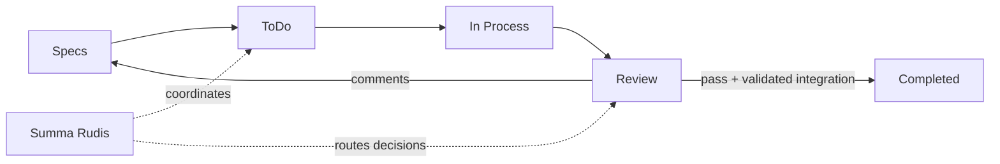

# Workflow contract

This is the single vocabulary for the rebuild. Configuration is saved in the UI;
files and model output are proposals, never executable policy.

## Setup and snapshots

Authorization and model catalogs are global. A default team assigns Speculator,
Implementor, Secutor and Summa Rudis to saved agents/models. A new Arena copies
that team; a new Tabula copies the Arena defaults. Edits affect future battles.
Applying different roles, schedules or grants to an existing Tabula is explicit
and audited; active battles retain immutable snapshots.

Arena registration only inspects/registers the selected folder. Confirm Git
initialization before doing it. If there is no commit, preview and separately
authorize a minimal baseline commit; never auto-add all documents or secrets.
An Arena/Tabula can be saved before it is runnable. Start names any missing
agent/model, baseline, grant or check instead of silently changing settings.

R030a implements the global default team. Required responsibilities keep
stable IDs even when renamed; Summa Rudis remains distinct. Custom roles default
to planning-only/read-only and have no executable slots. Saved bindings survive
account/catalog changes visibly; a new binding requires current verified metadata.
Saving is versioned and audited, never a start command. Removal of saved custom
roles requires confirmation and retains history.

R040a adds **Choose folder → preview path/team → confirm → Register Arena**.
The native dialog accepts one existing directory and cannot create folders.
Registration freezes the team revision shown at selection, permits unassigned
drafts and leaves all project files untouched. Later default-team changes do not
rewrite it. Git-entry presence is labeled unverified; execution grants remain
subsequent work. Cancel or interrupted selection requires a new
explicit choice; it never starts planning or a battle.

R040c adds **Open Tabulae → Repository setup → Inspect Git**. A missing result
offers a separate confirmation to initialize `.git` on `main`, with no templates,
staging or commit. Consent binds the latest observation and expires after five
minutes; changed identity or newly appeared metadata refuses initialization.
Unborn means no HEAD commit; existing means a validated HEAD commit, not clean
files or execution readiness. Cancel waits for native cleanup; interruption or
uncertain cleanup requires a fresh inspection and never automatically retries.
Manual drafts remain usable when Git is unavailable or the layout is unsupported.

R040d adds **relative file paths → Preview initial commit → confirm exact preview
→ Create initial commit** for unborn repositories with no refs/index. Blank paths
mean an empty baseline. Show each path, byte size, mode and expandable SHA-256 plus
branch, fixed author and message. Consent expires in five minutes and is invalidated
by changed selection, bytes, mode, repository or branch. No bulk add is implicit.
A commit receipt persists its head/tree; interrupted publication may leave staged
files/objects and needs inspection, never automatic rollback or replay.

R030b adds **Arena settings or Tabula team → review current/proposed rosters →
confirm → Adopt saved team**. The latest saved default is an explicit choice;
changing Team alone never propagates. Arena adoption changes inheritance for new
boards; an existing board needs its own adoption. Preview includes role removals,
models and full instructions. Stale scope/default revisions require fresh consent.
A board cannot change team during pending/running/cancelling planning. Earlier
proposals and task drafts remain usable; new planning consent binds the adopted
revision. Per-scope role editing and grants remain open.

## Project checks

R040j adds **Arena → Project checks → Add check → Review changes → confirm → Save
checks**. Enter an executable name and one nonempty literal argument per line;
spaces/quotes stay in that argument. An entirely blank argument field means no
arguments. Choose a relative directory (`.` for worktree root) and timeout. The
preview shows the exact executable/argument array. Removals are staged in the
draft and require the same review/confirmation, including removal of every check.

Saving creates an immutable Arena revision, starts nothing and grants no access.
Live updates preserve draft text/errors, clear stale approval and show newer saved
revisions. **Reload saved checks** asks before discarding edits; recovered forms
from another Arena/revision remain blocked until reload. Historical definitions
survive edits/restart. Future Start must bind the selected revision and separately
validate executable, worktree and grants. No task or agent proposal can add an
approved command, and an empty check list is never proof that checks passed.

## Planning

Target: **Create tasks** launches the selected planning-capable role read-only, with a
bounded brief and explicitly selected, canonicalized Arena files. The agent
proposes a versioned Markdown spec and tasks: stable IDs, description, source
references, acceptance criteria, dependencies and suggested checks. Phoenix
validates bounds, paths, duplicate IDs and dependency cycles before persisting.

The user sees and can edit the result; planning starts no delivery worker.
Accepted specs move tasks from Specs to ToDo. A task in Specs at battle start is
prepared automatically within the approved brief. Generated shell commands
remain proposals; only previously approved checks may execute.

Start battle shows the goal/spec revision, task membership, team/model bindings,
local completion choice, check commands, concurrency and finite limits. One
confirmation records the authorization and starts work. No per-task approvals
are required for ordinary work. Adding unrelated tasks after Start leaves them
for the next battle. In-scope task splits/repairs may be proposed by Speculator,
checked by Secutor and imported by the host within the original criteria and
lifetime task limit; running/completed task history is never rewritten.

## Default Tabula

R040b implements **Open Tabulae → Create Tabula → Save task** for manual planning.
Each board freezes the Arena team and the five default stage keys. Tasks retain
title, description, criteria and immutable revision history. The Column select
moves between Specs and ToDo; ToDo requires description and criteria. This is
draft readiness only, not a validated spec or execution authorization. Delivery
columns reject manual moves until battle execution exists. Stale editors keep
their text and require explicitly loading a current draft; history is never
rewritten. Custom columns remain open; R040f supplies
selected document snapshots and R040h binds per-task source references below.

R040g adds **Edit task → Prerequisites → Save task**. Select up to sixteen other
tasks in the same Tabula; self-links, missing/foreign tasks and cycles are refused
on save against the latest graph. Native checkboxes work with the keyboard.
Cards show prerequisite titles/short IDs; revision history retains the exact IDs
and labels them using current titles. Unsaved selections survive live updates.
Legacy proposals start without prerequisites. These are planning links;
ToDo does not wait for completion yet because battle scheduling is not implemented.

R040h proposals list prerequisite suggestions first and cite only selected
document snapshots. Expand citations to inspect exact text/hash, then **Add to
Specs** in prerequisite order. Out-of-order imports are refused; they do not
silently import other suggestions. Dependent tasks receive the prerequisite UUIDs
without replacing earlier edits. **Original proposal sources** in the task editor
retains citations after edits/reconnect. Citations are references to inspect, not
a correctness verdict or live-file observation. Old proposals retain v1 behavior.

R040i adds **Edit saved task → Accepted specifications → Preview specification →
review exact Markdown → confirm → Accept specification**. Save unsaved edits first.
Acceptance freezes the task, prerequisite revisions and original citations in
private app storage, then moves the unchanged task to ToDo. It starts no agent.
**Reload task** loads the resulting revision and asks before discarding unsaved
edits. **Download Markdown** verifies retained bytes/hash through the authenticated
session. Later task/prerequisite revisions mark the acceptance historical. Missing
or modified files require a new preview/acceptance; old artifacts are preserved.
Manual ToDo moves remain draft planning and do not imply acceptance. This is an
optional pre-battle planning action; future Start authority still covers ordinary
in-scope specification preparation without repeated post-Start prompts.

| Column / stable key | Assigned role | Exit condition |
| --- | --- | --- |
| Specs / `specs` | Speculator | Valid spec, criteria and dependencies |
| ToDo / `todo` | Summa Rudis coordinates this queue | Dependencies complete, grants valid, capacity available |
| In Process / `in_process` | Implementor | Candidate revision and verification evidence |
| Review / `review` | Secutor | Pass with evidence, return comments, or block |
| Completed / `completed` | System applies the validated Secutor result | Reviewed local integration and required checks passed |

```mermaid
flowchart LR
  Specs --> ToDo --> Work["In Process"] --> Review
  Review -->|comments| Specs
  Review -->|pass + validated integration| Completed
  Rudis["Summa Rudis"] -.coordinates.-> ToDo
  Rudis -.routes decisions.-> Review
```

A returned task carries the candidate, spec revision, findings and failed check
receipts back to Speculator, then Implementor. It cannot jump straight back to
coding while leaving ambiguous intent unresolved.

Users can insert ordered role steps before implementation, before review, or
after review but before Completed; ToDo can remain an idle queue. Each added
working step needs a role, declared outputs, grant and exit result. Write-capable
steps must precede a mandatory final Secutor review. After-review steps are
read-only or route back through review if they change the candidate. Renaming
a column changes only its label. Reordering or adding steps publishes a new
workflow revision; no arbitrary conditional graph editor is required.

R040e implements **Ask Speculator → type brief → confirm provider usage → Generate
proposals → review → Add to Specs**. It snapshots the board's currently assigned required Speculator
and the catalog's default effort, without per-task assignment or model fallback.
A fresh supported executable/account/catalog is required; changed observations
invalidate old consent. Saving a new global team never changes this board.

The brief is at most 8,000 UTF-8 bytes. One ephemeral, two-minute turn uses empty
scratch read-only permissions with tools disabled; no live Arena access is granted.
Its response must contain a summary (2,000 bytes) and one to six unique tasks,
each with title (120 bytes), description (4,000 bytes) and criteria (2,000 bytes).
The fixed output schema guides the provider; host validation remains authoritative.
Suggestions are untrusted text, not commands. Import is explicit, scoped and
idempotent; it creates a Specs draft with source-request/index provenance.
Cancellation waits for owned cleanup, preserves the brief and rejects late results.
Expired running claims become interrupted once and never silently repeat usage.
R040g/h add dependencies; R040i adds accepted Markdown artifacts. Battle workers remain open.

R040f adds **Optional documents → enter relative paths → Preview documents →
review exact snapshots → confirm provider usage → Generate proposals**. Local
preview reads up to four `.md`/`.txt` files (4,096 bytes each, 12,000 total), saves
text/hash evidence and invokes no model or Git command. Provider consent selects
that exact snapshot, not future file contents. Preview selection expires after
five minutes; re-preview or choose **Use brief only**. Changing selection clears
consent without erasing the brief or draft editor. Reconnect retains the preview
and previous planning sources but requires **Use these snapshots** to select it
again. Imported drafts retain source-set provenance through their proposal;
R040h adds per-task citation scope checks and R040i adds accepted Markdown specs.

## Summa Rudis control loop

R050a implements **Tabula → Battle preview → Refresh preview** as a read-only
preparation view. It shows every saved task with its revision, acceptance/artifact
status and current prerequisites; the assigned team (including planning-only
custom roles); exact saved check argv/directories/timeouts; and the latest dated
Git receipt. Defaults are never silently adopted. Saved ToDo placement without
an acceptance receipt remains a draft. Missing/changed Markdown and prerequisite
edits are visible, with links to the relevant setup screens.

Updates or one minute of elapsed preview time mark the display stale. Refresh
re-reads evidence without launching Git, checks or providers. This is not Start,
membership selection, admission, a frozen snapshot or completion evidence.
Specification acceptance remains optional planning; future Start still authorizes
ordinary in-scope Speculator preparation. The control loop below remains a target.

1. Read committed battle state, eligible tasks, public reports and remaining
   limits. Invoke the coordinator only for a decision/event, not a busy polling
   conversation.
2. Request a closed proposal: dispatch eligible task, route findings, request
   in-scope replanning, wait with reason, request clarification, or propose finish.
3. Host validation binds proposal to battle/revision, task membership, role,
   current spec/candidate, grants, dependencies, capacity and idempotency key.
4. Persist accepted command, projection and event atomically. Dispatch through
   supervised workers; publish the committed event to LiveView.
5. Reject stale/foreign/invalid proposals without side effects. A bounded
   correction turn may fix schema mistakes; it cannot reset budgets.

Phoenix owns leases and scheduling mechanics. Summa Rudis owns coordination
judgment. Summa Rudis is a distinct selected role, not a hidden Speculator turn.
No model receives direct SQL or privileged host APIs.

## States and controls

A card has a column plus execution status: `idle`, `queued`, `running`,
`paused`, `blocked`, `completed`, `skipped` or `cancelled`.
The workflow definition controls allowed column transitions; status alone cannot
satisfy a gate. A blocked card stays in the relevant column with a text reason.

Battle states: `ready`, `running`, `pausing`, `paused`,
`needs_attention`, `stopping`, `stopped`, `completed`.
Waiting/backoff and sleep are recorded reasons, not fake completion states.

| Control | Meaning |
| --- | --- |
| Pause | Close admission immediately; checkpoint and quiesce owned workers, then show Paused only once verified |
| Resume | Revalidate authority, processes, worktrees and limits, then continue from durable evidence |
| Retry | New recorded attempt for an eligible failed stage, retaining prior artifacts and consumed limits |
| Stop | Confirm; close admission, cancel owned workers, verify cleanup and preserve changes/history |
| Skip task | Confirm; retain unfinished work and defer dependents; never count it completed |
| Inspect | Open task, evidence, worktree or redacted logs without altering execution |

If a runtime cannot resume a live session, checkpoint public evidence, end the
owned process and use a fresh compatible session. The UI states what will happen.
No automatic restart may replay an uncertain write.

Defaults proposed for the first implementation: two concurrent task workers per
Arena, four active agent sessions globally (including planning, review and
Summa Rudis), 20 lifetime tasks per battle, two transient retries per task,
three Secutor review attempts per task, four active hours and 24 wall hours per
battle. These are editable, finite start-time settings, not measurements.
Backoff, corrections, splits and continuations do not reset cumulative budgets.
Sleep consumes wall time but not active time. Cost telemetry is advisory if
provider usage is missing/delayed; do not claim a guaranteed billing cap.

Task-local blockers pause descendants while independent work continues. Invalid
policy, uncertain process ownership or Arena-wide Git drift closes that Arena's
admission. Other Arenas keep working. Once no work can advance, show Needs
attention with the cause and smallest useful question. Auth/quota recovery is
handled once for the affected connection.

## Parallel workers and Git integration

A clone is a new attempt/session using the same role definition, not a duplicated
login or shared writable checkout. Atomically claim tasks and capacity; retain
lease TTL/heartbeat and one active attempt per task/stage. Apply global, Arena,
Tabula and provider-account caps with fair admission across Arenas. Idle
coordinator conversations hold no worker slot.

Allow one active battle per Arena initially, with multiple saved Tabulae.
Independent Arenas and independent tasks in that battle may run concurrently.
This avoids competing integration branches without removing requested task
parallelism.

Every task branches from a recorded reviewed battle head, after prerequisites
have integrated. Each task has its own worktree, process group and optional
ports. Secutor reviews the exact task candidate and its evidence.

Local integration into the battle branch is serialized. If the reviewed head
has advanced, form a new integration candidate in an owned integration worktree,
run affected checks and obtain Secutor review of the combined candidate before
advancing the head with a compare-and-swap. A conflict returns to Speculator/
Implementor as bounded repair work. Never force-reset a task or the user's
checkout. Persist integration intent and candidate identity before Git effects;
on crash reconcile refs before retrying. One task's pass is not evidence for a
different combined revision.

A task reaches Completed only after its reviewed contribution is integrated.
Dependents use that integrated head. The whole battle completes only when every
required criterion is met, no required tasks remain blocked/skipped/cancelled,
final checks pass on the final head, and Secutor records a final independent
review. Summa Rudis summarizes the result; the host records completion. Local
integration is part of Start battle authority; user-branch merge/push is separate.
