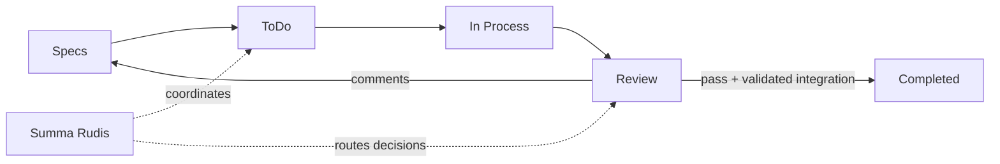

# Workflow contract

This is the single vocabulary for the rebuild. Configuration is saved in the UI;
files and model output are proposals, never executable policy.

## Setup and snapshots

Authorization and model catalogs are global. A default team assigns Speculator,
Implementor, Secutor and Summa Rudis to saved agents/models. A new Arena copies
that team; a new Tabula copies the Arena defaults. Edits affect future battles.
Applying different roles, schedules or grants to an existing Tabula is explicit
and audited; active battles retain immutable snapshots.

Arena registration only inspects/registers the selected folder. Confirm Git
initialization before doing it. If there is no commit, preview and separately
authorize a minimal baseline commit; never auto-add all documents or secrets.
An Arena/Tabula can be saved before it is runnable. Start names any missing
agent/model, baseline, grant or check instead of silently changing settings.

## Planning

**Create tasks** launches the selected planning-capable role read-only, with a
bounded brief and explicitly selected, canonicalized Arena files. The agent
proposes a versioned Markdown spec and tasks: stable IDs, description, source
references, acceptance criteria, dependencies and suggested checks. Phoenix
validates bounds, paths, duplicate IDs and dependency cycles before persisting.

The user sees and can edit the result; planning starts no delivery worker.
Accepted specs move tasks from Specs to ToDo. A task in Specs at battle start is
prepared automatically within the approved brief. Generated shell commands
remain proposals; only previously approved checks may execute.

Start battle shows the goal/spec revision, task membership, team/model bindings,
local completion choice, check commands, concurrency and finite limits. One
confirmation records the authorization and starts work. No per-task approvals
are required for ordinary work. Adding unrelated tasks after Start leaves them
for the next battle. In-scope task splits/repairs may be proposed by Speculator,
checked by Secutor and imported by the host within the original criteria and
lifetime task limit; running/completed task history is never rewritten.

## Default Tabula

| Column / stable key | Assigned role | Exit condition |
| --- | --- | --- |
| Specs / `specs` | Speculator | Valid spec, criteria and dependencies |
| ToDo / `todo` | Summa Rudis coordinates this queue | Dependencies complete, grants valid, capacity available |
| In Process / `in_process` | Implementor | Candidate revision and verification evidence |
| Review / `review` | Secutor | Pass with evidence, return comments, or block |
| Completed / `completed` | System applies the validated Secutor result | Reviewed local integration and required checks passed |

```mermaid
flowchart LR
  Specs --> ToDo --> Work["In Process"] --> Review
  Review -->|comments| Specs
  Review -->|pass + validated integration| Completed
  Rudis["Summa Rudis"] -.coordinates.-> ToDo
  Rudis -.routes decisions.-> Review
```

A returned task carries the candidate, spec revision, findings and failed check
receipts back to Speculator, then Implementor. It cannot jump straight back to
coding while leaving ambiguous intent unresolved.

Users can insert ordered role steps before implementation, before review, or
after review but before Completed; ToDo can remain an idle queue. Each added
working step needs a role, declared outputs, grant and exit result. Write-capable
steps must precede a mandatory final Secutor review. After-review steps are
read-only or route back through review if they change the candidate. Renaming
a column changes only its label. Reordering or adding steps publishes a new
workflow revision; no arbitrary conditional graph editor is required.

## Summa Rudis control loop

1. Read committed battle state, eligible tasks, public reports and remaining
   limits. Invoke the coordinator only for a decision/event, not a busy polling
   conversation.
2. Request a closed proposal: dispatch eligible task, route findings, request
   in-scope replanning, wait with reason, request clarification, or propose finish.
3. Host validation binds proposal to battle/revision, task membership, role,
   current spec/candidate, grants, dependencies, capacity and idempotency key.
4. Persist accepted command, projection and event atomically. Dispatch through
   supervised workers; publish the committed event to LiveView.
5. Reject stale/foreign/invalid proposals without side effects. A bounded
   correction turn may fix schema mistakes; it cannot reset budgets.

Phoenix owns leases and scheduling mechanics. Summa Rudis owns coordination
judgment. Summa Rudis is a distinct selected role, not a hidden Speculator turn.
No model receives direct SQL or privileged host APIs.

## States and controls

A card has a column plus execution status: `idle`, `queued`, `running`,
`paused`, `blocked`, `completed`, `skipped` or `cancelled`.
The workflow definition controls allowed column transitions; status alone cannot
satisfy a gate. A blocked card stays in the relevant column with a text reason.

Battle states: `ready`, `running`, `pausing`, `paused`,
`needs_attention`, `stopping`, `stopped`, `completed`.
Waiting/backoff and sleep are recorded reasons, not fake completion states.

| Control | Meaning |
| --- | --- |
| Pause | Close admission immediately; checkpoint and quiesce owned workers, then show Paused only once verified |
| Resume | Revalidate authority, processes, worktrees and limits, then continue from durable evidence |
| Retry | New recorded attempt for an eligible failed stage, retaining prior artifacts and consumed limits |
| Stop | Confirm; close admission, cancel owned workers, verify cleanup and preserve changes/history |
| Skip task | Confirm; retain unfinished work and defer dependents; never count it completed |
| Inspect | Open task, evidence, worktree or redacted logs without altering execution |

If a runtime cannot resume a live session, checkpoint public evidence, end the
owned process and use a fresh compatible session. The UI states what will happen.
No automatic restart may replay an uncertain write.

Defaults proposed for the first implementation: two concurrent task workers per
Arena, four active agent sessions globally (including planning, review and
Summa Rudis), 20 lifetime tasks per battle, two transient retries per task,
three Secutor review attempts per task, four active hours and 24 wall hours per
battle. These are editable, finite start-time settings, not measurements.
Backoff, corrections, splits and continuations do not reset cumulative budgets.
Sleep consumes wall time but not active time. Cost telemetry is advisory if
provider usage is missing/delayed; do not claim a guaranteed billing cap.

Task-local blockers pause descendants while independent work continues. Invalid
policy, uncertain process ownership or Arena-wide Git drift closes that Arena's
admission. Other Arenas keep working. Once no work can advance, show Needs
attention with the cause and smallest useful question. Auth/quota recovery is
handled once for the affected connection.

## Parallel workers and Git integration

A clone is a new attempt/session using the same role definition, not a duplicated
login or shared writable checkout. Atomically claim tasks and capacity; retain
lease TTL/heartbeat and one active attempt per task/stage. Apply global, Arena,
Tabula and provider-account caps with fair admission across Arenas. Idle
coordinator conversations hold no worker slot.

Allow one active battle per Arena initially, with multiple saved Tabulae.
Independent Arenas and independent tasks in that battle may run concurrently.
This avoids competing integration branches without removing requested task
parallelism.

Every task branches from a recorded reviewed battle head, after prerequisites
have integrated. Each task has its own worktree, process group and optional
ports. Secutor reviews the exact task candidate and its evidence.

Local integration into the battle branch is serialized. If the reviewed head
has advanced, form a new integration candidate in an owned integration worktree,
run affected checks and obtain Secutor review of the combined candidate before
advancing the head with a compare-and-swap. A conflict returns to Speculator/
Implementor as bounded repair work. Never force-reset a task or the user's
checkout. Persist integration intent and candidate identity before Git effects;
on crash reconcile refs before retrying. One task's pass is not evidence for a
different combined revision.

A task reaches Completed only after its reviewed contribution is integrated.
Dependents use that integrated head. The whole battle completes only when every
required criterion is met, no required tasks remain blocked/skipped/cancelled,
final checks pass on the final head, and Secutor records a final independent
review. Summa Rudis summarizes the result; the host records completion. Local
integration is part of Start battle authority; user-branch merge/push is separate.
