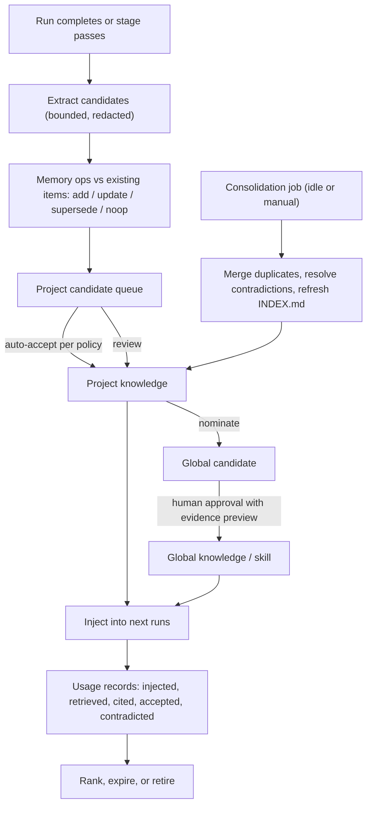

# Knowledge: Extraction, Consolidation, Publication, and Use

## Purpose

Every run produces evidence: specs, diffs, test results, review findings, corrections, costs. Cuckoding turns that evidence into project knowledge that later runs use, and into reusable skills that other projects may adopt after review. The pipeline is not model training; it never deletes source evidence, and every item can be traced back to what produced it and forward to where it was used.

## Landscape reviewed (2026-09)

| Approach | Mechanism | What Cuckoding takes from it | What it avoids |
| --- | --- | --- | --- |
| Claude Code auto memory + Auto Dream | Per-repo Markdown directory (`MEMORY.md` index plus topic files) written by a forked subagent after sessions; a background consolidation pass merges duplicates and replaces stale entries | Markdown-first, index-plus-topics layout, always-loaded index with on-demand topics, separate append and consolidate phases, idle-time consolidation | Machine-local and single-runtime scope; no evidence links, no approval step, no usage tracking |
| Cursor memories / Devin knowledge / playbooks | Auto-suggested facts that a human approves; entries carry trigger descriptions; playbooks are reusable procedures | Human approval before global effect, trigger descriptions for retrieval, procedure packaging | Hosted storage; no provenance to the run that produced the fact |
| Community session-compressors (for example claude-mem) | Hooks capture session activity, an LLM compresses it, relevant context is injected into the next session across several runtimes | Capture at run boundaries via the hub, inject through runtime-native mechanisms, work across runtimes | Unbounded injection; no review; token savings claimed without measurement |
| Mem0-style extract-and-retrieve | LLM extracts candidate facts, then decides ADD / UPDATE / DELETE / NOOP against existing memory; vector plus optional graph store | Explicit memory operations with conflict handling instead of blind appends | Vector store as the source of truth; opaque to the user |
| Zep / Graphiti temporal graphs | Facts with validity intervals; supersession rather than deletion; entity/edge graph | `valid_from` / `invalid_at` and `supersedes` on every item; contradiction detection | Graph database as a core dependency; heavy ingestion cost |
| Letta / MemGPT | Small always-in-context core memory blocks, archival memory paged in, self-editing, "sleep-time" consolidation | Bounded always-injected core, deep material on demand, background consolidation when idle | Agent-managed self-editing of global memory without review |
| Agent Skills (`SKILL.md`) | Portable instruction packages with name, trigger description, instructions, resources; supported by several runtimes | Packaging format for published skills so any runtime can consume them | Skills as memory of facts; they are procedures |
| Local-first graph/vector engines (cognee, Graphiti self-hosted, XERJ, single-binary stores) | Semantic and graph retrieval over local data | Optional `knowledge_backend` plugins for retrieval; never the source of truth | Core dependency on any one of them |

Conclusion: file-based, human-readable knowledge with an indexed provenance layer, explicit memory operations, validity and supersession, human approval for anything global, runtime-native injection, and measured usage. Semantic retrieval is a plugin.

## Store layout

```
<project repo>/.cuckoding/knowledge/        # project-scoped, committed if the user wants
  INDEX.md              # always injected (bounded), maintained by consolidation
  facts/*.md            # stable repository facts, glossary, setup
  decisions/*.md        # architecture decisions with applicability
  patterns/*.md         # patterns and anti-patterns with evidence
  recipes/*.md          # testing/quality recipes
  observations/*.md     # runtime/model observations with sample size
  skills/<name>/SKILL.md
<app data>/knowledge/global/                 # human-approved, cross-project
  INDEX.md
  patterns/*.md
  skills/<name>/SKILL.md
```

Every file has front matter: `id`, `kind`, `title`, `scope`, `status` (`candidate | project | global | superseded | revoked`), `version`, `confidence`, `valid_from`, `invalid_at`, `supersedes`, `evidence` (run/stage/artifact/event IDs and repository SHAs), `produced_by` (runtime, model, policy version), `triggers` (when to retrieve), `review` (approver, date). SQLite mirrors the front matter in `knowledge_items` and links usage in `knowledge_usages`; the files remain the human-readable truth and can be edited by hand, after which the index re-syncs and marks the edit as a user revision.

The Phase 7 store baseline accepts only bounded regular Markdown files in the
declared kind directory, rejects symlinks, duplicate/unknown fields, invalid
UUIDs and timestamps, incomplete provenance, and inconsistent scope/status.
Confidence is numeric from `0.0` through `1.0`. A new file is indexed as a user
revision. A later hash mismatch records `modified` and the observed hash while
retaining the previously accepted metadata and hash. The user must explicitly
accept a matching-ID, matching-scope edit with a higher version; same-version
changes remain flagged. Missing and invalid files remain visible in the mirror.
Project retrieval checks the owning project before reading any path. Global
items require a human review in front matter and an explicit per-call opt-in;
task 0705 will bind that opt-in to the run capability and project policy.

## Pipeline



### Extraction (per run)

- Runs after a stage exit gate passes or a run completes; uses the board's configured runtime with a bounded input budget and a fixed template; only public artifacts and events are inputs.
- Produces candidates with evidence IDs; each candidate is compared to existing items and labeled as an explicit operation.
- Redaction runs before synthesis and again before storage: secrets, personal data, absolute private paths, proprietary identifiers.

The Phase 7 extraction baseline runs only after a durable run reaches `done`
and the trusted policy permits `on_completion`. It selects that run's recorded
agent runtime, builds a size-bounded fixed-template prompt from the normalized
public activity stream and public artifact event descriptors, and stores only
the prompt hash. Registered secret values and sensitive keyed fields are
redacted before the runtime call and again on its untrusted structured output.
The application—not the runtime—assigns evidence IDs and classifies exact
content matches as `noop`, matching kind/title revisions as `update`, valid
explicit replacements as `supersede`, and otherwise as `add`. Jobs are
idempotent per run; failed synthesis leaves a durable failed job and no partial
candidate rows.

### Consolidation ("dream")

- Runs when the machine is idle and no run needs the runtime, or on demand; never during an active stage on the same project without the user asking.
- Merges duplicates, resolves contradictions by supersession with both items kept in history, rewrites `INDEX.md` within its size budget, and proposes expiries for stale observations.
- The implemented pass is deterministic: it leaves source Markdown untouched,
  collapses duplicate and superseded entries in the derived index, redacts
  before its atomic write, and stores every `INDEX.md` version in an
  append-only revision row. Its durable scan checkpoint resumes after process
  interruption without creating a second version for the same job revision.

### Publication

- Project acceptance can be automatic for `facts` and `recipes` when policy allows; `patterns`, `decisions`, and `observations` default to review.
- Global publication always requires a human with a visible evidence preview and a redaction report. Published items record the exact content hash and support supersession, revocation, and rollback.
- Skills are published as `SKILL.md` packages with name, semantic version, trigger description, prerequisites, instructions, safety limits, verification checklist, evidence, ownership, and review date. An approved skill is not enabled for every role; workflows select it.

The implemented review queue is available at `/knowledge`. Human decisions
and policy-allowed system decisions are recorded against the candidate and its
source run. Acceptance writes a new project file; update and supersede
operations point at the prior item. Publication, revocation, and rollback
validate the latest approval for the exact run and action before writing.
Global versions retain their exact Markdown and hash in append-only rows.
Approved recipes may additionally write a bounded Agent Skills-compatible
`SKILL.md` and manifest under the global knowledge root.

### Injection

- Adapters inject knowledge through the runtime's native mechanism for the run only: generated instruction files in the run's `agent/` folder (`CLAUDE.md`/`AGENTS.md` fragments), skill directories, or a scoped MCP resource. Cuckoding never writes into the user's global runtime configuration.
- Always-injected content is `INDEX.md` plus items whose `triggers` match the stage and task; the rest is available on demand through the built-in retrieval endpoint or a knowledge backend plugin.
- Injected content is marked as evidence that cannot change tools, policy, or instructions.

### Usage tracking

For each stage attempt record which items were injected, which were retrieved on demand, which the public artifacts cite (by ID), whether the reviewer accepted the work, and whether a later correction contradicted an item. These records feed the Knowledge Lineage and Usage dashboard and the ranking/expiry logic. Token savings from knowledge are estimates unless the provider reports cache behavior; label them.

## Metrics-based knowledge

Observations about runtimes and models include sample size, task mix, dates, and cost source. A single task never becomes a universal claim.

## Contamination controls

- Repository text and model output are untrusted; embedded instructions cannot alter publication policy or scope.
- Project-scoped items cannot be retrieved by another project unless published globally.
- Global candidates require a human with evidence preview.
- Cross-project retrieval of global items is opt-in per project.

## Evaluation

Track retrieval precision from sampled review, stale-item rate, secret false-negative tests, candidate approval rate, later contradiction rate, and stage-time change controlled for task type. Use feedback to rank or retire knowledge, never to silently rewrite immutable history.
