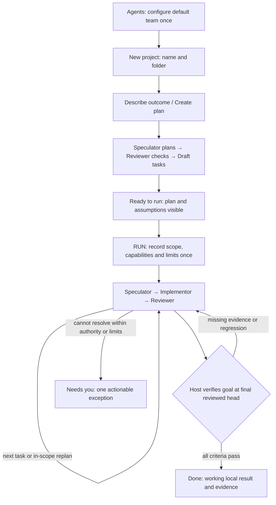

# Paperclip adoption for autonomous Cuckoding

Date: 2026-09-30. Status: **implemented in the working tree by task 1057**. In-flight native restart during an active provider prompt, and a signed clean-machine release, remain open.
Tracking: [task 1056](../tasks/phase-10-hardening-beta/1056-paperclip-adoption-plan.md).
This revision supersedes the earlier PC-01–PC-05 roadmap.

## Product goal

**Set up agents once → create a project → describe it → agents create the plan
and tasks → press Run → receive a working, tested, independently reviewed result.**

The developer should not have to assign agents again, create a board manually,
select task proposals, approve every task, restart ordinary failed attempts or
move cards between columns. Those are orchestration responsibilities.

The main success measure is **completed goals with zero required human actions
after Run**, within the scope, capabilities and limits authorized at that start.
Pause, Stop and inspection remain available, but optional. Code remains local;
publication is a separate action under Cuckoding's existing product boundary.

A new project follows this guided autonomous path. Existing manual workflows and
fixed batches remain available in advanced controls and retain their recorded
behavior. An upgrade must not silently authorize old projects to run autonomously.

## Revised conclusion

Keep Cuckoding's engine. Task 1055 already supplies goal planning, independent
plan review, reviewed revisions, task-local blocker handling, role conversations,
bounded recovery and sequential reviewed-commit delivery. Replacing that engine
would add risk without demonstrated benefit.

The biggest gaps are the steps surrounding it: new projects start with unassigned
roles, planning has a separate manual-import flow, autonomous planning starts after
board Start, delivery context lacks explicit original criterion mapping, and host
failure classification currently recognizes only timeouts as transient.

Use Paperclip where it helps close those gaps: durable intent/source identity,
criterion-based completion, idempotent preparation, reason-aware continuation
accounting, and concise outcomes. Reduce human attention to genuine exceptions.
Recurring routines, portable bundles and an elaborate management dashboard are
removed from the active roadmap. Reusable default-team setup is a Cuckoding UX
improvement derived from this user's goal; we have not established that Paperclip
implements this exact cross-project experience.

“Better” below means a better fit supported by inspected mechanisms. Neither
application was benchmarked against the other, and Paperclip's runtime reliability
has not been established by this source analysis.

## Keep, adapt or remove

| Idea | Fit for the goal | Decision |
| --- | --- | --- |
| Goal context and completion contracts [P2] | Helps agents preserve requirements and finish the requested outcome without repeated human checking | **Keep and adapt.** Bind every delivery stage and final assessment to the approved brief, criteria and candidate |
| Durable requests, ownership and deduplication [P5] | Prevents duplicate work and lost direction during reconnects and retries | **Keep the behavior; reuse our implementation.** Extend Commands, leases and BoardControl where needed |
| Separate failure retries from productive continuation/resource waiting [P7] | Avoids unnecessary stops when a provider is busy or a turn ends while work can continue | **Keep and adapt.** Separate bounded counters; all attempts still consume the total time/usage allowance |
| Idempotent setup from a recorded brief [P6] | Makes Describe/Run safe to replay without duplicate projects, plans or tasks | **Adapt the transaction pattern.** Keep our project and saved-agent model |
| Simple work-product presentation [P3] | Lets the user open the result rather than reconstruct it from logs | **Keep the presentation idea.** Reuse our commits, artifacts, QA evidence and preview |
| Scoped budget admission [P4] | Makes a single Run authorization finite and understandable | **Narrow it to one goal execution first.** Reuse cumulative usage; no company/monthly/agent finance subsystem |
| Attention inbox [P1] | Useful only when agents cannot proceed within the approved scope | **Shrink to Needs you.** Existing dashboard projection and source-linked controls; no separate inbox project |
| Default reusable team | Eliminates repeated project role assignment | **Add to Cuckoding.** One durable machine-wide default referencing saved agents; not portable import/export |
| Autonomous plans, role conversations, review loop, knowledge | Already present in Cuckoding and aligned with local coding work | **Keep ours.** Improve missing cases and provider acceptance; no replacement subsystem |
| Recurring routines [P8] | Solves repeated maintenance, not Describe → Run | **Remove from this roadmap.** Reconsider only for an explicit recurring-work requirement |
| Portable company/team bundles [P8] | Adds export/import, collisions and permission mapping instead of simplifying normal setup | **Remove from this roadmap.** A default-team selector addresses the immediate need |
| Org chart, CEO, hiring, company tenancy, cloud control plane | Adds concepts the developer does not need to deliver a local project | **Do not adopt** |
| Agent-claimed completion, autonomous release or self-expanded permissions | Can report success or perform actions beyond the recorded authority | **Do not adopt.** Independent Reviewer and host validation remain automatic quality gates |
| A second heartbeat service, task queue, runtime or workflow engine | Duplicates our durable controller and supervised dispatcher | **Do not adopt.** An idle board needs no paid manager-agent polling |

## The intended experience

### 1. Configure agents once

In Agents, connect the desired runtimes and choose the default Speculator,
Implementor and Reviewer. The same saved connection/model may fill several roles;
Review still uses an independent session. Do not require three logins or a second
model merely to use the normal flow. Prefer distinct models when the user already
has them configured, without silently substituting a different provider.

Save the default team's model settings, role instructions and finite execution
profile once. A new project copies that configuration by reference/snapshot.
A later default-team edit affects new projects only. Project overrides remain
optional and visible under advanced settings. Reconnect is requested only when a
saved authorization actually fails; credentials remain in app-owned provider stores.

### 2. Create a project and describe the outcome

Choose a name and repository/folder, then describe what should be built or changed.
For an empty folder, retain the existing explicit project-creation confirmation
for Git initialization. Immediately show a project brief field rather than routing
the user through agent assignment and board administration.

Submitting **Create plan** authorizes bounded read-only planning, independent plan
review and creation of Draft tasks. It does not authorize implementation. The host
creates/reuses one default delivery board as part of this explicit action. Speculator
reads the repository, derives testable criteria and tasks from the brief, and records
ordinary implementation assumptions. Reviewer checks scope, coverage and dependencies.
Correction loops happen automatically within the planning allowance.

The result is **Ready to run** with a concise outcome, generated task list and the
important assumptions. Editing is optional. There is no manual task-selection/import
step and no mandatory per-task approval. Generated criteria are proposed interpretations
of the user's brief, not a license to narrow it or introduce unrelated work.

### 3. Press Run once

One clearly labeled **Run** action authorizes the displayed brief/plan revision,
saved team, finite limits, in-scope replanning, correction loops, safe recovery and
automatic local completion after passing Review. Show a compact summary beside
that action; expand details on demand. Do not add a second confirmation for the
same start authorization.

Preflight checks authorization, repository/base state, declared commands, tool
availability and required capabilities before showing Ready. For a new project,
verify bootstrap/build/test prerequisites as well as agent login. The agents may
propose setup commands, but the host validates them and the Run action authorizes
only the displayed trusted configuration digest. Executable setup is never taken
directly from free-form model text. A new capability request after Run remains a
separate decision; known prerequisites should have been resolved before Run.

### 4. The team delivers automatically

Speculator → Implementor → Reviewer repeats as needed. The controller schedules
eligible tasks, manages dependencies, passes reviewed commits forward, replans
unstarted work within the brief and keeps independent tasks moving around local
blockers. Failed tests and review comments go back to the team, not to the user.
Routine implementation choices use repository conventions and recorded assumptions.

The UI shows progress, current role/runtime/model, elapsed time and **Pause / Stop
/ Inspect**. Temporary waiting and recovery remain Working details, not user alerts.
An exception appears only after safe automated resolution is unavailable or exhausted.

### 5. Receive the result

**Done** means the accepted goal criteria are satisfied against the final reviewed
head and required checks passed. Show the result/preview, changes, test evidence,
actual limitations and local branch/worktree. Offer a separate release action when
requested. Unfinished criteria remain visible and cannot be hidden by skipped cards
or a cheerful completion message.



## How to avoid routine human interruptions

| Situation | Default autonomous response |
| --- | --- |
| Naming, layout, file organization, ordinary implementation choice | Use the repository's conventions or the smallest reversible choice; record an assumption and continue |
| Missing code/tests or a failing quality check | Return evidence through Speculator → Implementor → Reviewer; preserve the original requirement |
| Task is too large or its dependencies were discovered late | Reviewer validates a bounded split/reorder of unstarted work; retain history and coverage |
| Known temporary provider outage, rate limit or unavailable capacity | Wait/back off within the recorded deadline; retry only after host classification and safe ownership checks |
| Productive turn reaches a provider limit | Continue with a compatible provider session or bounded public evidence, within a separate continuation ceiling and the same total allowance |
| One task is blocked | Continue independent eligible work; retain the blocker and its dependent tasks |
| Repeated identical failure with no verified progress | Try a bounded reviewed change of approach, then surface one exception rather than spin |
| Ambiguity would change the promised outcome | Ask one concise question if the brief and repository cannot resolve it; continue independent work when possible |
| Missing authorization, new capability, uncertain process ownership, exhausted total limit | Preserve work and show Needs you; do not guess or silently increase authority |

Questions must be classified and justified with the unresolved requirement and
what was already checked. Provider output proposing an assumption or recovery is
untrusted input to host validation. Ordinary questions do not become permission
grants. Users can inspect assumptions without having to approve each one.

This targets zero routine intervention, not a false promise that an expired login,
an unavailable external service or an impossible requirement can always be resolved
without the developer. The normal path must be demonstrated, not inferred from tests.

## Implementation plan

AU-01 through AU-05 are implemented in the working tree by task 1057. The earlier PC labels are retired; do not create
implementation tasks for the removed inbox/routines/portable-bundle roadmap.
Use one assigned task and branch per bounded implementation slice.

| Slice | Dependency | User-visible result |
| --- | --- | --- |
| AU-01 Default team | Existing saved-agent catalog | New projects inherit the configured team |
| AU-02 Describe to ready plan | AU-01 | One brief produces reviewed Draft tasks before Run |
| AU-03 One Run authorization | AU-02 | The prepared goal executes without per-task approvals |
| AU-04 Autonomous resolution | AU-03 | Routine uncertainty, waits and recoverable failures stay with the team |
| AU-05 Verified finish and simple status | AU-03; recovery cases from AU-04 | Done proves the goal; Needs you is exceptional |

### AU-01 — Default team and project entry

Extend [AgentSettingsLive](../lib/cuckoding_web/live/agent_settings_live.ex),
[ProjectOnboarding](../lib/cuckoding/project_onboarding.ex) and
[ProjectSetupLive](../lib/cuckoding_web/live/project_setup_live.ex).
Saved `provider_accounts` already exist. Add one minimal revisioned default-team
record, role-to-account references and an audited saved execution profile. Do not
build a team catalog, preset marketplace or new credential store.

On project registration, copy validated default-team settings into the existing
project configuration version. Keep the current immutable project → board → run
snapshot chain. Store no credentials. Existing projects retain their assignments;
missing/deleted/disconnected references produce an exact setup issue, not an
unannounced fallback. Empty/migrated installations have no chosen team until the
user saves one. Override remains an explicit advanced action.

**Acceptance:** configure once, then create two projects without another login or
role assignment; both receive the intended team. One connection can serve all
three roles in separate sessions. Changing defaults does not rewrite either
project/run. Simulated auth revocation blocks only affected new launches. Add
focused onboarding/agent-settings tests and prior-schema migration coverage.
Record default revision and copied configuration hash, never credentials.

### AU-02 — Describe, automatically plan, stop at Ready to run

Extend [BoardControl](../lib/cuckoding/board_control.ex) and
[Plans](../lib/cuckoding/board_control/plans.ex), reusing task-intake parsing and
validation. Add a phase-aware authorization boundary: Create plan permits
read-only planning/review and Draft import; Run later permits delivery. The
prepared goal must not use today's unconditional local-delivery start path.

Use the existing autonomous plan/review mechanism, which permits an independently
scoped Reviewer with the same model. Do not force the different-model rule from
manual `TaskProposalReview` onto this quick-start journey. Automatically validate
and materialize the accepted tasks/dependency mapping in one transaction. Keep
source brief, assumptions, generated criteria and plan-review evidence linked.

Add a durable `ready_to_run` board phase and planning authorization evidence.
It may retain the board claim, but consumes no provider process or delivery slot.
Before Run, cancel/discard preparation releases the claim while retaining history.
Use stable command keys for board creation, brief revision, planning and import;
a retry or browser reconnect must never duplicate tasks. Editing the brief
invalidates the prepared plan and triggers a bounded new review. Keep existing
manual intake available without silently changing its import contract.

**Acceptance:** an empty project and an existing repository both reach Ready to
run from a brief; review corrections resolve automatically; no delivery starts
before Run; stale/concurrent brief edits cannot import a stale plan; import and
restart replay once. Goals exceeding supported task/iteration ceilings must be
identified before Run, without silently dropping part of the requested outcome.
Add board/planning, migration and accessible project/board LiveView checks.

### AU-03 — One Run, complete local delivery

Add an activation command on the prepared BoardControl aggregate. In one short
transaction, validate the accepted plan/brief, repository base, saved team,
policy/grants, budget profile and workspace control state; persist the delivery
authorization and switch to delivery. Reuse shared `RunControl` admission and
existing task preparation, Review, local completion and reviewed-commit handoff.
Do not call the current fresh-batch preflight blindly: it rejects an already-owned
board and would re-plan a prepared goal unnecessarily.

Planning and delivery authorizations are separate immutable records. Bind Run to
the precise reviewed plan and policy digests; never edit the earlier snapshot to
pretend it already granted delivery. A forward-compatible snapshot/event version
must keep old fixed batches and historical runs unchanged. After Run, reviewed
in-scope task changes use task 1055's existing bounded plan revision path.

Reuse finite profile defaults and cumulative accounting. Count pre-Run planning,
controller turns, all roles, corrections, retries and continuations in the visible
goal total. Separate active work time, wall time and sleep/wait gaps. Require
finite task/time/revision/retry limits; optional monetary caps need a supported
billing basis and explicit unavailable/estimated labels. Check total allowance
at every common launch and consume usage once. Stop further admission durably
when exhausted and use existing ownership-checked controls for live work. Late
provider accounting means this is not a guaranteed ceiling on the provider bill.
No separate company/monthly budget subsystem is needed for this journey.

For greenfield projects, include a trusted bootstrap/build/test plan in preflight.
Reuse declared-command validation and host-side execution. Do not execute newly
agent-modified policy in the same run or assume network access/package installation
is available. Expected setup work must fit the recorded capability grant before
Run; further grant changes require an explicit decision.

**Acceptance:** one click starts the displayed plan exactly once, every passing
review completes locally without another confirmation, corrections/replans remain
automatic, and the final branch contains the sequential reviewed result. No push,
PR, merge or global knowledge publication occurs. Exhausted allowances and stale
policy/plan snapshots reject launch without resetting consumed usage. Add
admission, board, workflow, accounting, security and migration regressions.

### AU-04 — Resolve routine issues autonomously

Extend [OrchestrationFailure](../lib/cuckoding/orchestration_failure.ex),
[BoardControl](../lib/cuckoding/board_control.ex),
[Conversations](../lib/cuckoding/board_control/conversations.ex) and the current
reconciler/ACP boundaries. Today only `agent_timeout` is transient, and exhausted
Review is task-local; everything else is global [C4]. Expand only typed,
provider-tested host classifications, not string guesses about raw error text.

Adapt Paperclip's separate retry/continuation accounting [P7]: capacity waits
must not consume a failure retry, while productive continuation must have its
own finite ceiling. All consume the same total allowance where applicable.
Persist reason, next eligible time, source attempt and counters before dispatch.
Use backoff/retry-after evidence when normalized by the adapter. Retain the
periodic dispatcher as recovery fallback; no new always-on LLM loop.

A retry follows verified process cleanup and policy/worktree checks. A restart
must distinguish a live compatible session, a known-ended attempt and an ambiguous
lost owner. Continue safely from the former two using recorded identity/evidence;
never blindly replay a reserved prompt or adopt a process from a PID alone.
Unreviewed failed work stays available as evidence and never becomes the next
reviewed base by assumption.

Teach planning/controller requests to resolve reversible implementation details
from the brief and repository before asking. Record assumption/change rationale
as public evidence. Use normalized failure class, reviewed head/artifact evidence
and fulfilled criteria to detect repeated non-progress; neither log volume nor an
agent saying “progress” resets a retry/continuation budget. A bounded alternative
plan must pass independent review. Do not automatically change providers, expand
permissions or rewrite the brief to evade a failure.

**Acceptance:** a simulated transient outage recovers without a user action;
capacity waiting does not exhaust failure retries; productive continuation ends
within its own ceiling; stale/repeated wakeups create no duplicate work; an
ordinary design choice does not ask the user; ambiguous ownership and irreducible
scope decisions do. Add typed failure/ACP/control/board tests, then real-provider
restart and physical sleep/wake evidence before claiming unattended reliability.

### AU-05 — Prove completion, simplify the result screen

Extend [WalkingSkeleton](../lib/cuckoding/walking_skeleton.ex),
[GateEvaluator](../lib/cuckoding/workflows/gate_evaluator.ex),
[Statistics](../lib/cuckoding/board_control/statistics.ex) and existing board/run/
dashboard components. Carry the original brief, criterion IDs and accepted plan
mapping into every delivery stage. Version the Review/evidence schema to require
criterion assessment linked to trusted test results and hash-verified artifacts
for the exact candidate. Keep these facts in the existing immutable evidence
artifacts/events, not a second artifact store.

Current criterion progress means all mapped tasks are Done [C5]. Keep that as
legacy task-based coverage for old runs; new autonomous Done must require verified
criteria. Also run a bounded final integration review/check against the final
reviewed head: individually passing tasks can still regress earlier work. Reuse
the assigned read-only Reviewer and declared checks, account for this attempt and
reserve room for it in the Run profile. Return repair findings through Speculator
within remaining limits; missing evidence or skipped criteria never becomes Done.

The main project view has progress, result and controls. Put logs, role topology,
raw accounting and full board controls behind Inspect/advanced disclosure. **Needs
you** appears only for actionable unresolved exceptions; reuse current questions,
approvals, failure events and their domain commands. Show the cause, affected work,
what automatic recovery tried and one appropriate action. Deduplicate by source
and revision; keep old history accessible without stale alerts. Do not add a
separate inbox, snooze system, bulk approvals or role-performance scoreboard.

**Acceptance:** two tasks that individually pass but fail final integration are
repaired automatically; missing/foreign/stale/modified criterion evidence cannot
finish; historical runs retain old validation. A normal completed goal requires
no interaction after Run and exposes a usable local result. Check desktop/narrow
layout, keyboard/focus/input retention, authenticated artifact links and live
refresh. Record goal completion, validated criteria and exception/resolution facts.

## Release gates and measures

Write ADRs before changing default-team state, phase-aware authorization, failure
semantics or completion contracts. Update PRODUCT/FLOW/DB/SECURITY and UI/runtime
documentation alongside implementation. Task 1057 implements this contract in
the working tree. This document does not by itself change a previously installed build.

Deliver AU-01–03 as the first end-to-end implementation milestone using existing
Review/local completion. AU-04–05 complete the intended unattended contract. Do
not call the product fully autonomous after shipping only a shortcut button.
The source/fixture, real-provider, physical recovery and signed-build gates remain
separate. Existing release work must not wait for unrelated Paperclip features.

The required demonstration is concrete:

1. Configure one saved team once, then create a fresh project from an empty folder.
2. Submit a brief for a small working application; agents produce reviewed tasks.
3. Press Run once, then provide no further input through implementation, a forced
   test/review correction, a known transient provider failure and final integration.
4. Open the working result and verify every promised criterion at the final head.
5. Repeat with an existing repository; separately verify restart and physical
   sleep/wake preserve ownership, history and single execution.
6. Verify the exceptions: revoked authorization, exhausted limits, changed policy,
   missing ownership evidence and unresolved scope cannot silently pass.

Measure required human actions after Run, setup actions for the second project,
completed-goal rate, automatic recovery success by cause, duplicate launches,
criterion evidence coverage and total observed usage. Report sample size and
provider/build identity. No comparative performance or cost gain has been measured.

Focused existing test entry points, to extend per slice:

```sh
rtk env -u CR_PAT mix test test/cuckoding/project_onboarding_test.exs test/cuckoding_web/agent_settings_live_test.exs test/cuckoding_web/project_setup_live_test.exs
rtk env -u CR_PAT mix test test/cuckoding/board_control_test.exs test/cuckoding/board_task_intake_test.exs test/cuckoding/walking_skeleton_test.exs
rtk env -u CR_PAT mix test test/cuckoding/run_control_test.exs test/cuckoding/execution/scheduler_test.exs test/cuckoding/execution/commands_test.exs test/cuckoding/telemetry/accounting_test.exs
rtk env -u CR_PAT mix test test/cuckoding/workflows/gate_evaluator_test.exs test/cuckoding/reconciler_test.exs test/cuckoding/power/manager_test.exs
rtk env -u CR_PAT mix test test/cuckoding_web/status_live_test.exs test/cuckoding_web/board_live_test.exs test/cuckoding/shared_authorization_migration_test.exs
rtk env -u CR_PAT mix quality
rtk env -u CR_PAT mix assets.build
rtk node --test test/task_board_motion_test.cjs
rtk git diff --check
```

These are future implementation gates, **not commands passed by this research
task**. Run migration tests on a copy of the previous schema and check integrity,
foreign keys and retained history. Rollback disables new starts and preserves
records/worktrees; it does not reverse released migrations or rewrite snapshots.

## Research baseline and sources

Paperclip: `a36cbffa9e71443a627641972052fbf52e636755`, shallow detached clone at
`~/.local/share/cuckoding/reference-code/paperclip`, commit timestamp
2026-09-30 10:20:50 −05:00. Its [MIT license](https://github.com/paperclipai/paperclip/blob/a36cbffa9e71443a627641972052fbf52e636755/LICENSE)
was inspected; retain the notice if substantial code is ever copied. No upstream
code/assets were copied. The clone remains unindexed in XERJ.
Cuckoding source baseline: `a04abe2548ee0838f625adaeeaab4b34bd345560`.
Analysis branch: `feature/1056-paperclip-adoption-plan`.

Method: inspect pinned implementation and relevant tests, compare current Cuckoding
source and the requested journey. Paperclip was not installed, executed or
browser-tested. No application tests/provider runs were executed for this
documentation revision. Sources establish implementation patterns, not superior
runtime outcomes. The earlier worklog retains the superseded research history.

| ID | Inspected Paperclip mechanism |
| --- | --- |
| P1 | [attention.ts:1069](https://github.com/paperclipai/paperclip/blob/a36cbffa9e71443a627641972052fbf52e636755/server/src/services/attention.ts#L1069) assembles actionable sources; [attention-service.test.ts:979](https://github.com/paperclipai/paperclip/blob/a36cbffa9e71443a627641972052fbf52e636755/server/src/__tests__/attention-service.test.ts#L979) suppresses superseded failure attention. Keep this as exception handling only. |
| P2 | [completion-contracts.ts:124](https://github.com/paperclipai/paperclip/blob/a36cbffa9e71443a627641972052fbf52e636755/server/src/services/native-runtime/completion-contracts.ts#L124) binds revisioned contracts; [work-assessments.ts:7](https://github.com/paperclipai/paperclip/blob/a36cbffa9e71443a627641972052fbf52e636755/server/src/services/native-runtime/work-assessments.ts#L7) binds assessments; [heartbeat.ts:8815](https://github.com/paperclipai/paperclip/blob/a36cbffa9e71443a627641972052fbf52e636755/server/src/services/heartbeat.ts#L8815) carries ancestor context. Reject the low-risk agent-claim authority at [completion-contracts.ts:67](https://github.com/paperclipai/paperclip/blob/a36cbffa9e71443a627641972052fbf52e636755/server/src/services/native-runtime/completion-contracts.ts#L67). |
| P3 | [work-products.ts:194](https://github.com/paperclipai/paperclip/blob/a36cbffa9e71443a627641972052fbf52e636755/server/src/services/work-products.ts#L194) exposes primary products, diffs and runtime-service state. |
| P4 | [budgets.ts:668](https://github.com/paperclipai/paperclip/blob/a36cbffa9e71443a627641972052fbf52e636755/server/src/services/budgets.ts#L668) evaluates threshold incidents; [budgets.ts:718](https://github.com/paperclipai/paperclip/blob/a36cbffa9e71443a627641972052fbf52e636755/server/src/services/budgets.ts#L718) checks invocation blocks. Borrow scope-wide enforcement, not all of its policy scopes. |
| P5 | [heartbeat.ts:28300](https://github.com/paperclipai/paperclip/blob/a36cbffa9e71443a627641972052fbf52e636755/server/src/services/heartbeat.ts#L28300) retains eligible pending comment identity during coalescing; [issues.ts:11347](https://github.com/paperclipai/paperclip/blob/a36cbffa9e71443a627641972052fbf52e636755/server/src/services/issues.ts#L11347) guards task checkout; [issue-comment-wakeup.ts:1](https://github.com/paperclipai/paperclip/blob/a36cbffa9e71443a627641972052fbf52e636755/server/src/services/issue-comment-wakeup.ts#L1) suppresses self-trigger loops. |
| P6 | [onboarding-seed.ts:361](https://github.com/paperclipai/paperclip/blob/a36cbffa9e71443a627641972052fbf52e636755/server/src/services/onboarding-seed.ts#L361) documents revision-idempotent setup; its transaction/audit implementation follows at [onboarding-seed.ts:393](https://github.com/paperclipai/paperclip/blob/a36cbffa9e71443a627641972052fbf52e636755/server/src/services/onboarding-seed.ts#L393). This is a cloud/company mechanism; only the transactional pattern fits Cuckoding. |
| P7 | [execution-recovery-attempt.ts:43](https://github.com/paperclipai/paperclip/blob/a36cbffa9e71443a627641972052fbf52e636755/server/src/services/execution-recovery-attempt.ts#L43) separates persistent failure/continuation accounting; [execution-recovery-attempt.ts:59](https://github.com/paperclipai/paperclip/blob/a36cbffa9e71443a627641972052fbf52e636755/server/src/services/execution-recovery-attempt.ts#L59) handles resource-wait lanes. Counts alone do not prove safe replay or recovery. |
| P8 | [routines.ts:1789](https://github.com/paperclipai/paperclip/blob/a36cbffa9e71443a627641972052fbf52e636755/server/src/services/routines.ts#L1789) and [company-portability.ts:5204](https://github.com/paperclipai/paperclip/blob/a36cbffa9e71443a627641972052fbf52e636755/server/src/services/company-portability.ts#L5204) substantiate the removed proposals; neither is a dependency of Describe → Run. |

| ID | Pre-implementation baseline, task 1056 |
| --- | --- |
| C1 | [ProjectOnboarding](../lib/cuckoding/project_onboarding.ex) (`lib/cuckoding/project_onboarding.ex:140`) starts with empty connections/unassigned default roles; [project setup](../lib/cuckoding_web/live/project_setup_live.ex) (`lib/cuckoding_web/live/project_setup_live.ex:93`) sends the user onward to agent/role setup. |
| C2 | [BoardTaskIntake](../lib/cuckoding/board_task_intake.ex) (`lib/cuckoding/board_task_intake.ex:108`) requires proposal selection/import; [Plans](../lib/cuckoding/board_control/plans.ex) (`lib/cuckoding/board_control/plans.ex:167`) already defines autonomous Speculator and independent Reviewer requests. |
| C3 | [BoardControl](../lib/cuckoding/board_control.ex) (`lib/cuckoding/board_control.ex:45`, `lib/cuckoding/board_control.ex:104`) combines fresh-board preflight and start authorization; [task 1055](../tasks/phase-10-hardening-beta/1055-autonomous-board.md) records the implemented autonomous scope. |
| C4 | [OrchestrationFailure](../lib/cuckoding/orchestration_failure.ex) (`lib/cuckoding/orchestration_failure.ex:77`) classifies timeout/task/global failures; [BoardControl](../lib/cuckoding/board_control.ex) (`lib/cuckoding/board_control.ex:731`) stops/checks before retry; [Conversations](../lib/cuckoding/board_control/conversations.ex) (`lib/cuckoding/board_control/conversations.ex:122`) binds native continuation compatibility. |
| C5 | [Statistics](../lib/cuckoding/board_control/statistics.ex) (`lib/cuckoding/board_control/statistics.ex:147`) derives criterion coverage from task outcomes; [GateEvaluator](../lib/cuckoding/workflows/gate_evaluator.ex) (`lib/cuckoding/workflows/gate_evaluator.ex:9`) validates evidence. |
| C6 | [WalkingSkeleton](../lib/cuckoding/walking_skeleton.ex) (`lib/cuckoding/walking_skeleton.ex:936`, `lib/cuckoding/walking_skeleton.ex:1108`) checks stage budgets and builds delivery context; [Accounting](../lib/cuckoding/telemetry/accounting.ex) (`lib/cuckoding/telemetry/accounting.ex:34`) retains idempotent, source-labeled usage. |
| C7 | [Commands](../lib/cuckoding/execution/commands.ex), [RunControl](../lib/cuckoding/run_control.ex) and [ProjectAutopilot](../lib/cuckoding/project_autopilot.ex) already own durable commands, shared admission and disposable dispatch. |
| C8 | [StatusLive](../lib/cuckoding_web/live/status_live.ex), [board components](../lib/cuckoding_web/components/board_control_components.ex) and [architecture](ARCHITECTURE.md#knowledge-service) provide existing controls, progress and reviewed knowledge. |

## Proposed implementation checklist

- [x] AU-01: configure the default team once and inherit it in new projects.
- [x] AU-02: turn a brief into reviewed Draft tasks and durable Ready to run.
- [x] AU-03: authorize the prepared goal once and complete local tasks automatically.
- [x] AU-04: resolve ordinary uncertainty, waits and recoverable failures autonomously.
- [x] AU-05: verify the whole goal at the final head and show a simple usable result.
- [ ] Demonstrate zero required actions after Run with in-flight native restart and a signed clean-machine release. One empty-project native drill is recorded in task 1057; it does not close those gates.
