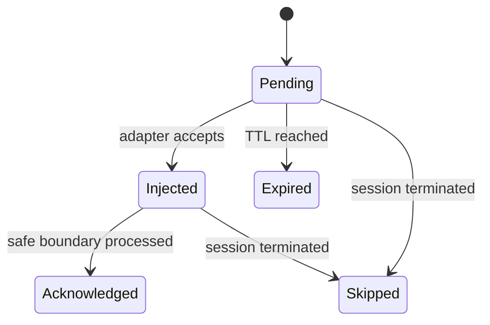

# Agent Hub Protocol

## 1. Purpose

Agent Hub gives Codex, Claude Code, Cursor Agent, OpenCode, and future providers one structured coordination interface. It is the MCP-facing surface of AgentDesk's built-in internal A2A domain. Its tools provide safe peer discovery, task delegation, messages, delivery acknowledgements, artifacts, handoffs, leases, project search, and memory without allowing agents to access one another directly or query the internal database.

Natural language is allowed inside message bodies, but identity, routing, ownership, status, and expiry are structured fields.

The internal semantics are defined in `A2A.md`. They align with A2A 1.0 concepts where useful but do not expose a public A2A wire endpoint in the MVP.

## 2. Connection and identity

Each provider process receives:

- `project_id`;
- `agent_id`;
- an MCP endpoint or stdio command;
- a short-lived capability token;
- an allowed tool set;
- its assigned worktree path;
- a generated Agent Card template and project A2A policy.

The server derives identity from the authenticated capability. An agent must not be allowed to claim another `agent_id` in request parameters.

Recommended capability claims:

```json
{
  "sub": "agent-session-uuid",
  "project_id": "project-uuid",
  "tools": ["hub_*", "project_search", "memory_*"],
  "issued_at": "timestamp",
  "expires_at": "timestamp",
  "nonce": "random"
}
```

Persist only a secure hash or verifier, not the raw token.

## 3. MCP surface for internal A2A

### Session tools

#### `hub_register`

Registers provider capabilities, publishes a safe internal Agent Card, and returns current project coordination state. Every first-class provider adapter calls it automatically after the provider session and MCP connection are ready.

Input:

```json
{
  "idempotency_key": "uuid",
  "provider": "codex",
  "provider_version": "string",
  "name": "Backend implementer",
  "description": "Implements Elixir and database tasks",
  "skills": [
    {"id": "elixir-backend", "tags": ["elixir", "phoenix", "ecto"]}
  ],
  "input_modes": ["text/plain", "application/json"],
  "output_modes": ["text/markdown", "application/json", "artifact/ref"],
  "capabilities": {
    "steering": true,
    "structured_events": true,
    "approvals": true
  }
}
```

Output includes the agent identity, Agent Card revision, visible peers, current context/task, pending delegations, active leases, unread cursor/count, project rules version, A2A policy, and heartbeat interval.

#### `hub_heartbeat`

Renews the session liveness window and optionally its listed leases.

```json
{
  "idempotency_key": "uuid",
  "lease_ids": ["uuid"],
  "status": "working",
  "summary": "Implementing the resource manager"
}
```

The server returns renewed and rejected lease IDs independently.

#### `hub_update_status`

Updates user-visible activity, not ownership.

```json
{
  "idempotency_key": "uuid",
  "status": "blocked",
  "summary": "Waiting for the migration resource",
  "task_id": "uuid"
}
```

Status changes update availability and task presentation but do not change assignment or resource ownership.

### Discovery tools

#### `hub_list_agents`

Returns bounded safe Agent Cards for visible project peers, including availability, skills, modes, features, and current load summary. It never returns provider credentials, private prompts, transcript content, or unrestricted paths.

#### `hub_get_agent_card`

Returns one visible Agent Card by `agent_id`, optionally requiring a minimum revision.

#### `hub_find_agents`

Filters available peers by required skill IDs/tags, input/output modes, features, and availability. Results are advisory; authorization and recipient acceptance are still required.

### Task tools

- `hub_list_tasks`
- `hub_get_task`
- `hub_create_task`
- `hub_delegate_task`
- `hub_list_delegations`
- `hub_accept_delegation`
- `hub_reject_delegation`
- `hub_update_task`
- `hub_cancel_task`
- `hub_complete_task`
- `hub_add_task_dependency`
- `hub_list_task_graph`
- `hub_save_workflow`
- `hub_list_workflows`
- `hub_run_workflow`
- `hub_list_roles`
- `hub_subscribe_task`
- `hub_request_review`

`hub_create_task` accepts `depends_on` task ids. Incomplete prerequisites mark the new task `blocked`. `hub_run_workflow` instantiates a saved template; omit `context_id` to use the project's working context. `hub_list_roles` returns name, description, and permission profile only; prompt templates are not included.

Task assignment and resource ownership are separate. Accepting a delegation does not automatically lock every file mentioned in its description.

#### `hub_delegate_task`

```json
{
  "idempotency_key": "uuid",
  "context_id": "uuid",
  "task_id": "uuid-or-null",
  "recipient_agent_id": "uuid",
  "title": "Review lease expiry transaction",
  "description": "Check race safety and add regression tests",
  "required_skills": ["elixir-backend", "code-review"],
  "priority": 10,
  "expires_at": "timestamp-or-null",
  "metadata": {}
}
```

The hub checks sender authority, recipient visibility/capabilities, recursion/fan-out policy, duplicate idempotency key, and task state before persisting the proposal. The recipient must accept or reject; proposal alone does not assign the task.

#### `hub_accept_delegation`

Requires `delegation_id`, its expected version, and a new idempotency key. Acceptance and task assignment commit in the same transaction. A conflicting prior acceptance returns the stable existing outcome or `task_conflict`.

#### `hub_reject_delegation`

Requires a bounded reason. Rejection is durable and not treated as provider failure.

#### `hub_subscribe_task`

Subscribes the connected session to live task updates while the process is online. Durable state remains available through `hub_get_task`, the inbox, and the event timeline after reconnect; PubSub is not the source of truth.

### Resource tools

#### `hub_claim_resources`

```json
{
  "idempotency_key": "uuid",
  "resources": [
    {
      "type": "file",
      "key": "lib/agent_desk/resource_manager.ex",
      "mode": "exclusive"
    },
    {
      "type": "database",
      "key": "agentdesk_test_codex_01",
      "mode": "exclusive"
    }
  ],
  "reason": "Implement lease acquisition",
  "ttl_seconds": 300,
  "all_or_nothing": true
}
```

Successful response:

```json
{
  "granted": true,
  "leases": [
    {
      "id": "uuid",
      "type": "file",
      "key": "lib/agent_desk/resource_manager.ex",
      "mode": "exclusive",
      "expires_at": "timestamp"
    }
  ]
}
```

Conflict response:

```json
{
  "granted": false,
  "conflicts": [
    {
      "requested_key": "lib/agent_desk/resource_manager.ex",
      "held_key": "lib/agent_desk",
      "owner": {
        "agent_id": "uuid",
        "display_name": "Claude reviewer"
      },
      "reason": "Reviewing resource coordination",
      "expires_at": "timestamp"
    }
  ]
}
```

#### `hub_release_resources`

Releases only leases owned by the authenticated agent and requires an idempotency key.

#### `hub_renew_resources`

Renews active owned leases within project TTL policy and requires an idempotency key. It cannot revive an expired, released, revoked, or foreign lease.

#### `hub_list_resources`

Returns bounded project lease state appropriate to the caller.

### Messaging tools

#### `hub_send_message`

```json
{
  "idempotency_key": "uuid",
  "context_id": "uuid",
  "scope": "direct",
  "recipient_agent_id": "uuid",
  "kind": "request",
  "priority": "normal",
  "task_id": "uuid",
  "correlation_id": "uuid",
  "causation_id": "uuid-or-null",
  "reply_to_message_id": "uuid-or-null",
  "parts": [
    {"text": "Please review the lease expiry transaction."},
    {"data": {"schema": "agentdesk.review_request.v1", "files": ["lib/agent_desk/resource_manager.ex"]}}
  ],
  "requires_ack": true,
  "expires_at": "timestamp-or-null",
  "metadata": {}
}
```

Supported parts are bounded `text`, schema-identified `data`, authorized `artifact_ref`, and approved project-relative/app-managed `file_ref`. Binary bytes and arbitrary remote URLs are rejected.

#### `hub_broadcast`

Project-wide message with stricter rate and size limits. `task` and `context` scopes fan out only to authorized active participants; every recipient gets an independent ordered delivery record.

#### `hub_read_inbox`

Returns messages after an opaque cursor or per-recipient inbox sequence. The result identifies whether each message is pending, injected, acknowledged, expired, or skipped and whether it was queued for a safe boundary.

#### `hub_ack_messages`

Acknowledges processed message IDs or a monotonic inbox sequence with an idempotency key. Acknowledgement means the provider adapter delivered the context at a safe boundary, not that the model obeyed it.

### Artifact tools

#### `hub_publish_artifact`

```json
{
  "idempotency_key": "uuid",
  "context_id": "uuid",
  "task_id": "uuid",
  "kind": "test_result",
  "name": "mix-test.json",
  "mime_type": "application/json",
  "path": "app-managed-relative-path",
  "sha256": "hex",
  "size_bytes": 4821,
  "metadata": {"command": "mix test", "status": "passed"}
}
```

The path must resolve inside authorized project/app-managed storage, and the server verifies size and hash before publishing. Revisions create new artifact rows referencing the prior artifact.

#### `hub_get_artifact`

Returns metadata and an authorized local reference. It never turns an arbitrary agent-supplied URL into a server-side fetch.

### Handoff tools

#### `hub_publish_handoff`

```json
{
  "idempotency_key": "uuid",
  "task_id": "uuid",
  "summary": "Implemented lease acquisition and expiry",
  "commit": "git-object-id",
  "changed_files": [
    "lib/agent_desk/resource_manager.ex",
    "test/agent_desk/resource_manager_test.exs"
  ],
  "checks": [
    {"name": "mix test", "status": "passed"}
  ],
  "warnings": [],
  "review_requested_from": ["uuid"]
}
```

AgentDesk validates that the commit belongs to the recorded worktree before accepting it as verified. The handoff is also enqueued on the project merge queue. Policy gates read `project.settings["required_checks"]` and the handoff `checks` list; a failed or missing required check marks `policy_status=failed`.

#### `hub_accept_handoff`

Records reviewer/user acceptance without auto-merging. Integration remains a separate explicit Git operation.

#### `hub_reject_handoff`

Rejects a queued handoff. Rejected items leave the open queue.

#### `hub_list_merge_queue`

Returns open (`queued` and `accepted`) merge-queue items for the current project.

There is no MCP tool that merges into the primary tree or that exports/imports a team-sync bundle. Those are user actions in LiveView.

### Search and memory tools

- `project_search`
- `memory_remember`
- `memory_recall`
- `memory_forget`

These are implemented through `AgentDesk.Search.Adapter` and must return an explicit `unavailable` error when XERJ is disabled or unhealthy.

## 4. Lease semantics

### Resource key formats

```text
file:<canonical-project-relative-path>
directory:<canonical-project-relative-path>
glob:<canonical-project-relative-glob>
database:<logical-database-name>
migration:<project-id>
service:<service-name>
port:<protocol>:<number>
git_ref:<full-ref-name>
custom:<namespace>:<key>
```

Rules:

- File, directory, and glob paths are normalized relative to the assigned worktree and resolved against traversal/symlink escape.
- A glob lease overlaps a file or directory when the path sits under the glob's static prefix or matches the pattern.
- Exact named resources compare by canonical key.
- Exclusive conflicts with any overlapping lease owned by another agent.
- Shared conflicts only with overlapping exclusive leases owned by another agent.
- Re-entrant acquisition by the same agent may extend or return the existing compatible lease.
- Default TTL: 300 seconds.
- Recommended heartbeat: every 60 seconds.
- Grace after a missed heartbeat: configurable, initially 30 seconds.
- Maximum TTL is capped by policy.
- Revocation is an administrative action and generates a high-visibility event.

## 5. Message delivery



Delivery strategies:

1. If the provider supports steering an active turn, inject a bounded coordination notice.
2. If the provider accepts queued stream input, enqueue it.
3. Otherwise, attach unread coordination messages to the next user/provider turn.
4. Always show the message immediately in the UI.

High-frequency events such as token deltas are never broadcast as agent messages.

Delivery order is stable per recipient through `inbox_sequence`. No global order across different recipients is promised. Restart resumes pending delivery from SQLite; it does not replay acknowledged messages as new prompts.

## 6. Idempotency and transition control

Every agent-originated mutating tool requires an `idempotency_key`. AgentDesk stores the authenticated session, stable operation name, canonical request hash, and bounded result.

- Same key and same request: return the original result.
- Same key and different request: return `idempotency_conflict`.
- Concurrent delegation acceptance: one transition commits; other callers receive the stable outcome or `task_conflict`.
- Task/delegation updates require an expected optimistic version.
- Message acknowledgement is monotonic and safe to repeat.
- Cancellation preserves already-created messages, artifacts, commits, and history.

## 7. Normalized events

Event names use dot-separated namespaces:

```text
project.opened
agent.starting
agent.ready
agent.card_published
agent.card_updated
agent.status_changed
agent.interrupted
agent.exited
task.claimed
task.delegation_proposed
task.delegation_accepted
task.delegation_rejected
task.delegation_expired
task.delegation_revoked
task.blocked
task.completed
resource.claimed
resource.renewed
resource.conflict
resource.released
resource.expired
message.sent
message.injected
message.acknowledged
message.expired
artifact.published
artifact.unavailable
handoff.published
task.dependency_added
task.unblocked
merge_queue.enqueued
merge_queue.accepted
merge_queue.rejected
merge_queue.merged
provider.approval_requested
provider.command_started
provider.file_changed
search.index_ready
search.failed
security.violation
```

Payloads are versioned when their shape changes incompatibly:

```json
{
  "type": "resource.claimed",
  "schema_version": 1,
  "payload": {}
}
```

## 8. Rate and size limits

Initial policy:

- message body: 16 KiB;
- message parts: 32 parts and 64 KiB total serialized payload;
- metadata: 32 KiB serialized;
- broadcast: 10 per minute per agent;
- delegation fan-out: initially 4 open proposals per agent and configurable project depth limit;
- Agent Card: 64 skills/tags entries and 64 KiB total;
- artifact metadata: 64 KiB; bytes live outside message/event rows;
- search results: at most 20 passages and a configured byte/token budget;
- heartbeat: no more than one per 10 seconds;
- lease batch: at most 100 resources;
- handoff changed-file list: at most 2,000 entries before switching to an artifact reference.

Limits are enforced server-side regardless of provider instructions.

## 9. Error shape

```json
{
  "code": "resource_conflict",
  "message": "One or more resources are already leased",
  "retryable": true,
  "details": {},
  "correlation_id": "uuid"
}
```

Stable initial error codes:

```text
unauthenticated
capability_expired
forbidden
invalid_request
resource_conflict
lease_expired
not_owner
task_conflict
delegation_not_pending
delegation_expired
agent_unavailable
capability_mismatch
idempotency_conflict
message_expired
artifact_not_found
artifact_integrity_failed
provider_unavailable
search_unavailable
rate_limited
internal_error
```

## 10. Generated project snapshot

AgentDesk may generate `.agent-hub/status.md` for human and fallback-agent readability. It contains safe Agent Card summaries, active tasks, pending delegations, agents, leases, unread counts, artifacts, and recent handoffs.

The snapshot must start with:

```md
> Generated by AgentDesk. Informational only. Canonical coordination state is maintained by the Agent Hub.
```

Agents must not edit it or treat it as a lock database.
