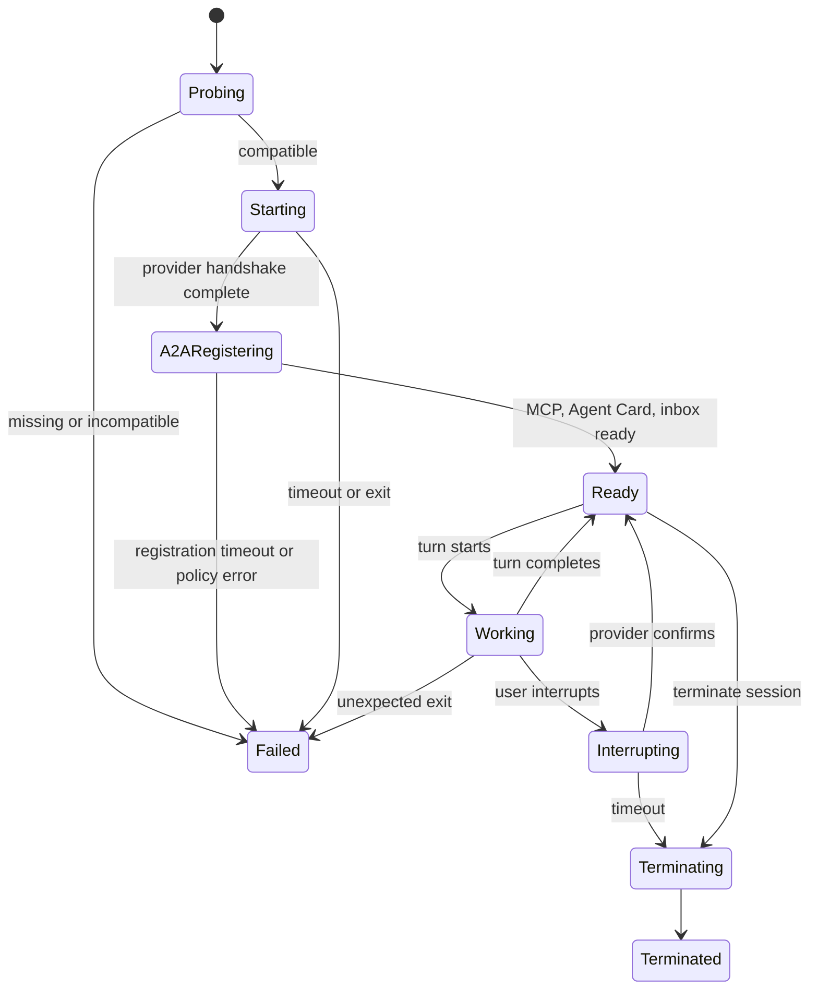

# Provider Integration

## 1. Goals

Provider adapters let AgentDesk operate Codex, Claude Code, Cursor Agent, OpenCode, and future agents through one domain model without reducing all providers to terminal text.

Adapters normalize lifecycle, streaming output, approvals, tool calls, file changes, usage, errors, and resume identifiers. Provider-specific features remain available through capability flags and diagnostic views.

## 2. Common capability model

```elixir
%AgentDesk.Providers.Capabilities{
  structured_events: true,
  multi_turn: true,
  resume: true,
  steer_active_turn: false,
  approvals: true,
  mcp_stdio: true,
  mcp_http: true,
  file_change_events: true,
  usage_events: true,
  structured_output: true,
  internal_a2a: true,
  safe_boundary_delivery: true
}
```

The UI must derive available controls from the reported capabilities. It must not render a fake pause/resume control for an adapter that cannot implement it safely.

Initial primary integration paths:

| Provider | Primary control interface | Transport | Compatibility path |
| --- | --- | --- | --- |
| Codex | `codex app-server` | stdio JSONL/JSON-RPC | `codex exec --json` for one-shot work |
| Claude Code | Structured headless/streaming CLI | stdio JSON/JSONL | Claude Agent SDK evaluation |
| Cursor Agent | `agent acp` | ACP over stdio JSON-RPC | Headless `agent -p` only for reduced one-shot workflows |
| OpenCode | `opencode acp --cwd <worktree>` | ACP over stdio nd-JSON | Loopback `opencode serve` API evaluation |
| SDK | User executable JSONL | stdio JSONL | Generic unstructured CLI (no PTY) |
| Remote | Attach / inbound MCP | loopback MCP stdio | Public A2A gateway (deferred) |

Cursor and OpenCode share ACP framing and request-correlation code. They do not share a single capability declaration: each installed version is probed and each adapter owns provider-specific methods, authentication readiness, and fallbacks.

Cuckoding also installs extra ACP agents from the official registry (`registry.json`). Mapped ids (`codex-acp`, `claude-acp`, `cursor`, `opencode`) use first-class adapters. Other agents use `AgentDesk.Providers.AcpGeneric`. Install records store executable + argv only.

## 3. Normalized event types

```elixir
@type normalized_event ::
        {:session_ready, map()}
        | {:turn_started, map()}
        | {:message_delta, map()}
        | {:message_completed, map()}
        | {:reasoning_delta, map()}
        | {:command_started, map()}
        | {:command_output, map()}
        | {:command_completed, map()}
        | {:file_change, map()}
        | {:tool_started, map()}
        | {:tool_completed, map()}
        | {:approval_requested, map()}
        | {:usage, map()}
        | {:turn_completed, map()}
        | {:provider_error, map()}
        | {:session_exited, map()}
```

Each event includes provider identifiers inside metadata for diagnostics, while the rest of the application consumes stable common fields.

## 4. Codex adapter

### Primary integration: App Server

Use `codex app-server` over the default stdio transport. The official protocol provides JSONL JSON-RPC messages for rich clients, including initialization, threads, turns, streamed items, steering, approvals, interruption, and resume.

Startup sequence:

1. Probe `codex --version` and required command availability.
2. Spawn `codex app-server` with stdin/stdout pipes and separate stderr.
3. Send `initialize` with AgentDesk client information.
4. Send `initialized`.
5. Start or resume a thread with the session's worktree as `cwd`.
6. Configure the Agent Hub MCP server for that isolated session.
7. Stream notifications and answer server-initiated approval requests.

Persist:

- Codex version;
- app-server protocol/schema version when discoverable;
- thread ID;
- active turn ID;
- item IDs needed for correlation;
- applied sandbox/permission policy.

Generate or fixture protocol schemas for the installed Codex version during adapter development rather than assuming one historical payload shape.

### Fallback: non-interactive execution

Use `codex exec --json` for one-shot tasks or compatibility fallback. JSONL stdout contains thread, turn, item, error, and usage events. The adapter must explicitly report reduced capabilities compared with App Server.

Prefer an explicit sandbox such as read-only for review or workspace-write inside the assigned worktree for implementation. Never default to unrestricted filesystem access.

## 5. Claude Code adapter

Use Claude Code's supported non-interactive/headless mode with structured output. The initial spike must verify the installed version's exact flags and supported session continuation flow.

Expected primary shape:

```text
claude -p ... --output-format stream-json --verbose
```

When continuous input is required, evaluate the documented `stream-json` input mode or the Claude Agent SDK. Keep CLI and SDK implementations behind the same adapter behavior.

Persist:

- Claude Code version;
- provider session ID when returned;
- configured permission mode;
- MCP configuration applied to the session;
- structured usage and result metadata.

Claude hooks may improve pre-edit coordination and observability, but correctness must not depend on hooks because other providers may not offer equivalent enforcement.

## 6. Cursor Agent adapter

### Primary integration: ACP

Run Cursor CLI as an ACP server:

```text
agent acp
```

Cursor documents stdio transport, JSON-RPC 2.0 envelopes, newline-delimited framing, stderr diagnostics, `session/new`, `session/load`, streamed `session/update`, `session/request_permission`, and `session/cancel`. The adapter should:

1. Probe `agent --version`, command availability, and `agent status` without reading stored credentials.
2. Spawn `agent acp` with the assigned worktree as the process working directory.
3. Send `initialize` with AgentDesk client capabilities and record the negotiated ACP version.
4. Use the advertised authentication method while preserving the user's existing Cursor login.
5. Create or load the provider session and persist its session ID.
6. Normalize standard ACP updates and supported `cursor/*` extensions.
7. Convert permission requests into AgentDesk approvals and send the selected outcome back to Cursor.

Persist:

- Cursor CLI version;
- negotiated ACP protocol and capabilities;
- Cursor session ID;
- selected model/mode when reported;
- permission decisions and cancellation outcome;
- MCP configuration source applied to the session.

Cursor ACP supports MCP configuration and exposes Cursor-specific blocking and notification methods. Unknown `cursor/*` methods must be logged as bounded diagnostics and answered with a protocol-safe unsupported response when a response is required. UI support for extensions such as questions, plans, tasks, or todo updates remains capability-gated.

### Reduced fallback

Cursor headless print mode (`agent -p`) may support a reduced one-shot adapter if ACP is unavailable. File modification requires an explicit write-enabled permission choice; never silently add `--force`/`--yolo`. The fallback must report no interactive permission round-trip or resumable ACP session unless the installed CLI proves otherwise.

## 7. OpenCode adapter

### Primary integration: ACP

Run OpenCode as an ACP server scoped to the assigned worktree:

```text
opencode acp --cwd <worktree>
```

The documented transport is stdin/stdout with newline-delimited JSON. Reuse the ACP client core for initialize, session, prompt, update, permission, cancellation, and resume operations, but capture fixtures from the installed OpenCode version before enabling a capability.

Persist:

- OpenCode version;
- negotiated ACP protocol and capabilities;
- OpenCode session ID;
- selected model/provider/agent when reported;
- permission policy and decisions;
- MCP configuration applied to the session.

OpenCode supports multiple underlying model providers. AgentDesk treats `opencode` as the agent adapter key and stores the selected underlying model/provider as session metadata; it does not create a separate AgentDesk provider adapter for every OpenCode model backend.

### Evaluated fallback: local server API

`opencode serve` exposes an OpenAPI 3.1 HTTP interface on loopback and has a generated SDK. Evaluate it only if ACP lacks a required stable feature. If selected later, AgentDesk must allocate a random loopback port, set server authentication, disable mDNS, supervise the process, and normalize the same adapter contract. Do not expose the server to the LAN or make a JavaScript sidecar mandatory for the ACP-first MVP.

`opencode run` is acceptable for isolated one-shot compatibility tasks. Session list/export/import operations are diagnostics and recovery aids, not substitutes for AgentDesk's canonical SQLite records.

## 8. Shared ACP client layer

`AgentDesk.Providers.ACP.Client` owns:

- newline-delimited JSON-RPC parsing with partial-line buffering and size limits;
- request IDs, pending-call timeouts, notifications, and server-initiated requests;
- initialize/capability negotiation;
- session creation, loading, prompting, cancellation, and update routing;
- normalized permission callbacks;
- protocol-level errors and stderr separation.

Provider adapters own:

- executable discovery, version constraints, and authentication readiness;
- provider extension methods and capability mapping;
- model/mode selection;
- any fallback transport;
- translation from ACP content/update variants into normalized AgentDesk events.

Never assume that equal transport means equal semantics. Cursor and OpenCode fixtures must remain separate even when they exercise the shared client.

## 9. Generic CLI adapter

The generic adapter is intentionally limited:

- executable and argument templates are user-configured;
- stdin may accept prompts;
- stdout/stderr are captured;
- exit status and signals are normalized;
- no structured approvals or file events are assumed;
- MCP is enabled only if explicitly configured and verified;
- resume is unavailable unless a provider extension implements it.

The `sdk` adapter is the structured path for the same user-configured executable model. It speaks newline JSON: outbound `{"op":"initialize"|"initialized"|"start_session"|"resume"|"prompt"|"interrupt"|"approve"|"configure_mcp"}` and inbound `{"type":"<normalized event>"}`. `remote` is an attach session with `Capabilities.spawned == false`; the agent connects to Agent Hub MCP using the per-session token file. Neither binds beyond loopback. Public A2A remains deferred.

Terminal/PTY emulation is a later feature. The structured custom UI does not require a PTY for any first-class provider path.

## 10. Process lifecycle



Termination policy:

1. Request provider-native interrupt.
2. Wait a short configurable interval.
3. Send graceful process termination.
4. Wait again.
5. Force-kill only the app-owned process group.
6. Preserve worktree, transcript, and diagnostic tail.

## 11. MCP injection

Each adapter receives a generated per-session MCP configuration. It must not overwrite the user's global Codex, Claude Code, Cursor, or OpenCode configuration.

Prefer protocol-level session configuration when the installed provider version supports it. If a provider requires a project-scoped config file, AgentDesk must merge into an app-owned worktree overlay, preserve existing entries, exclude generated state from Git, and remove only the exact generated entry during cleanup. Global configuration mutation is never the default.

Preferred transports:

- stdio when the provider owns the MCP child lifecycle cleanly;
- authenticated Streamable HTTP on loopback when several providers share the Agent Hub process.

The capability token is passed through an environment variable or protected temporary file, never as visible prompt content or a raw command-line argument when avoidable.

## 12. Internal A2A bootstrap and delivery

Internal A2A is not an optional provider feature. Every first-class adapter must:

1. inject the Agent Hub MCP configuration into the isolated session;
2. call or cause `hub_register` after the provider and MCP connection are ready;
3. publish a safe Agent Card derived from user role settings plus verified runtime capabilities;
4. load pending delegations, unread inbox state, current task/context, and active leases;
5. deliver A2A notices through provider steering when safe, otherwise at the next turn boundary;
6. acknowledge only after the adapter has injected the content successfully;
7. preserve delivery cursor and provider session identity across supported resume;
8. mark undeliverable messages explicitly when terminating.

Provider adapter code never routes messages directly to another provider process. It receives normalized deliveries from `AgentDesk.A2A.MessageRouter` and returns delivery outcomes.

Capabilities such as active-turn steering affect latency, not whether internal A2A exists. A provider without steering still participates through durable next-boundary delivery.

## 13. Approval handling

Provider approval requests become normalized `approval_requested` events containing:

- provider request ID;
- session and turn correlation;
- requested action;
- command or path summary;
- requested permissions;
- expiry/cancellation state.

LiveView renders a blocking approval card. The user's decision is returned to the originating provider request. AgentDesk must not broaden requested permissions silently.

## 14. Backpressure and transcript policy

- Do not assign every token delta directly into an ever-growing LiveView socket.
- Batch deltas on a short timer and cap the visible buffer.
- Persist normalized completed items rather than every token when possible.
- Keep raw events optional and short-lived.
- Store large transcripts as append-only files with database metadata and integrity hashes.
- Redact likely secrets before disk persistence or search indexing.

## 15. Adapter conformance tests

Every provider adapter ships fixtures covering:

- successful handshake;
- malformed JSON/event;
- stdout/stderr separation;
- partial line buffering;
- approval request and response;
- tool call lifecycle;
- file-change event;
- normal completion;
- interrupt;
- unexpected process exit;
- restart/resume;
- MCP unavailable;
- internal A2A registration;
- pending delegation/inbox bootstrap;
- safe-boundary message injection and acknowledgement;
- resume without duplicate A2A delivery;
- provider version incompatibility.

ACP adapters additionally require fixtures for capability negotiation, server-initiated permission requests, unknown extension methods, `session/new`, `session/load`, cancellation, and concurrent request correlation.

Live CLI protocol tests (`test/agent_desk/providers/*_live_test.exs`) skip when the vendor binary is missing and never send a paid prompt. Codex and ACP adapters complete handshake when installed. Claude stream-json waits for a user turn, so the live test asserts a clean handshake timeout and terminate. Cursor/OpenCode skip if `agent`/`opencode` is missing. CI must not require a vendor login. See `TESTING.md`.
