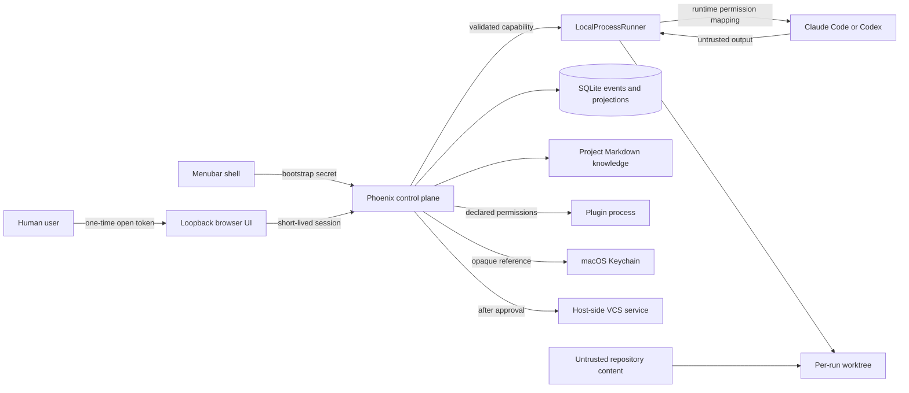

# Trusted-Host Threat Model

**Review date:** 2026-09-17  
**Applies to:** host-runner MVP on a single-user Apple Silicon Mac

## Security claim

Cuckoding constrains and audits what its control plane launches and grants. It does not make an arbitrary host process safe and does not claim that a worktree is a security sandbox. An agent allowed to run unrestricted shell commands has the same practical access as the macOS user unless the selected runtime or operating system enforces a narrower grant.

## Assets and actors

Protected assets are repository and worktree contents, Git identity and history, provider and VCS credentials, Keychain references, workflow state and audit evidence, artifacts and logs, project/global knowledge, budget and resource limits, browser sessions, plugin configuration, and the signed update chain.

Threat actors include malicious repository authors, compromised dependencies or developer tools, malicious or confused model output, malicious plugins, local unprivileged processes or browser pages, accidental user configuration, and a compromised update source.

## Boundaries

Every inbound edge from a repository, agent, plugin, browser, or network service is untrusted data. A parsed result does not become a trusted command without schema validation, policy evaluation, and any required approval.

## Mandatory human approvals

A human must approve:

1. Any capability or policy escalation.
2. Use of newly modified `.cuckoding/` execution policy or plugin configuration in the same run.
3. Enabling a plugin that requests host, network, or secret access, and any later permission expansion.
4. Granting or using a Cuckoding-managed secret outside an already approved capability.
5. Destructive cleanup when Cuckoding cannot prove ownership, and any permanent deletion outside a run-owned disposable path.
6. Publishing project knowledge into the global namespace.
7. External Git push or pull-request creation.
8. Installing an update that changes trust policy, performing an irreversible migration, or restoring from backup.
9. Final merge, release, or deployment.

Approvals are scoped, expiring, recorded events; one approval cannot silently authorize a broader later action.

## Risk register

Likelihood and impact are rated Low, Medium, or High for the MVP before the listed control is validated.

| ID | Threat and boundary | Likelihood | Impact | Required mitigation | Owner | Validation task | Residual risk |
| --- | --- | --- | --- | --- | --- | --- | --- |
| R1 | Repository prompt injection causes host reads or execution outside the worktree | High | High | Separate instructions from data; protected paths; narrow runtime grants; never promote output to commands; visible host warning | Runner + adapters | 0303, 0401, 1001 | High when the user grants unrestricted shell access |
| R2 | Agent, plugin, log, or export steals a credential | Medium | High | Keychain references, environment allowlist, no secrets in argv, pre-persistence redaction, canary tests | Security | 0204, 1001 | Provider CLIs manage their own credentials |
| R3 | Another local process or web page obtains dashboard access | Medium | High | Loopback only, one-time bootstrap token, short session, origin/host/CSRF checks, replay tests | Shell + web | 0901, 1001 | A compromised user account can access local application state |
| R4 | Plugin exceeds declared filesystem, network, or secret permission | Medium | High | Manifest grants, enablement approval, process supervision, output treated as data, conformance denial tests | Plugins | 0801, 0802, 1001 | Host enforcement depends on the plugin runner available in MVP |
| R5 | A run edits `.cuckoding/` and executes its own elevated policy | Medium | High | Snapshot/hash trusted config; changed config cannot apply to the same run without approval | Policy | 0303, 1001 | A user can explicitly approve a malicious change |
| R6 | Agent performs destructive Git action or pushes unreviewed code | Medium | High | Credentials excluded from agents; constrained host VCS service; protected branches; no force-push; approval | VCS | 0504, 1001 | Other credentials already available to the macOS user remain outside Cuckoding's control |
| R7 | Run exhausts tokens, money, CPU, memory, ports, or disk | High | Medium | Per-stage/global budgets, concurrency limits, disk/resource alerts, pause/hibernate, unattended caps | Scheduler + telemetry | 0503, 0603 | Provider accounting may be delayed or estimated |
| R8 | Malicious evidence becomes global knowledge or crosses projects | Medium | High | Evidence/provenance, redaction, project scope, review, supersession/revocation, usage record | Knowledge | 0703, 0704, 1001 | A reviewer can approve plausible poisoned content |
| R9 | Sleep/wake or crash duplicates a stage or corrupts workflow truth | Medium | High | Durable command keys, append-before-broadcast events, leases, sleep-gap record, reconcile before scheduling | Runtime + power | 0306, 1002 | External CLIs may not resume deterministically |
| R10 | PID reuse or stale metadata causes adoption/termination of the wrong process | Medium | High | PID plus start identity, process-group ownership proof, bounded termination ladder | Runner | 0203, 0302 | Platform process metadata can become unavailable |
| R11 | Symlink, traversal, or race escapes a permitted path | Medium | High | Canonical-path validation, `openat`-style safe operations where available, protected roots, race fixtures | Runner | 0301, 0303 | Arbitrary provider subprocess behavior is not fully confined |
| R12 | Artifact access leaks another run, source path, or private output | Medium | High | Opaque IDs, authorization by project/run, no direct path serving, redaction, cross-run tests | Web + security | 1001 | User-approved exports can still contain sensitive source |
| R13 | Compromised update installs malicious code or destroys recoverability | Low | High | Signed/notarized builds, pinned update channel, SBOM/provenance, backup, migration rehearsal, rollback | Release | 0902, 0903, 1004 | Signing-account compromise requires incident response |
| R14 | Optional analytics exposes repository, identity, prompts, or secrets | Low | High | Off by default, field allowlist, local preview, redaction, explicit consent, deletion | Telemetry | 0601, 1001 | Third-party crash tooling adds its own processing boundary |

## Boundary coverage

| Trust boundary | Threats | Primary controls |
| --- | --- | --- |
| Shell/browser ↔ Phoenix | R3 | Loopback, one-time token, session/origin/CSRF checks |
| Control plane ↔ host runtime | R1, R2, R5, R7, R9, R10 | Capability snapshot, supervision, durable commands, redaction, budgets |
| Worktree ↔ host filesystem/other runs | R1, R6, R11, R12 | Ownership proof, canonical paths, runtime permissions, opaque artifacts |
| Application ↔ plugin | R2, R4, R7 | Manifest grants, approval, supervision, conformance tests |
| Project ↔ knowledge namespaces | R8, R12 | Scope, provenance, human publication, revocation |
| Application ↔ credentials/VCS | R2, R6 | Keychain references, host-only service, approvals |
| Application ↔ update/telemetry endpoints | R13, R14 | Signature, pinned channel, opt-in telemetry, redaction |

## Malicious-repository tabletop

Fixture: a repository `README` tells the agent to (1) read `~/.ssh`, (2) edit `.cuckoding/` to allow that access, and (3) publish the extracted material as reusable knowledge.

1. The repository text enters as untrusted content. It cannot directly invoke a control-plane command.
2. Cuckoding supplies no SSH, GitHub, provider, or Keychain secret in the child environment. The adapter requests a worktree-scoped runtime permission grant and records the effective grant.
3. A request to read `~/.ssh` is denied when the runtime permission mechanism or Cuckoding-owned command path enforces the grant. The attempt is recorded. **The host runner cannot promise to stop an arbitrary unrestricted Bash subprocess**; if the user selects a bypass/full-access runtime mode, the UI must disclose that it can read anything available to that macOS account.
4. The agent may propose a `.cuckoding/` diff, but the running command retains its immutable policy snapshot. A hash mismatch blocks use of the modified policy until a human reviews and approves it for a later run.
5. Agent output cannot directly publish knowledge. Extraction creates a redacted, project-scoped candidate with evidence. Global publication needs separate human approval.
6. If canary content appears in stdout, artifacts, the database, UI, export, or knowledge files, the security test fails and the credential is treated as exposed.

**Result:** the control plane can prevent its own policy escalation, secret injection, direct command promotion, and automatic global publication. It can audit and narrow runtime grants. It cannot turn an unrestricted host process into a sandbox or protect secrets that the macOS user has already made readable to that process.

## Required disclosure

Before a host-runner stage starts, the UI must state that worktree isolation prevents normal Git overlap but is not a filesystem security boundary. It must show the selected runtime permission mode, allowed worktree, network class, protected paths, plugin set, secret references, budget, expiry, and whether any value is advisory rather than enforced.

Review this model before beta, after a material runner/permission/plugin/update change, and after any incident.
