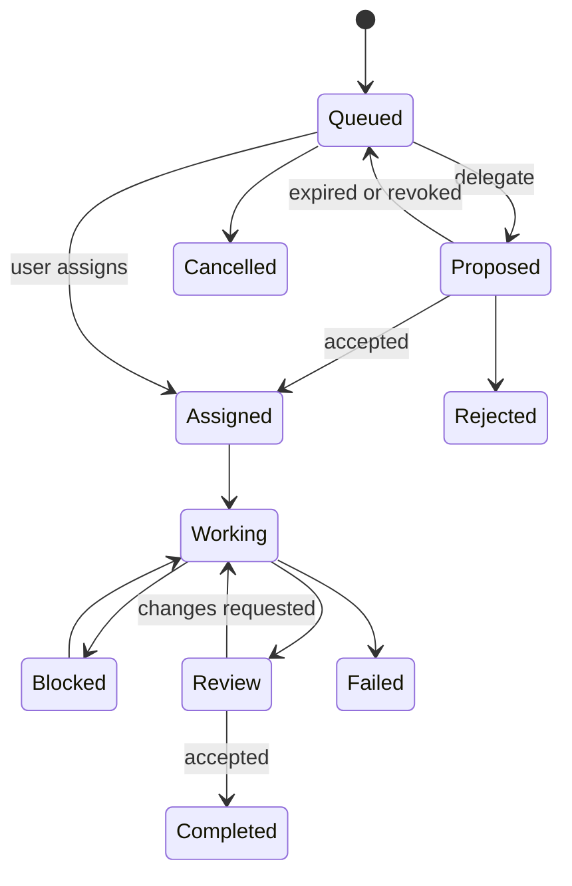

# User Interface

## 1. Product shell

The product name is **Cuckoding**. OTP modules remain `AgentDesk` / `AgentDeskWeb`.

The interface should feel like a focused multi-agent development workspace, not a collection of embedded terminals.

The theme is dark only (`data-theme="dark"` on the root layout). There is no light/dark switch.

LiveView is split by role:

- `workspace_live.ex` — events, OTP, assigns;
- `workspace_html.ex` — shell markup (sidebar, tabs, composer, context);
- `workspace_view.ex` — presentation helpers (filters, load summary, handoff fields);
- `workspace_panels.ex` — registry, analytics, grove, onboarding, activity cards.

```text
┌ Project sidebar ─┬ Dashboard | Agent tabs | + ─────────────┬ Context panel ┐
│ Tasks/Delegation │ Codex | Claude | Cursor | OpenCode       │ Agent status  │
│ Agents           │                                          │ Leases        │
│ Files            │ Active tab: dashboard or one agent       │ Messages      │
│ Artifacts        │ Activity stream / prompt composer        │ Approvals     │
│ Handoffs         │                                          │ A2A context   │
│ Search           │                                          │ Task details  │
│ ACP Registry     │                                          │ Isolation     │
└──────────────────┴──────────────────────────────────────────┴───────────────┘
```

The implementation uses responsive LiveView components; the diagram describes information architecture, not fixed pixel dimensions.

Visual language (dark):

- Canvas is deep navy with ambient purple/blue glows. Columns float as glass panels with ~28px corners, not flush bordered panes.
- Type is Inter with SF Pro fallbacks. Kickers are small uppercase labels with wide tracking; titles are tight and heavy.
- Primary actions use a purple-to-blue gradient pill. Status uses a labeled chip plus a color dot so color is never the only cue.
- Working/active uses the purple glow; blocked/interrupted uses amber; completed uses teal.

## 2. Primary areas

### Project sidebar

- current project and branch (open a Git repo with the native macOS folder picker);
- recently opened projects (name plus truncated path; Check again re-validates Git);
- task queue;
- pending, accepted, rejected, and expired delegations;
- running and stopped agents;
- safe Agent Cards and capability filters;
- worktrees and dirty status;
- recent handoffs;
- project search;
- settings and diagnostics.

### Agent tabs

Each agent session is **one compact tab** in the main strip (name + status dot; close is inside the tab). Dashboard is a tab. Agent tabs share the remaining strip and shrink so every open agent stays visible; `+` stays on the right. Duplicate names get a short id suffix. Sidebar Agents and Agent Cards open that tab. The prompt and activity in the center belong to the selected tab only.

Each agent tab shows a prompt composer. Attach files with the Attach control, or paste/drop images the same way Cursor does. Images are sent as provider image input; other files are stored under the session data directory and referenced by path. Isolated worktrees may also receive a copy under `.cuckoding-inbox`. The primary tree is never used as an inbox.

The prompt and activity in the center belong to the selected tab only.

- provider, model when available, role, and task;
- current state and elapsed time;
- assigned worktree/branch;
- streamed messages and normalized activity;
- commands, tool calls, file changes, and test results;
- prompt composer;
- optional containerized Compose for that session;
- interrupt, resume, and terminate controls based on capabilities;
- unread coordination indicator;
- current A2A context and delivery state;
- lease-conflict and approval badges.

### Context panel

The panel follows the active tab and presents information requiring action:

- current task and dependencies;
- held resources and expiry countdowns;
- direct messages and broadcasts;
- pending delegation actions;
- task conversation and artifact references;
- pending approvals;
- changed files;
- token/cost totals from canonical usage samples;
- a living grove that grows while agents work;
- isolation names and the app-owned template directory (never the primary tree);
- attach-session connect file path (never the raw token);
- provider capability/version diagnostics.

### ACP Registry

Browse the official ACP Registry (bundled snapshot, refresh from CDN). Search and filter All / Installed / Not Installed. Install records a command spec (executable + argv, typically `npx -y <package>`). Mapped Codex, Claude, Cursor, and OpenCode agents use the first-class adapters when those CLIs exist. Other registry agents use the generic ACP adapter. Remove disables the agent in Cuckoding; it does not uninstall a vendor CLI from the machine. Use starts a session tab.

### Dashboard

The Dashboard tab reports BEAM runtime memory, SQLite size and row counts, search/XERJ health, memory namespaces (shared / agent / task / context), and usage (tokens, cost, messages, artifacts, events). XERJ is a projection; missing search never hides SQLite coordination rows.

## 3. Agent state presentation

| State | Visual behavior | Allowed primary actions |
| --- | --- | --- |
| `queued` | Neutral | Cancel |
| `starting` | Progress | Cancel |
| `idle` | Ready | Send prompt, terminate |
| `working` | Active | Steer if supported, interrupt |
| `waiting` | Muted active | Send input, interrupt |
| `blocked` | Warning | Resolve conflict, message owner, reassign |
| `completed` | Success | Review handoff, continue |
| `failed` | Error | View diagnostics, retry/resume |
| `interrupted` | Warning | Resume, terminate |
| `terminating` | Progress | Wait; force action appears after timeout |
| `terminated` | Inactive | Archive, create new session |

Color is never the only state indicator.

## 4. Activity stream

The default view renders structured cards. Streamed provider tokens (`message_delta`, `reasoning_delta`) are grouped into one card per turn so the feed reads as paragraphs, not one card per word.

- agent message;
- reasoning summary when the provider exposes one appropriately;
- command with expandable output;
- file change with diff link;
- MCP tool call;
- approval request;
- lease acquisition/conflict/release;
- message/handoff;
- Agent Card or delegation update;
- artifact publication or integrity warning;
- error or provider exit.

Users can switch to a raw diagnostic view, but raw protocol payloads are not the primary interface.

The stream must be bounded and virtualized. Older activity is loaded from persistence on demand.

## 5. Task flow



Creating a task allows the user to choose:

- provider and role;
- required skills and preferred recipient, or automatic eligible-peer selection;
- autonomous delegation depth/fan-out policy;
- isolated worktree or explicit shared mode;
- permission profile;
- optional dependencies;
- initial files/resources to claim;
- reviewer agent;
- required checks before handoff.

**Split work** asks a lead agent to analyze a goal and assign backend, UI/frontend, and test lanes. It starts missing specialist sessions when you pick a provider. The Tasks panel groups the parent with nested lane and review children and shows lane progress. The lead reviews results; Cuckoding does not merge into the primary tree.

The `Proposed` state in the diagram is a composite UI state backed by a pending `task_delegations` row; it is not a replacement for the canonical task status.

## 6. Internal A2A collaboration

### Agents directory

Shows safe project-scoped Agent Cards:

- display name, role, provider, and current availability;
- declared skills/tags and supported input/output modes;
- current load summary (`status · N assigned`) and last heartbeat;
- skill/feature filter chips (All plus discovered keys);
- features such as review, structured artifacts, and safe-boundary delivery;
- `Message`, `Delegate task`, and `Request review` actions when authorized.

### Delegation inbox

Shows task, sender, requested skills, priority, context, expiry, and resource hints. Actions are `Accept`, `Reject with reason`, `Redirect`, and user-only `Revoke`. Accepting never claims resources automatically.

### Task conversation and delivery

Messages are grouped by A2A context/task and display text, structured-data summaries, artifact/file references, reply relationships, and delivery state. The UI distinguishes `pending`, `injected`, `acknowledged`, `expired`, and `skipped` without implying that acknowledgement means completion.

### Artifact panel

Shows kind, media type, producer, task/context, size, hash verification, revision lineage, and availability. Missing, corrupt, or quarantined artifacts remain visible with high-visibility warnings.

## 7. Resource conflict flow

When a lease conflicts, show:

- requested resource;
- current owner and task;
- reason and expected expiry;
- `Send message`;
- `Wait and retry`;
- `Choose another task`;
- `Request release`;
- administrative `Revoke` with confirmation.

Never offer a silent force takeover.

## 8. Handoff and review

A handoff screen contains:

- summary;
- base and head commits;
- changed files and diff statistics;
- checks run and results;
- warnings/open questions;
- originating A2A context, delegation, messages, and artifact identities;
- resources released or still held;
- review conversation;
- safe integration actions.

Integration actions are disabled while required checks fail or Git reports unresolved conflicts.

## 9. Search and memory

Project search groups results by source:

- source code;
- project documentation;
- decisions;
- handoffs;
- agent history;
- artifacts.

Each result displays source path/identity, relevance mode, and enough context to verify it. Memory entries show namespace, author, kind, timestamp, and a `Forget` action.

## 10. Team sync

The context panel can export a redacted coordination bundle and import one from a file path. Import requires a matching Git origin or sync id. Destructive Git merges are never part of the bundle.

## 11. Onboarding

First run:

1. Select a project with Choose folder… (native macOS picker) or a recent project. There is no paste-a-path field.
2. Cuckoding checks Git and project health. Check again on a recent re-runs that open/validate path. If the folder is gone, the UI says so and offers Remove from recents (with confirm).
3. Detect Codex, Claude Code, Cursor Agent, and OpenCode installations and versions.
4. Show authentication readiness without reading credentials.
5. Let the user enable providers and configure safe Agent Card roles/skills. Role prompts stay on the session and are never published on cards.
6. Explain built-in internal A2A, task delegation, acknowledgements, and resource leases.
7. Select autonomous delegation depth/fan-out policy.
8. Explain isolated worktrees and app-owned storage.
9. Optionally enable XERJ indexing.
10. Create the first agent tab and register it with the A2A Hub.

## 12. Keyboard and accessibility baseline

- Full keyboard navigation for tabs, task/delegation lists, Agent Cards, artifacts, approvals, and composer.
- Visible focus states.
- Semantic labels for status and icon-only buttons.
- Screen-reader announcements for agent completion, conflict, and approval request.
- Respect reduced-motion preference.
- User-configurable font size for activity and diffs.
- Shortcuts are discoverable under Settings · shortcuts and persist on the project. Defaults: Meta+Enter send, Meta+. interrupt, Meta+Shift+Enter new session, Meta+Shift+] / [ next/prev tab, Meta+L composer, Meta+K search, Meta+[ load older activity.
