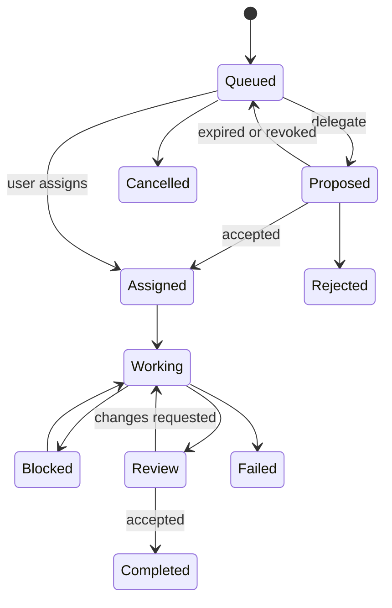

# User Interface

## 1. Product shell

The interface should feel like a focused multi-agent development workspace, not a collection of embedded terminals.

```text
┌ Project sidebar ─┬ Agent tabs and workspace ───────────────┬ Context panel ┐
│ Tasks/Delegation │ Codex | Claude | Cursor | OpenCode       │ Agent status  │
│ Agents           │                                          │ Leases        │
│ Files            │ Activity stream / diff / prompt composer │ Messages      │
│ Artifacts        │                                          │ Approvals     │
│ Handoffs         │                                          │ A2A context   │
│ Search           │                                          │ Task details  │
└──────────────────┴──────────────────────────────────────────┴───────────────┘
```

The implementation uses responsive LiveView components; the diagram describes information architecture, not fixed pixel dimensions.

## 2. Primary areas

### Project sidebar

- current project and branch;
- task queue;
- pending, accepted, rejected, and expired delegations;
- running and stopped agents;
- safe Agent Cards and capability filters;
- worktrees and dirty status;
- recent handoffs;
- project search;
- settings and diagnostics.

### Agent tabs

Each tab shows:

- provider, model when available, role, and task;
- current state and elapsed time;
- assigned worktree/branch;
- streamed messages and normalized activity;
- commands, tool calls, file changes, and test results;
- prompt composer;
- optional containerized Compose for that session;
- interrupt, resume, and terminate controls based on capabilities;
- unread coordination indicator;
- current A2A context and delivery state;
- lease-conflict and approval badges.

### Context panel

The panel follows the active tab and presents information requiring action:

- current task and dependencies;
- held resources and expiry countdowns;
- direct messages and broadcasts;
- pending delegation actions;
- task conversation and artifact references;
- pending approvals;
- changed files;
- token/cost totals from canonical usage samples;
- attach-session connect file path (never the raw token);
- provider capability/version diagnostics.

## 3. Agent state presentation

| State | Visual behavior | Allowed primary actions |
| --- | --- | --- |
| `queued` | Neutral | Cancel |
| `starting` | Progress | Cancel |
| `idle` | Ready | Send prompt, terminate |
| `working` | Active | Steer if supported, interrupt |
| `waiting` | Muted active | Send input, interrupt |
| `blocked` | Warning | Resolve conflict, message owner, reassign |
| `completed` | Success | Review handoff, continue |
| `failed` | Error | View diagnostics, retry/resume |
| `interrupted` | Warning | Resume, terminate |
| `terminating` | Progress | Wait; force action appears after timeout |
| `terminated` | Inactive | Archive, create new session |

Color is never the only state indicator.

## 4. Activity stream

The default view renders structured cards:

- agent message;
- reasoning summary when the provider exposes one appropriately;
- command with expandable output;
- file change with diff link;
- MCP tool call;
- approval request;
- lease acquisition/conflict/release;
- message/handoff;
- Agent Card or delegation update;
- artifact publication or integrity warning;
- error or provider exit.

Users can switch to a raw diagnostic view, but raw protocol payloads are not the primary interface.

The stream must be bounded and virtualized. Older activity is loaded from persistence on demand.

## 5. Task flow



Creating a task allows the user to choose:

- provider and role;
- required skills and preferred recipient, or automatic eligible-peer selection;
- autonomous delegation depth/fan-out policy;
- isolated worktree or explicit shared mode;
- permission profile;
- optional dependencies;
- initial files/resources to claim;
- reviewer agent;
- required checks before handoff.

The `Proposed` state in the diagram is a composite UI state backed by a pending `task_delegations` row; it is not a replacement for the canonical task status.

## 6. Internal A2A collaboration

### Agents directory

Shows safe project-scoped Agent Cards:

- display name, role, provider, and current availability;
- declared skills/tags and supported input/output modes;
- current load summary and last heartbeat;
- features such as review, structured artifacts, and safe-boundary delivery;
- `Message`, `Delegate task`, and `Request review` actions when authorized.

### Delegation inbox

Shows task, sender, requested skills, priority, context, expiry, and resource hints. Actions are `Accept`, `Reject with reason`, `Redirect`, and user-only `Revoke`. Accepting never claims resources automatically.

### Task conversation and delivery

Messages are grouped by A2A context/task and display text, structured-data summaries, artifact/file references, reply relationships, and delivery state. The UI distinguishes `pending`, `injected`, `acknowledged`, `expired`, and `skipped` without implying that acknowledgement means completion.

### Artifact panel

Shows kind, media type, producer, task/context, size, hash verification, revision lineage, and availability. Missing, corrupt, or quarantined artifacts remain visible with high-visibility warnings.

## 7. Resource conflict flow

When a lease conflicts, show:

- requested resource;
- current owner and task;
- reason and expected expiry;
- `Send message`;
- `Wait and retry`;
- `Choose another task`;
- `Request release`;
- administrative `Revoke` with confirmation.

Never offer a silent force takeover.

## 8. Handoff and review

A handoff screen contains:

- summary;
- base and head commits;
- changed files and diff statistics;
- checks run and results;
- warnings/open questions;
- originating A2A context, delegation, messages, and artifact identities;
- resources released or still held;
- review conversation;
- safe integration actions.

Integration actions are disabled while required checks fail or Git reports unresolved conflicts.

## 9. Search and memory

Project search groups results by source:

- source code;
- project documentation;
- decisions;
- handoffs;
- agent history;
- artifacts.

Each result displays source path/identity, relevance mode, and enough context to verify it. Memory entries show namespace, author, kind, timestamp, and a `Forget` action.

## 10. Team sync

The context panel can export a redacted coordination bundle and import one from a file path. Import requires a matching Git origin or sync id. Destructive Git merges are never part of the bundle.

## 11. Onboarding

First run:

1. Select a project.
2. AgentDesk checks Git and project health.
3. Detect Codex, Claude Code, Cursor Agent, and OpenCode installations and versions.
4. Show authentication readiness without reading credentials.
5. Let the user enable providers and configure safe Agent Card roles/skills. Role prompts stay on the session and are never published on cards.
6. Explain built-in internal A2A, task delegation, acknowledgements, and resource leases.
7. Select autonomous delegation depth/fan-out policy.
8. Explain isolated worktrees and app-owned storage.
9. Optionally enable XERJ indexing.
10. Create the first agent tab and register it with the A2A Hub.

## 12. Keyboard and accessibility baseline

- Full keyboard navigation for tabs, task/delegation lists, Agent Cards, artifacts, approvals, and composer.
- Visible focus states.
- Semantic labels for status and icon-only buttons.
- Screen-reader announcements for agent completion, conflict, and approval request.
- Respect reduced-motion preference.
- User-configurable font size for activity and diffs.
- Shortcuts must be discoverable and configurable where practical.
