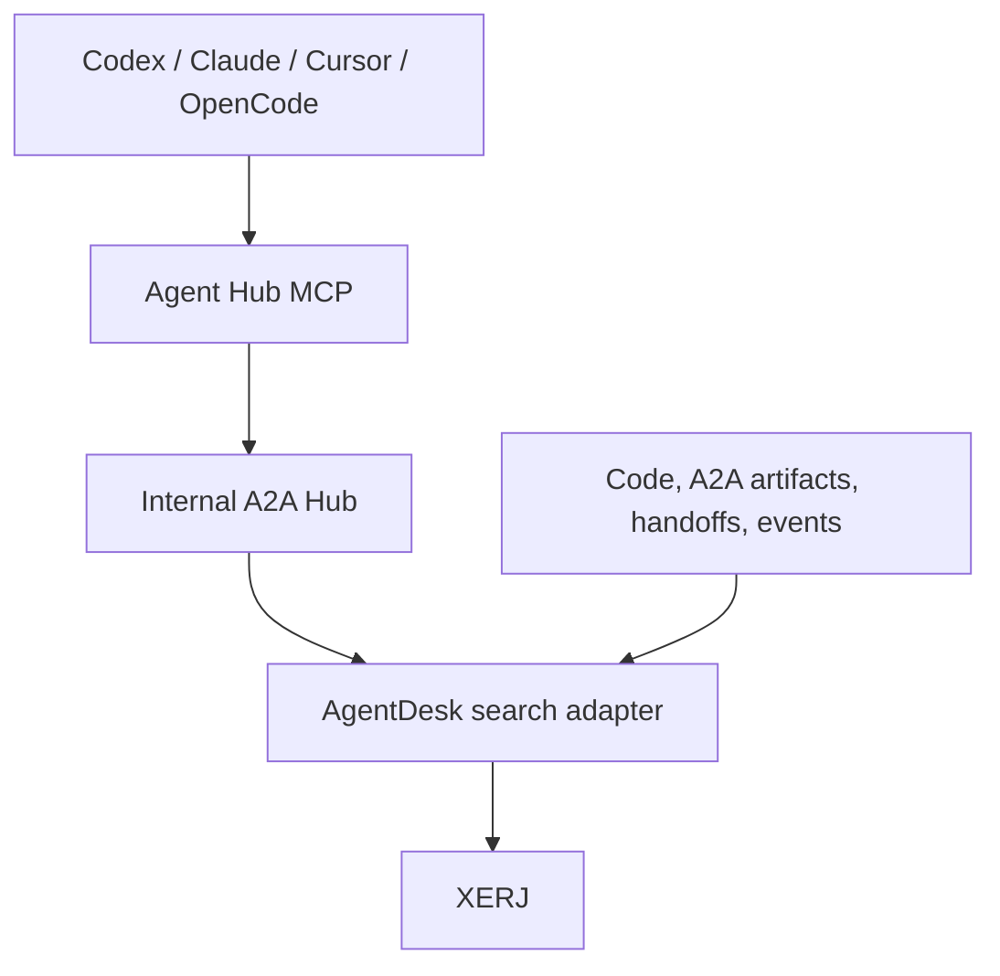

# XERJ Integration

## 1. Role

XERJ is AgentDesk's optional local search and long-term memory engine. It is not the internal A2A directory, task/delegation coordinator, message queue, artifact registry, lock manager, or canonical event store.



## 2. Use cases

- Search source code and Markdown by keyword or meaning.
- Search PDFs, DOCX, logs, SQLite, and other project-adjacent artifacts selected by the user.
- Recall architecture decisions and prior handoffs.
- Search accepted A2A artifacts, context summaries, task outcomes, and review results.
- Maintain shared project memory.
- Maintain isolated per-agent or per-task memory.
- Inspect SQLite/XERJ usage from the Dashboard tab (`AgentDesk.Analytics`).
- Query normalized historical activity for debugging.
- Return bounded passages instead of loading whole files into model context.

## 3. Adapter boundary

```elixir
defmodule AgentDesk.Search.Adapter do
  @callback health(context :: map()) :: :ok | {:error, term()}
  @callback index_project(project :: map()) :: :ok | {:error, term()}
  @callback index_documents(project :: map(), [map()]) :: :ok | {:error, term()}
  @callback search(project :: map(), query :: map()) :: {:ok, [map()]} | {:error, term()}
  @callback remember(namespace :: String.t(), memory :: map()) :: {:ok, map()} | {:error, term()}
  @callback recall(namespace :: String.t(), query :: map()) :: {:ok, [map()]} | {:error, term()}
  @callback forget(namespace :: String.t(), id :: String.t()) :: :ok | {:error, term()}
  @callback rebuild(project :: map()) :: :ok | {:error, term()}
end
```

No LiveView, provider adapter, or task module calls XERJ HTTP directly.

Implemented adapters:

| Config `:search, adapter:` | Module | When |
| --- | --- | --- |
| `:auto` | XERJ if a binary is found and `:9200` is free, else projection | Development default |
| `:projection` | `AgentDesk.Search.Projection` | Tests / CI |
| `:xerj` | `AgentDesk.Search.Xerj` | Feature flag `features: [xerj: true]` and owned process |
| `:disabled` | `AgentDesk.Search.Disabled` | Explicit off |

AgentDesk never HTTP-attaches to a XERJ node it did not start. An occupied default `:9200` is treated as unavailable.

## 4. Index strategy

Initial logical indices:

| Index | Contents | Rebuild source |
| --- | --- | --- |
| `project-<id>-files` | Code and project documentation | Project filesystem |
| `project-<id>-knowledge` | Decisions, handoffs, accepted A2A context summaries | `.agent-hub/`, SQLite, and artifacts |
| `project-<id>-events` | Selected normalized A2A/provider events | SQLite `events` |
| `project-<id>-artifacts` | Accepted task outputs and user-approved external documents | Artifact files and metadata |

Do not index:

- `.git` object storage;
- dependencies and build output by default;
- provider credential/config directories;
- environment files likely to contain secrets;
- raw command environments;
- binary artifacts that the user did not select;
- raw transcripts until redaction and retention rules are applied.

Default exclusions include `_build`, `deps`, `node_modules`, `target`, `.git`, app runtime data, and common secret filenames.

## 5. Memory namespaces

```text
project-<project_id>-shared
project-<project_id>-agent-<agent_id>
project-<project_id>-context-<context_id>
project-<project_id>-task-<task_id>
```

Shared memory contains stable project facts and accepted decisions. Agent memory contains provider/session-specific observations. Context memory contains findings shared by authorized A2A participants across related tasks. Task memory contains temporary findings useful across handoffs.

Agent Hub authorizes namespace access:

- every project agent may recall shared project memory;
- an agent may access its own namespace;
- A2A context participants may access that context's namespace;
- task participants may access that task's namespace;
- cross-project access is denied;
- promotion from private/task memory into shared memory requires an explicit tool call and is recorded as an event.

## 6. Memory metadata

```json
{
  "kind": "architecture_decision",
  "project_id": "uuid",
  "task_id": "uuid-or-null",
  "context_id": "uuid-or-null",
  "agent_id": "uuid-or-null",
  "source_type": "handoff",
  "source_id": "uuid",
  "source_path": "ARCHITECTURE.md",
  "recorded_at": "timestamp",
  "confidence": "accepted",
  "content_hash": "sha256"
}
```

The text stored with the memory must be concise and independently understandable. Do not store speculative model reasoning as an accepted project fact.

## 7. Index lifecycle

1. Start XERJ under supervision.
2. Wait for health readiness.
3. Compare project index metadata and content state.
4. Run initial autoindex or controlled ingestion.
5. Mark search ready.
6. Watch project changes and debounce incremental/re-index work.
7. Persist indexing status in SQLite.
8. On corruption or version incompatibility, stop, quarantine/rebuild derived data, and continue without search.

Indexing is asynchronous and must never block opening a project or starting an agent.

## 8. Search result contract

Agent Hub returns a provider-neutral result:

```json
{
  "source": "project_file",
  "source_id": "lib/agent_desk/resource_manager.ex",
  "title": "AgentDesk.ResourceManager",
  "passage": "bounded text",
  "score": 0.82,
  "retrieval": "hybrid",
  "metadata": {
    "path": "lib/agent_desk/resource_manager.ex",
    "content_hash": "sha256"
  }
}
```

Results are bounded by count and total bytes/tokens. If a provider needs more context, it requests a narrower follow-up search or reads the source file from its worktree.

## 9. Embeddings

XERJ can perform lexical search locally and can accept vectors or use a configured embedding endpoint for stronger semantic recall. AgentDesk should support:

1. lexical-only local mode as the privacy-first default;
2. XERJ's local semantic capability where acceptable;
3. an explicitly configured local OpenAI-compatible embedding server;
4. an explicitly configured hosted embedding provider.

Hosted embeddings must be opt-in because they transmit indexed text outside the machine.

## 10. Packaging and maturity

XERJ is a single executable and its repository is Apache-2.0 licensed, which is compatible with bundling subject to normal license/notice compliance. The currently reviewed documentation identifies it as a release candidate. Keep integration behind a feature flag and adapter until upgrade, corruption, resource-use, and cross-platform packaging behavior are proven.

## 11. Failure behavior

- If XERJ is missing: show search disabled and offer setup.
- If startup fails: retry with bounded exponential backoff.
- If health fails repeatedly: open a circuit and keep core coordination running.
- If a query times out: return `search_unavailable` or partial results explicitly.
- If indexing fails: retain the previous healthy index when possible and show stale status.
- If data is removed: rebuild without affecting Agent Cards, contexts, delegations, messages, tasks, artifacts, or leases.
